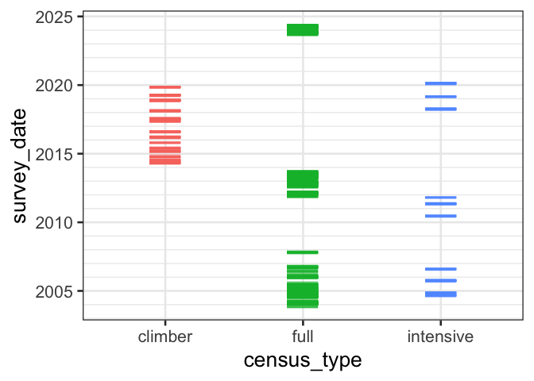
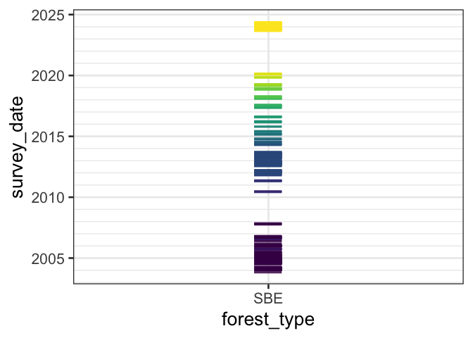

# SBE data summary
eleanorjackson
2024-12-09

``` r
library("tidyverse")
library("here")
library("patchwork")
```

``` r
data <- 
  readRDS(here::here("data", "derived", "data_cleaned.rds"))
```

``` r
data %>% 
  group_by(species_mix, plot) %>% 
  summarise(n_species = n_distinct(genus_species)) %>% 
  arrange(plot)
```

    # A tibble: 142 × 3
    # Groups:   species_mix [18]
       species_mix   plot  n_species
       <fct>         <fct>     <int>
     1 4-species(13) 001           6
     2 monoculture   002           1
     3 16-species    003          16
     4 monoculture   004           1
     5 16-species    005          16
     6 4-species(6)  006           4
     7 monoculture   007           1
     8 16-species    008          16
     9 4-species(3)  009           6
    10 monoculture   010           1
    # ℹ 132 more rows

``` r
data %>% 
  mutate(forest = "SBE") %>% 
  mutate(census_type = str_extract(census_id, "[a-z]+" )) %>% 
  mutate(month = lubridate::month(survey_date)) %>% 
  group_by(survey_date) %>% 
  slice_head() %>% 
  ggplot(aes(x = census_type, y = survey_date, 
             colour = census_type)) +
  geom_point(alpha = 0.6, shape = "—", size = 10) +
  theme_bw(base_size=20) +
  scale_y_date(minor_breaks = "year") +
  theme(legend.position = "none")
```



``` r
data %>% 
  mutate(month = lubridate::month(survey_date)) %>% 
  mutate(forest_type = "SBE") %>% 
  group_by(survey_date) %>% 
  slice_head() %>% 
  ggplot(aes(x = forest_type, y = survey_date, 
             colour = census_no)) +
  geom_point(alpha = 0.6, shape = "—", size = 10) +
  theme_bw(base_size=20) +
  scale_y_date(minor_breaks = "year") +
  scale_colour_viridis_d() +
  theme(legend.position = "none")
```



``` r
data %>% 
  mutate(census_type = str_extract(census_id, "[a-z]+" )) %>% 
  select(census_type, plot) %>% 
  distinct() %>% 
  arrange(census_type) %>% 
  knitr::kable()
```

| census_type | plot |
|:------------|:-----|
| climber     | 003  |
| climber     | 005  |
| climber     | 008  |
| climber     | 011  |
| climber     | 014  |
| climber     | 021  |
| climber     | 022  |
| climber     | 029  |
| climber     | 031  |
| climber     | 032  |
| climber     | 040  |
| climber     | 042  |
| climber     | 046  |
| climber     | 049  |
| climber     | 062  |
| climber     | 064  |
| climber     | 075  |
| climber     | 085  |
| climber     | 091  |
| climber     | 100  |
| climber     | 111  |
| climber     | 115  |
| full        | 001  |
| full        | 002  |
| full        | 003  |
| full        | 004  |
| full        | 005  |
| full        | 006  |
| full        | 007  |
| full        | 008  |
| full        | 009  |
| full        | 010  |
| full        | 011  |
| full        | 012  |
| full        | 013  |
| full        | 014  |
| full        | 015  |
| full        | 016  |
| full        | 017  |
| full        | 018  |
| full        | 019  |
| full        | 021  |
| full        | 022  |
| full        | 023  |
| full        | 025  |
| full        | 027  |
| full        | 028  |
| full        | 029  |
| full        | 030  |
| full        | 031  |
| full        | 032  |
| full        | 033  |
| full        | 034  |
| full        | 035  |
| full        | 037  |
| full        | 038  |
| full        | 039  |
| full        | 040  |
| full        | 041  |
| full        | 042  |
| full        | 043  |
| full        | 044  |
| full        | 045  |
| full        | 046  |
| full        | 048  |
| full        | 049  |
| full        | 050  |
| full        | 051  |
| full        | 052  |
| full        | 053  |
| full        | 054  |
| full        | 055  |
| full        | 056  |
| full        | 058  |
| full        | 059  |
| full        | 060  |
| full        | 061  |
| full        | 062  |
| full        | 063  |
| full        | 064  |
| full        | 065  |
| full        | 066  |
| full        | 067  |
| full        | 069  |
| full        | 070  |
| full        | 071  |
| full        | 072  |
| full        | 073  |
| full        | 074  |
| full        | 075  |
| full        | 076  |
| full        | 077  |
| full        | 078  |
| full        | 079  |
| full        | 081  |
| full        | 082  |
| full        | 083  |
| full        | 084  |
| full        | 085  |
| full        | 086  |
| full        | 087  |
| full        | 088  |
| full        | 090  |
| full        | 091  |
| full        | 092  |
| full        | 093  |
| full        | 094  |
| full        | 096  |
| full        | 097  |
| full        | 098  |
| full        | 099  |
| full        | 100  |
| full        | 101  |
| full        | 102  |
| full        | 103  |
| full        | 104  |
| full        | 105  |
| full        | 106  |
| full        | 107  |
| full        | 109  |
| full        | 110  |
| full        | 111  |
| full        | 112  |
| full        | 113  |
| full        | 114  |
| full        | 115  |
| full        | 116  |
| full        | 118  |
| full        | 119  |
| full        | 120  |
| full        | 121  |
| full        | 122  |
| full        | 123  |
| full        | 124  |
| intensive   | 003  |
| intensive   | 005  |
| intensive   | 008  |
| intensive   | 011  |
| intensive   | 014  |
| intensive   | 017  |
