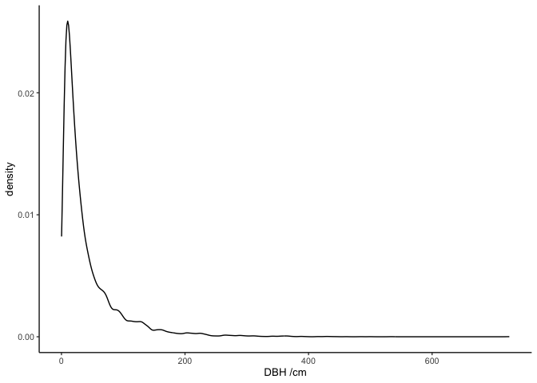

# Tree sizes
eleanorjackson
2024-12-09

Are the planted trees reaching the canopy yet? Looking at DBH recorded
in the latest full census.

``` r
library("tidyverse")
library("here")
library("patchwork")
```

``` r
new_census <- 
  readRDS(here::here("data", "derived", "data_cleaned.rds")) %>% 
  filter(census_id == "full_measurement_03") 

new_census %>% 
  drop_na(dbh_mean) %>% 
  glimpse()
```

    Rows: 12,261
    Columns: 17
    $ plant_id      <fct> 001_01_001_O, 001_01_002_N, 001_01_002_O, 001_01_003_O, …
    $ species_mix   <fct> 4-species(13), 4-species(13), 4-species(13), 4-species(1…
    $ plot          <fct> 001, 001, 001, 001, 001, 001, 001, 001, 001, 001, 001, 0…
    $ line          <fct> 01, 01, 01, 01, 01, 01, 01, 01, 01, 01, 01, 01, 01, 01, …
    $ position      <fct> 001, 002, 002, 003, 004, 010, 014, 015, 017, 019, 020, 0…
    $ cohort        <fct> 1, 2, 1, 1, 1, 1, 2, 1, 1, 1, 1, 2, 1, 1, 2, 1, 2, 1, 1,…
    $ genus         <chr> "Dryobalanops", "Shorea", "Dryobalanops", "Shorea", "Sho…
    $ species       <chr> "lanceolata", "macrophylla", "lanceolata", "macrophylla"…
    $ genus_species <fct> Dryobalanops_lanceolata, Shorea_macrophylla, Dryobalanop…
    $ planting_date <date> 2002-07-18, 2002-07-18, 2002-07-18, 2002-07-18, 2002-07…
    $ census_no     <fct> 26, 26, 26, 26, 26, 26, 26, 26, 26, 26, 26, 26, 26, 26, …
    $ census_id     <fct> full_measurement_03, full_measurement_03, full_measureme…
    $ survey_date   <date> 2023-09-12, 2023-09-12, 2023-09-12, 2023-09-12, 2023-09…
    $ survival      <dbl> 1, 1, 1, 1, 1, 1, 1, 1, 1, 1, 1, 1, 1, 1, 1, 1, 1, 1, 1,…
    $ height_apex   <dbl> NA, NA, NA, NA, NA, NA, NA, NA, NA, NA, NA, NA, 272, NA,…
    $ dbh_mean      <dbl> 11.60, 210.00, 191.00, 362.00, 230.00, 90.00, 110.00, 35…
    $ dbase_mean    <dbl> 12.30, 250.00, 211.00, NaN, 260.00, 100.00, 120.00, 44.2…

``` r
new_census %>% 
  summarise(
    mean = mean(dbh_mean, na.rm = TRUE),
    median = median(dbh_mean, na.rm = TRUE),
    max = max(dbh_mean, na.rm = TRUE),
    min = min(dbh_mean, na.rm = TRUE)
  )
```

    # A tibble: 1 × 4
       mean median   max   min
      <dbl>  <dbl> <dbl> <dbl>
    1  41.2   23.2   725   0.2

``` r
new_census %>% 
  ggplot(aes(x = dbh_mean)) +
  geom_density() +
  labs(x = "DBH /cm")
```



``` r
new_census %>% 
  filter(dbh_mean > 50) %>% 
  nrow()
```

    [1] 3077

``` r
new_census %>% 
  filter(dbh_mean > 50) %>% 
  group_by(plot) %>% 
  summarise(n_distinct(plant_id)) %>% 
  arrange(`n_distinct(plant_id)`
          |> desc() ) %>% 
  knitr::kable()
```

| plot | n_distinct(plant_id) |
|:-----|---------------------:|
| 001  |                  151 |
| 002  |                  134 |
| 037  |                  116 |
| 004  |                   79 |
| 011  |                   67 |
| 099  |                   65 |
| 021  |                   63 |
| 084  |                   63 |
| 006  |                   56 |
| 003  |                   55 |
| 044  |                   54 |
| 105  |                   53 |
| 005  |                   52 |
| 027  |                   51 |
| 075  |                   51 |
| 042  |                   48 |
| 071  |                   48 |
| 070  |                   43 |
| 015  |                   42 |
| 121  |                   42 |
| 085  |                   41 |
| 065  |                   39 |
| 092  |                   39 |
| 100  |                   39 |
| 112  |                   38 |
| 049  |                   37 |
| 051  |                   37 |
| 008  |                   36 |
| 017  |                   36 |
| 081  |                   33 |
| 104  |                   33 |
| 014  |                   32 |
| 009  |                   31 |
| 031  |                   31 |
| 094  |                   31 |
| 063  |                   30 |
| 111  |                   30 |
| 018  |                   29 |
| 087  |                   29 |
| 107  |                   29 |
| 019  |                   28 |
| 083  |                   28 |
| 016  |                   26 |
| 088  |                   26 |
| 101  |                   25 |
| 122  |                   25 |
| 106  |                   24 |
| 110  |                   24 |
| 115  |                   24 |
| 041  |                   23 |
| 038  |                   22 |
| 072  |                   22 |
| 093  |                   22 |
| 007  |                   21 |
| 045  |                   21 |
| 097  |                   21 |
| 118  |                   21 |
| 120  |                   21 |
| 043  |                   20 |
| 046  |                   20 |
| 098  |                   20 |
| 114  |                   20 |
| 082  |                   19 |
| 116  |                   19 |
| 052  |                   18 |
| 091  |                   18 |
| 109  |                   18 |
| 050  |                   17 |
| 069  |                   17 |
| 077  |                   17 |
| 048  |                   16 |
| 053  |                   16 |
| 123  |                   16 |
| 022  |                   15 |
| 032  |                   15 |
| 033  |                   15 |
| 064  |                   15 |
| 029  |                   14 |
| 040  |                   14 |
| 055  |                   14 |
| 028  |                   13 |
| 066  |                   13 |
| 076  |                   13 |
| 059  |                   12 |
| 096  |                   12 |
| 102  |                   12 |
| 103  |                   12 |
| 124  |                   12 |
| 012  |                   11 |
| 060  |                   11 |
| 113  |                   11 |
| 119  |                   11 |
| 025  |                   10 |
| 067  |                   10 |
| 023  |                    9 |
| 054  |                    9 |
| 030  |                    8 |
| 058  |                    8 |
| 073  |                    8 |
| 010  |                    7 |
| 056  |                    7 |
| 074  |                    7 |
| 090  |                    7 |
| 062  |                    6 |
| 079  |                    6 |
| 086  |                    6 |
| 061  |                    5 |
| 013  |                    3 |
| 035  |                    3 |
| 034  |                    2 |
| 039  |                    2 |
| 078  |                    1 |

``` r
new_census %>% 
  filter(dbh_mean > 50) %>% 
  group_by(genus_species) %>% 
  summarise(n_distinct(plant_id)) %>% 
  arrange(`n_distinct(plant_id)`
          |> desc() ) %>% 
  knitr::kable()
```

| genus_species           | n_distinct(plant_id) |
|:------------------------|---------------------:|
| Hopea_sangal            |                  487 |
| Shorea_beccariana       |                  323 |
| Shorea_macrophylla      |                  304 |
| Shorea_ovalis           |                  284 |
| Dryobalanops_lanceolata |                  256 |
| Shorea_johorensis       |                  255 |
| Parashorea_malaanonan   |                  194 |
| Parashorea_tomentella   |                  185 |
| Hopea_ferruginea        |                  173 |
| Shorea_leprosula        |                  126 |
| Shorea_parvifolia       |                  125 |
| Shorea_macroptera       |                  101 |
| Dipterocarpus_conformis |                   98 |
| Shorea_gibbosa          |                   70 |
| Shorea_argentifolia     |                   52 |
| Shorea_faguetiana       |                   44 |
