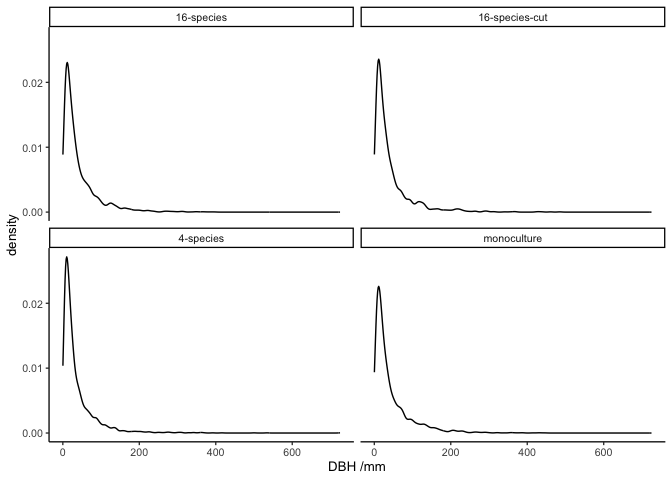
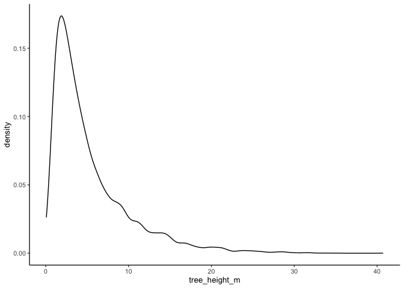
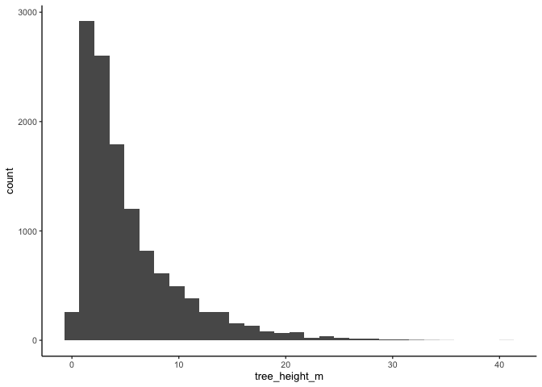
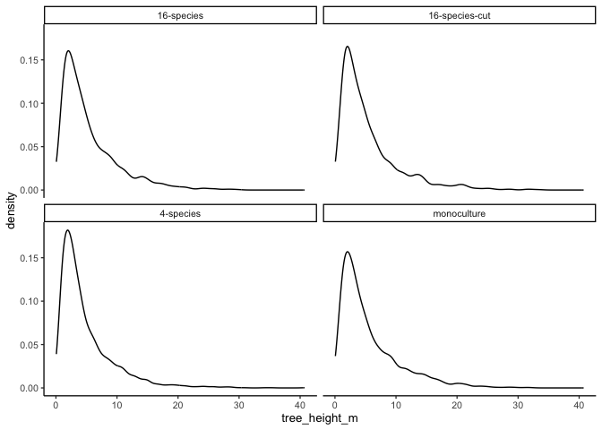
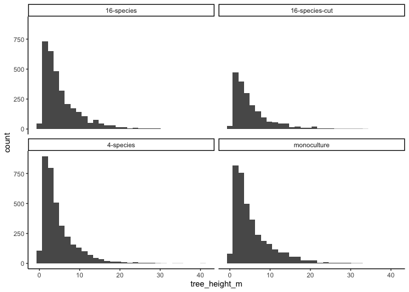
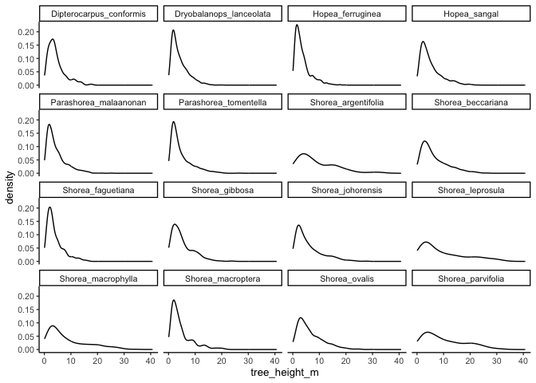
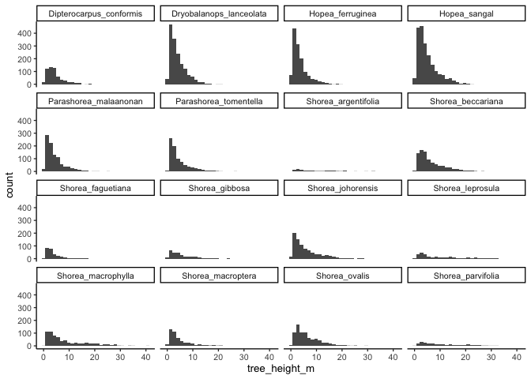

# Tree sizes
eleanorjackson
2025-07-21

- [DBH](#dbh)
  - [Trees above 30cm DBH](#trees-above-30cm-dbh)
- [Height](#height)

Are the planted trees reaching the canopy yet?

## DBH

Looking at DBH recorded in the latest full census of the SBE.

``` r
library("tidyverse")
library("here")
library("patchwork")
```

``` r
new_census <- 
  readRDS(here::here("data", "derived", "data_cleaned.rds")) %>% 
  filter(census_id == "full_measurement_03") 

new_census %>% 
  drop_na(dbh_mm) %>% 
  glimpse()
```

    Rows: 12,259
    Columns: 19
    $ plant_id      <fct> 001_01_001_O, 001_01_002_N, 001_01_002_O, 001_01_003_O, …
    $ treatment     <fct> 4-species, 4-species, 4-species, 4-species, 4-species, 4…
    $ species_mix   <fct> 4-species(13), 4-species(13), 4-species(13), 4-species(1…
    $ plot          <fct> 001, 001, 001, 001, 001, 001, 001, 001, 001, 001, 001, 0…
    $ line          <fct> 01, 01, 01, 01, 01, 01, 01, 01, 01, 01, 01, 01, 01, 01, …
    $ position      <fct> 001, 002, 002, 003, 004, 010, 014, 015, 017, 019, 020, 0…
    $ cohort        <fct> 1, 2, 1, 1, 1, 1, 2, 1, 1, 1, 1, 2, 1, 1, 2, 1, 2, 1, 1,…
    $ genus         <chr> "Dryobalanops", "Shorea", "Dryobalanops", "Shorea", "Sho…
    $ species       <chr> "lanceolata", "macrophylla", "lanceolata", "macrophylla"…
    $ genus_species <fct> Dryobalanops_lanceolata, Shorea_macrophylla, Dryobalanop…
    $ planting_date <date> 2002-07-18, NA, 2002-07-18, 2002-07-18, 2002-07-18, 200…
    $ first_survey  <date> 2003-11-18, 2011-11-25, 2003-11-18, 2003-11-18, 2003-11…
    $ census_no     <fct> 26, 26, 26, 26, 26, 26, 26, 26, 26, 26, 26, 26, 26, 26, …
    $ census_id     <fct> full_measurement_03, full_measurement_03, full_measureme…
    $ survey_date   <date> 2023-09-12, 2023-09-12, 2023-09-12, 2023-09-12, 2023-09…
    $ survival      <dbl> 1, 1, 1, 1, 1, 1, 1, 1, 1, 1, 1, 1, 1, 1, 1, 1, 1, 1, 1,…
    $ height_apex   <dbl> NA, NA, NA, NA, NA, NA, NA, NA, NA, NA, NA, NA, 272, NA,…
    $ dbh_mm        <dbl> 11.60, 210.00, 191.00, 362.00, 230.00, 90.00, 110.00, 35…
    $ dbase_mm      <dbl> 12.30, 250.00, 211.00, NaN, 260.00, 100.00, 120.00, 44.2…

``` r
new_census %>% 
  summarise(
    mean = mean(dbh_mm, na.rm = TRUE),
    median = median(dbh_mm, na.rm = TRUE),
    max = max(dbh_mm, na.rm = TRUE),
    min = min(dbh_mm, na.rm = TRUE)
  )
```

    # A tibble: 1 × 4
       mean median   max   min
      <dbl>  <dbl> <dbl> <dbl>
    1  41.2   23.2   725   0.2

``` r
new_census %>% 
  ggplot(aes(x = dbh_mm)) +
  geom_density() +
  labs(x = "DBH /mm")
```


``` r
new_census %>% 
  ggplot(aes(x = dbh_mm)) +
  geom_density() +
  labs(x = "DBH /mm") +
  facet_wrap(~treatment)
```



### Trees above 30cm DBH

``` r
new_census %>% 
  filter(dbh_mm > 300) %>% 
  nrow()
```

    [1] 62

``` r
new_census %>% 
  filter(dbh_mm > 300) %>% 
  group_by(genus_species) %>% 
  summarise(n_distinct(plant_id)) %>% 
  arrange(`n_distinct(plant_id)`
          |> desc() ) %>% 
  knitr::kable()
```

| genus_species         | n_distinct(plant_id) |
|:----------------------|---------------------:|
| Shorea_macrophylla    |                   28 |
| Shorea_leprosula      |                   16 |
| Shorea_parvifolia     |                    8 |
| Shorea_argentifolia   |                    4 |
| Shorea_beccariana     |                    2 |
| Shorea_johorensis     |                    2 |
| Parashorea_tomentella |                    1 |
| Shorea_ovalis         |                    1 |

``` r
new_census %>% 
  filter(dbh_mm > 300) %>% 
  group_by(treatment) %>% 
  summarise(n_distinct(plant_id)) %>% 
  arrange(`n_distinct(plant_id)`
          |> desc() ) %>% 
  knitr::kable()
```

| treatment      | n_distinct(plant_id) |
|:---------------|---------------------:|
| 4-species      |                   20 |
| monoculture    |                   16 |
| 16-species     |                   15 |
| 16-species-cut |                   11 |

## Height

Using a Weibull function to estimate tree height from DBH:

predicted height = *a*\*(1 − exp(−*b*\*DBH<sup>*c*</sup>))

Parameters *a, b* and *c* from [Feldpausch *et al.*
2012](https://doi.org/10.5194/bg-9-3381-2012) (Asia-specific model).

*We think they use DBH in cm and height in m*

``` r
a <- 57.122 

b <- 0.0332 

c <- 0.8468 
```

``` r
get_height <- function(dbh, a, b, c) {
  height <-
    a * (1-exp(-b * (dbh)^c))
  
  return(height)
}
```

So for a tree with DBH of 50 cm, the predicted height is:

``` r
get_height(dbh = 50,
           a = a,
           b = b,
           c = c)
```

    [1] 34.16681

Across the all the SBE planted trees:

``` r
new_census %>% 
  mutate(dbh_cm = dbh_mm / 10) %>% 
  mutate(tree_height_m = get_height(dbh = dbh_cm,
                                     a = a,
                                     b = b,
                                     c = c) ) %>% 
  summarise(
    mean = mean(tree_height_m, na.rm = TRUE),
    median = median(tree_height_m, na.rm = TRUE),
    max = max(tree_height_m, na.rm = TRUE),
    min = min(tree_height_m, na.rm = TRUE)
  )
```

    # A tibble: 1 × 4
       mean median   max    min
      <dbl>  <dbl> <dbl>  <dbl>
    1  5.33   3.74  40.7 0.0690

``` r
new_census %>% 
  mutate(dbh_cm = dbh_mm / 10) %>% 
  mutate(tree_height_m = get_height(dbh = dbh_cm,
                                     a = a,
                                     b = b,
                                     c = c) ) %>% 
  ggplot(aes(x = tree_height_m)) +
  geom_density() 
```



``` r
new_census %>% 
  mutate(dbh_cm = dbh_mm / 10) %>% 
  mutate(tree_height_m = get_height(dbh = dbh_cm,
                                     a = a,
                                     b = b,
                                     c = c) ) %>% 
  ggplot(aes(x = tree_height_m)) +
  geom_histogram() 
```



By treatment:

``` r
new_census %>% 
  mutate(dbh_cm = dbh_mm / 10) %>% 
  mutate(tree_height_m = get_height(dbh = dbh_cm,
                                     a = a,
                                     b = b,
                                     c = c) ) %>% 
  ggplot(aes(x = tree_height_m)) +
  geom_density() +
  facet_wrap(~treatment)
```



``` r
new_census %>% 
  mutate(dbh_cm = dbh_mm / 10) %>% 
  mutate(tree_height_m = get_height(dbh = dbh_cm,
                                     a = a,
                                     b = b,
                                     c = c) ) %>% 
  ggplot(aes(x = tree_height_m)) +
  geom_histogram() +
  facet_wrap(~treatment)
```


``` r
new_census %>% 
  mutate(dbh_cm = dbh_mm / 10) %>% 
  mutate(tree_height_m = get_height(dbh = dbh_cm,
                                     a = a,
                                     b = b,
                                     c = c) ) %>% 
  ggplot(aes(x = tree_height_m)) +
  geom_histogram() +
  facet_wrap(~treatment)
```



By species:

``` r
new_census %>% 
  mutate(dbh_cm = dbh_mm / 10) %>% 
  mutate(tree_height_m = get_height(dbh = dbh_cm,
                                     a = a,
                                     b = b,
                                     c = c) ) %>% 
  drop_na(genus_species) %>% 
  ggplot(aes(x = tree_height_m)) +
  geom_density() +
  facet_wrap(~genus_species)
```



``` r
new_census %>% 
  mutate(dbh_cm = dbh_mm / 10) %>% 
  mutate(tree_height_m = get_height(dbh = dbh_cm,
                                     a = a,
                                     b = b,
                                     c = c) ) %>% 
  drop_na(genus_species) %>% 
  ggplot(aes(x = tree_height_m)) +
  geom_histogram() +
  facet_wrap(~genus_species)
```


