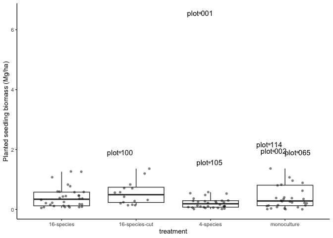

# Estimate biomass
eleanorjackson
2025-07-22

- [Get wood density](#get-wood-density)
- [Estimate biomass](#estimate-biomass)

How much are planted seedlings contributing to aboveground carbon?

``` r
library("tidyverse")
library("here")
library("patchwork")
```

``` r
new_census <- 
  readRDS(here::here("data", "derived", "data_cleaned.rds")) %>% 
  filter(census_id == "full_measurement_03") %>% # most recent census
  mutate(dbh_mm = case_when(plot == "001" ~ dbh_mm /10,
                            .default = dbh_mm)) # I think plot 1 is in cm
```

Survival slightly better in plots with liana removal?

## Get wood density

Wood density data from [Both et
al. (2018)](https://doi.org/10.1111/nph.15444). Using the median across
samples.

``` r
wood_dens_both <- 
  readxl::read_excel(
  here::here(
    "data",
    "raw",
    "traits",
    "Both_tree_functional_traits_subset RV.xlsx"
    ),
  sheet = 4,
  skip = 6,
  na = c("", " ", "NA")
) %>% 
  mutate(genus_species = 
           str_replace(species, "\\.", "_")) %>% 
  select(tree_id, genus_species, forest_type, location, WD_B, WD_NB) %>% 
  group_by(genus_species) %>% 
  summarise(wood_density_both = median(WD_NB, na.rm = TRUE)) 
```

Also from https://doi.org/10.5061/dryad.234 associated with [Chave et
al. (2009)](https://doi.org/10.1111/j.1461-0248.2009.01285.x)

``` r
wood_dens_chave <- 
  readxl::read_excel(
  here::here(
    "data",
    "raw",
    "traits",
    "GlobalWoodDensityDatabase.xls"
    ),
  sheet = 2,
  na = c("", " ", "NA")
) %>% 
  mutate(genus_species = 
           str_replace(Binomial, " ", "_")) %>% 
  group_by(genus_species) %>% 
  summarise(wood_density_chave = 
              median(`Wood density (g/cm^3), oven dry mass/fresh volume`, 
                     na.rm = TRUE)) 
```

Preference for Both data because the measurements were taken in Danum.

``` r
wood_dens_data <- 
  wood_dens_both %>% 
  full_join(wood_dens_chave) %>% 
  mutate(wood_density = ifelse(is.na(wood_density_both),
                               wood_density_chave, 
                               wood_density_both )) %>% 
  select(genus_species, wood_density)
```

``` r
new_census <-
  new_census %>% 
  left_join(wood_dens_data)
```

## Estimate biomass

Using a Weibull function to estimate tree height from DBH, equation (3)
in [Feldpausch *et al.* 2012](https://doi.org/10.5194/bg-9-3381-2012):

predicted height = *a* (1 − exp(−*b* DBH<sup>*c*</sup>))

Parameters *a, b* and *c* from [Feldpausch *et al.*
2012](https://doi.org/10.5194/bg-9-3381-2012) (Asia-specific model).

``` r
Ha <- 57.122    

Hb <- 0.0332    

Hc <- 0.8468    
```

``` r
get_height <- function(dbh, a, b, c) {
  height <-
    a * (1-exp(-b * (dbh)^c))
  
  return(height)
}
```

To estimate biomass, equation (2) in [Feldpausch *et al.*
2012](https://doi.org/10.5194/bg-9-3381-2012):

biomass = *exp*( *a* + *b* *ln*(*wd* DBH<sup>2</sup> *height*))

Units:

- wood density (g/cm^3)
- diameter (cm)
- height (m)
- biomass (kg)

``` r
get_biomass <- function(dbh, height, wd, a, b) {
  biomass <-
    exp( a + b * log(dbh^2 * wd * height) )
  
  return(biomass)
}
```

``` r
Ba <- -2.9205

Bb <- 0.9894    
```

``` r
biomass_data <- 
  new_census %>% 
  filter(survival == 1) %>% 
  mutate(dbh_cm = dbh_mm / 10) %>% 
  mutate(tree_height_m = get_height(dbh = dbh_cm,
                                     a = Ha,
                                     b = Hb,
                                     c = Hc) ) %>% 
  mutate(biomass_kg = get_biomass(dbh = dbh_cm,
                                     height = tree_height_m,
                                     wd = wood_density,
                                     a = Ba,
                                     b = Bb) ) %>% 
  mutate(biomass_Mg = biomass_kg / 1000)
```

``` r
plot_biomass <- 
  biomass_data %>% 
  group_by(treatment, plot) %>% 
  summarise(sum_biomass_Mg = sum(biomass_Mg, na.rm = TRUE)) %>% 
  mutate(sum_biomass_Mg_ha = sum_biomass_Mg / 4) %>%  # plots are 4 ha
  mutate(plot = paste("plot", plot)) 
```

``` r
plot_biomass %>% 
  ungroup() %>% 
  summarise(median = median(sum_biomass_Mg_ha))
```

    # A tibble: 1 × 1
      median
       <dbl>
    1  0.267

``` r
pos <- 
  position_jitter(seed = 123, width = 0.3, height = 0)

plot_biomass %>% 
  ggplot(aes(x = treatment, y = sum_biomass_Mg_ha)) +
  geom_boxplot(outliers = FALSE) +
  geom_point(position = pos,
             alpha = 0.5, shape = 16) +
  geom_text(data = 
              mutate(plot_biomass, 
                     plot = ifelse(sum_biomass_Mg_ha > 1.5, plot, "")),
            aes(label = plot),
            position = pos) +
  labs(y = "Planted seedling biomass (Mg/ha)")
```


