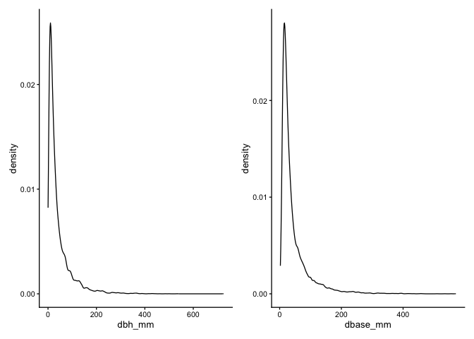

# Estimate total basal area of seedlings from most recent census
eleanorjackson
2025-10-30

``` r
library("tidyverse")
library("here")
library("patchwork")
```

``` r
new_census <- 
  readRDS(here::here("data", "derived", "data_cleaned.rds")) %>% 
  filter(census_id == "full_measurement_03") # most recent census
```

Number of seedlings:

``` r
new_census %>% 
  group_by(survival) %>% 
  summarise(n_seedlings = n_distinct(plant_id))
```

    # A tibble: 2 × 2
      survival n_seedlings
         <dbl>       <int>
    1        0       40504
    2        1       14577

14,577 seedlings alive and 40,504 dead across SBE. Note that seedlings
which were never recorded as alive are not included here (i.e., they
died between planting and the first census, so we have no size data for
them).

``` r
new_census %>% 
  group_by(plot, treatment, survival) %>% 
  summarise(n_seedlings = n_distinct(plant_id),
            .groups = "drop") %>% 
  pivot_wider(names_from = survival, values_from = n_seedlings) %>% 
  rename(n_alive = `1`, n_dead = `0`) %>% 
  mutate(total = n_dead + n_alive) %>% 
  knitr::kable()
```

| plot | treatment      | n_dead | n_alive | total |
|:-----|:---------------|-------:|--------:|------:|
| 001  | 4-species      |    319 |     320 |   639 |
| 002  | monoculture    |    692 |     385 |  1077 |
| 003  | 16-species     |    493 |     199 |   692 |
| 004  | monoculture    |    707 |     481 |  1188 |
| 005  | 16-species-cut |    590 |     186 |   776 |
| 006  | 4-species      |    365 |     166 |   531 |
| 007  | monoculture    |    441 |      57 |   498 |
| 008  | 16-species     |    588 |     156 |   744 |
| 009  | 4-species      |    422 |     147 |   569 |
| 010  | monoculture    |    551 |     128 |   679 |
| 011  | 16-species-cut |    481 |     206 |   687 |
| 012  | 4-species      |    337 |     142 |   479 |
| 013  | monoculture    |    345 |      55 |   400 |
| 014  | 16-species-cut |    646 |     189 |   835 |
| 015  | 16-species     |    439 |     134 |   573 |
| 016  | 4-species      |    382 |     163 |   545 |
| 017  | 16-species     |    442 |     140 |   582 |
| 018  | monoculture    |    575 |     170 |   745 |
| 019  | 4-species      |    357 |     153 |   510 |
| 021  | 16-species     |    302 |     175 |   477 |
| 022  | 16-species-cut |    233 |      87 |   320 |
| 023  | monoculture    |    322 |      23 |   345 |
| 025  | 4-species      |    310 |      50 |   360 |
| 027  | monoculture    |    497 |     136 |   633 |
| 028  | 4-species      |    189 |      88 |   277 |
| 029  | 16-species-cut |    303 |     110 |   413 |
| 030  | 16-species     |    217 |      59 |   276 |
| 031  | 16-species     |    219 |     131 |   350 |
| 032  | 16-species-cut |    302 |     111 |   413 |
| 033  | 16-species     |    380 |     146 |   526 |
| 034  | monoculture    |     58 |       7 |    65 |
| 035  | 4-species      |    208 |      56 |   264 |
| 037  | monoculture    |    400 |     269 |   669 |
| 038  | 16-species     |    348 |     166 |   514 |
| 039  | 4-species      |    259 |     113 |   372 |
| 040  | 16-species-cut |    316 |     142 |   458 |
| 041  | 4-species      |    245 |     157 |   402 |
| 042  | 16-species     |    364 |     181 |   545 |
| 043  | monoculture    |    166 |      41 |   207 |
| 044  | monoculture    |    449 |     259 |   708 |
| 045  | 16-species     |    315 |     128 |   443 |
| 046  | 16-species-cut |    291 |     107 |   398 |
| 048  | 4-species      |    365 |     135 |   500 |
| 049  | 16-species-cut |    283 |     177 |   460 |
| 050  | monoculture    |    285 |      85 |   370 |
| 051  | 16-species     |    388 |     140 |   528 |
| 052  | monoculture    |    128 |      99 |   227 |
| 053  | 16-species     |    316 |      98 |   414 |
| 054  | 4-species      |    257 |     114 |   371 |
| 055  | 16-species     |    315 |     118 |   433 |
| 056  | 4-species      |    206 |      77 |   283 |
| 058  | 4-species      |    334 |     119 |   453 |
| 059  | monoculture    |    437 |     134 |   571 |
| 060  | 4-species      |    288 |     206 |   494 |
| 061  | monoculture    |    363 |     181 |   544 |
| 062  | 16-species     |    426 |     104 |   530 |
| 063  | 16-species     |    290 |     118 |   408 |
| 064  | 16-species-cut |    337 |     154 |   491 |
| 065  | monoculture    |    509 |      50 |   559 |
| 066  | 16-species     |    435 |      98 |   533 |
| 067  | 4-species      |    565 |     145 |   710 |
| 069  | monoculture    |    507 |     196 |   703 |
| 070  | monoculture    |    450 |     253 |   703 |
| 071  | 4-species      |    357 |     176 |   533 |
| 072  | 16-species     |    360 |     128 |   488 |
| 073  | 16-species     |    344 |     104 |   448 |
| 074  | 4-species      |    249 |      69 |   318 |
| 075  | 16-species-cut |    338 |     224 |   562 |
| 076  | 16-species     |    306 |      91 |   397 |
| 077  | 4-species      |    491 |     201 |   692 |
| 078  | monoculture    |    246 |      83 |   329 |
| 079  | 4-species      |    316 |      93 |   409 |
| 081  | monoculture    |    473 |     113 |   586 |
| 082  | 4-species      |    335 |     108 |   443 |
| 083  | 16-species     |    292 |      92 |   384 |
| 084  | monoculture    |    402 |     203 |   605 |
| 085  | 16-species-cut |    440 |     186 |   626 |
| 086  | monoculture    |    146 |      47 |   193 |
| 087  | 16-species     |    396 |     104 |   500 |
| 088  | 4-species      |    315 |     139 |   454 |
| 090  | monoculture    |    307 |      18 |   325 |
| 091  | 16-species-cut |    409 |     125 |   534 |
| 092  | 16-species     |    491 |     142 |   633 |
| 093  | 4-species      |    493 |     127 |   620 |
| 094  | 16-species     |    337 |     109 |   446 |
| 096  | 16-species     |    374 |      88 |   462 |
| 097  | 4-species      |    387 |     130 |   517 |
| 098  | monoculture    |    437 |     132 |   569 |
| 099  | 16-species     |    423 |     162 |   585 |
| 100  | 16-species-cut |    411 |     154 |   565 |
| 101  | monoculture    |    446 |     112 |   558 |
| 102  | 4-species      |    378 |      82 |   460 |
| 103  | 16-species     |    325 |      61 |   386 |
| 104  | monoculture    |    404 |     187 |   591 |
| 105  | 4-species      |    448 |     199 |   647 |
| 106  | 16-species     |    348 |      96 |   444 |
| 107  | monoculture    |    252 |      73 |   325 |
| 109  | 4-species      |    369 |      71 |   440 |
| 110  | monoculture    |    378 |      83 |   461 |
| 111  | 16-species-cut |    267 |     112 |   379 |
| 112  | 4-species      |    303 |     135 |   438 |
| 113  | 16-species     |    340 |      66 |   406 |
| 114  | monoculture    |    374 |      32 |   406 |
| 115  | 16-species-cut |    328 |     108 |   436 |
| 116  | 4-species      |    325 |     106 |   431 |
| 118  | monoculture    |    224 |      68 |   292 |
| 119  | 4-species      |    276 |      56 |   332 |
| 120  | 16-species     |    350 |     112 |   462 |
| 121  | monoculture    |    435 |     123 |   558 |
| 122  | 4-species      |    242 |     108 |   350 |
| 123  | 16-species     |    228 |      71 |   299 |
| 124  | 16-species     |    240 |      48 |   288 |

Mean and max seedling sizes:

``` r
new_census %>% 
  filter(survival == 1) %>% 
  summarise(max_dbh = max(dbh_mm, na.rm = TRUE),
            mean_dbh = mean(dbh_mm, na.rm = TRUE),
            max_basal = max(dbase_mm, na.rm = TRUE),
            mean_basal = mean(dbase_mm, na.rm = TRUE)) %>% 
  knitr::kable()
```

| max_dbh | mean_dbh | max_basal | mean_basal |
|--------:|---------:|----------:|-----------:|
|     725 | 41.21933 |       571 |   44.42506 |

Distribution of seedling sizes:

``` r
new_census %>% 
  filter(survival == 1) %>% 
  ggplot(aes(x = dbh_mm)) +
  geom_density() +
  
  new_census %>% 
  filter(survival == 1) %>% 
  ggplot(aes(x = dbase_mm)) +
  geom_density()
```



``` r
new_census %>% 
  filter(survival == 1) %>% # only alive seedlings
  summarise(n_distinct(plant_id))
```

    # A tibble: 1 × 1
      `n_distinct(plant_id)`
                       <int>
    1                  14577

Calculate basal area for each seedling using basal diameter measurements

``` r
seedling_ba <-
  new_census %>% 
  filter(survival == 1) %>% # only alive seedlings
  mutate(dbase_m = dbase_mm / 1000) %>% 
  mutate(basal_area = pi * (dbase_m/2)^2)
```

Summing basal area per treatment and calculating per ha

``` r
seedling_ba %>% 
  group_by(treatment) %>% 
  summarise(sum_basal_area = sum(basal_area, na.rm = TRUE),
            n_plots = n_distinct(plot)) %>% 
  mutate(basal_area_per_ha = (sum_basal_area / n_plots)/4 ) %>% # 1 plot is 4ha
  knitr::kable()
```

| treatment      | sum_basal_area | n_plots | basal_area_per_ha |
|:---------------|---------------:|--------:|------------------:|
| 16-species     |       13.50826 |      32 |         0.1055333 |
| 16-species-cut |        9.22940 |      16 |         0.1442094 |
| 4-species      |       12.01510 |      32 |         0.0938680 |
| monoculture    |       16.47040 |      32 |         0.1286750 |

``` r
seedling_ba %>% 
  mutate(treatment_simplified = 
           case_when(treatment == "16-species-cut" ~ "lianas+planting",
                     .default = "planting")) %>% 
  group_by(treatment_simplified) %>% 
  summarise(sum_basal_area = sum(basal_area, na.rm = TRUE),
            n_plots = n_distinct(plot)) %>% 
  mutate(basal_area_per_ha = (sum_basal_area / n_plots)/4 ) %>% # 1 plot is 4ha 
  knitr::kable()
```

| treatment_simplified | sum_basal_area | n_plots | basal_area_per_ha |
|:---------------------|---------------:|--------:|------------------:|
| lianas+planting      |        9.22940 |      16 |         0.1442094 |
| planting             |       41.99376 |      96 |         0.1093588 |
