# Summarise data
eleanorjackson
2025-11-17

- [Size in the 2023-2024 census](#size-in-the-2023-2024-census)
  - [By treatment](#by-treatment)
  - [monoculture vs mixture](#monoculture-vs-mixture)
  - [Liana cutting](#liana-cutting)
- [Growth](#growth)
  - [By treatment](#by-treatment-1)
  - [monoculture vs mixture](#monoculture-vs-mixture-1)
  - [Liana cutting](#liana-cutting-1)
- [Survival](#survival)
  - [By treatment](#by-treatment-2)
  - [monoculture vs mixture](#monoculture-vs-mixture-2)
  - [Liana cutting](#liana-cutting-2)

``` r
library("tidyverse")
library("here")
library("patchwork")
```

``` r
data <- 
  readRDS(here::here("data", "derived", "data_cleaned.rds")) 
```

``` r
glimpse(data)
```

    Rows: 183,393
    Columns: 19
    $ plant_id      <fct> 001_01_001_O, 001_01_001_O, 001_01_001_O, 001_01_002_N, …
    $ treatment     <fct> 4-species, 4-species, 4-species, 4-species, 4-species, 4…
    $ species_mix   <fct> 4-species(13), 4-species(13), 4-species(13), 4-species(1…
    $ plot          <fct> 001, 001, 001, 001, 001, 001, 001, 001, 001, 001, 001, 0…
    $ line          <fct> 01, 01, 01, 01, 01, 01, 01, 01, 01, 01, 01, 01, 01, 01, …
    $ position      <fct> 001, 001, 001, 002, 002, 002, 002, 002, 003, 003, 003, 0…
    $ cohort        <fct> 1, 1, 1, 2, 2, 1, 1, 1, 1, 1, 1, 1, 1, 1, 1, 1, 1, 2, 2,…
    $ genus         <chr> "Dryobalanops", "Dryobalanops", "Dryobalanops", "Shorea"…
    $ species       <chr> "lanceolata", "lanceolata", "lanceolata", "macrophylla",…
    $ genus_species <fct> Dryobalanops_lanceolata, Dryobalanops_lanceolata, Dryoba…
    $ planting_date <date> 2002-07-18, 2002-07-18, 2002-07-18, NA, NA, 2002-07-18,…
    $ first_survey  <date> 2003-11-18, 2003-11-18, 2003-11-18, 2011-11-25, 2011-11…
    $ census_no     <fct> 01, 08, 26, 08, 26, 01, 08, 26, 01, 08, 26, 01, 08, 26, …
    $ census_id     <fct> full_measurement_01, full_measurement_02, full_measureme…
    $ survey_date   <date> 2003-11-18, 2011-11-25, 2023-09-12, 2011-11-25, 2023-09…
    $ survival      <dbl> 1, 1, 1, 1, 1, 1, 1, 1, 1, 1, 1, 1, 1, 1, 1, 1, 1, 1, 0,…
    $ height_apex   <dbl> 95.0, 915.0, NA, 452.0, NA, 95.0, 1403.0, NA, 146.0, 149…
    $ dbh_mm        <dbl> NaN, 64.00, 11.60, 33.50, 210.00, NaN, 111.00, 191.00, 2…
    $ dbase_mm      <dbl> 7.865, 82.000, 12.300, 48.000, 250.000, 9.080, 141.000, …

# Size in the 2023-2024 census

## By treatment

``` r
data %>% 
  filter(census_id == "full_measurement_03") %>% 
  ggplot(aes(x = treatment, y = dbase_mm)) +
  see::geom_violinhalf(fill = "grey", 
                       colour = "grey", 
                       alpha = 0.8) +
  geom_boxplot(position = position_nudge(-0.25),
               width = 0.25,
               outlier.alpha = 0.5, 
               outlier.shape = 16) 
```

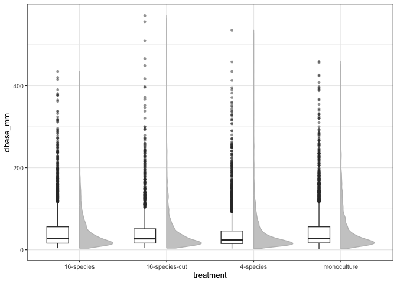

``` r
data %>% 
  filter(census_id == "full_measurement_03") %>% 
  ggplot(aes(x = treatment, y = dbase_mm)) +
  geom_boxplot(outlier.alpha = 0.5, outlier.shape = 16) +
  facet_wrap(~genus_species, scales = "free_y") +
  theme(axis.text.x = element_text(angle = 90))
```

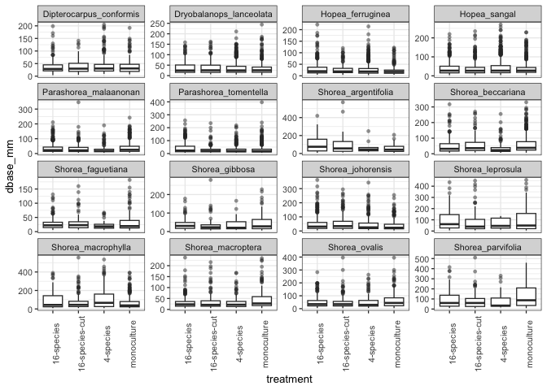

## monoculture vs mixture

``` r
data %>% 
  filter(census_id == "full_measurement_03") %>% 
  mutate(mix = ifelse(treatment == "monoculture", 
                      "monoculture", "mixture")) %>% 
  ggplot(aes(x = mix, y = dbase_mm)) +
  see::geom_violinhalf(fill = "grey", 
                       colour = "grey", 
                       alpha = 0.8) +
  geom_boxplot(position = position_nudge(-0.25),
               width = 0.25,
               outlier.alpha = 0.5, 
               outlier.shape = 16) 
```

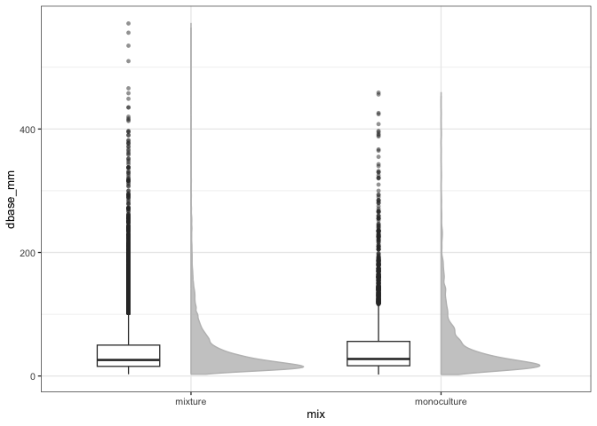

``` r
data %>% 
  filter(census_id == "full_measurement_03") %>% 
  mutate(mix = ifelse(treatment == "monoculture", 
                      "monoculture", "mixture")) %>% 
  ggplot(aes(x = mix, y = dbase_mm)) +
  see::geom_violinhalf(fill = "grey", 
                       colour = "grey", 
                       alpha = 0.8) +
  geom_boxplot(position = position_nudge(-0.25),
               width = 0.25,
               outlier.alpha = 0.5, 
               outlier.shape = 16) +
  facet_wrap(~genus_species, scales = "free_y") 
```

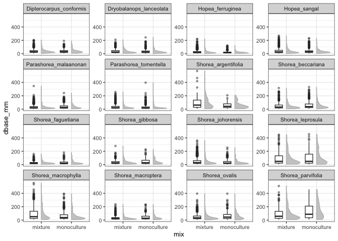

## Liana cutting

``` r
data %>% 
  filter(census_id == "full_measurement_03") %>% 
  mutate(lianas = ifelse(treatment == "16-species-cut", 
                      "cut", "not")) %>% 
  ggplot(aes(x = lianas, y = dbase_mm)) +
  see::geom_violinhalf(fill = "grey", 
                       colour = "grey", 
                       alpha = 0.8) +
  geom_boxplot(position = position_nudge(-0.25),
               width = 0.25,
               outlier.alpha = 0.5, 
               outlier.shape = 16) 
```

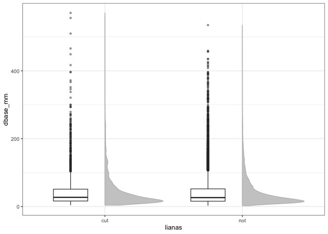

``` r
data %>% 
  filter(census_id == "full_measurement_03") %>% 
  mutate(lianas = ifelse(treatment == "16-species-cut", 
                      "cut", "not")) %>%
  ggplot(aes(x = lianas, y = dbase_mm)) +
  see::geom_violinhalf(fill = "grey", 
                       colour = "grey", 
                       alpha = 0.8) +
  geom_boxplot(position = position_nudge(-0.25),
               width = 0.25,
               outlier.alpha = 0.5, 
               outlier.shape = 16) +
  facet_wrap(~genus_species, scales = "free_y") 
```

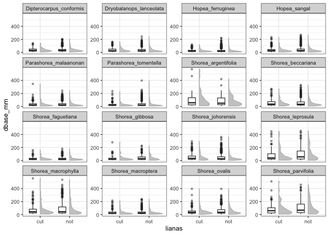

# Growth

**Percentage increase in basal diameter relative to initial size**

``` r
data_growth <- 
  data %>% 
  filter(str_detect(census_id, "full_measurement")) %>% 
  select(!survey_date:dbh_mm & !census_no) %>% 
  pivot_wider(names_from = census_id,
              values_from = dbase_mm) %>% 
  mutate(change = full_measurement_03 - full_measurement_01) %>% 
  mutate(rgr = (change / full_measurement_01) *100)
```

## By treatment

``` r
data_growth %>% 
  ggplot(aes(x = treatment, y = rgr)) +
  see::geom_violinhalf(fill = "grey", 
                       colour = "grey", 
                       alpha = 0.8) +
  geom_boxplot(position = position_nudge(-0.25),
               width = 0.25,
               outlier.alpha = 0.5, 
               outlier.shape = 16) +
  ylab("Relative growth (%)")
```


``` r
data_growth %>% 
  ggplot(aes(x = treatment, y = rgr)) +
  geom_boxplot(outlier.alpha = 0.5, outlier.shape = 16) +
  facet_wrap(~genus_species, scales = "free_y") +
  theme(axis.text.x = element_text(angle = 90)) +
  ylab("Relative growth (%)")
```

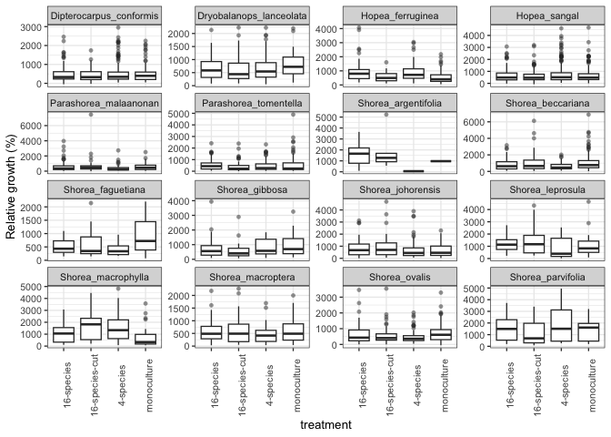

## monoculture vs mixture

``` r
data_growth %>% 
  mutate(mix = ifelse(treatment == "monoculture", 
                      "monoculture", "mixture")) %>% 
  ggplot(aes(x = mix, y = rgr)) +
  see::geom_violinhalf(fill = "grey", 
                       colour = "grey", 
                       alpha = 0.8) +
  geom_boxplot(position = position_nudge(-0.25),
               width = 0.25,
               outlier.alpha = 0.5, 
               outlier.shape = 16) +
  ylab("Relative growth (%)")
```

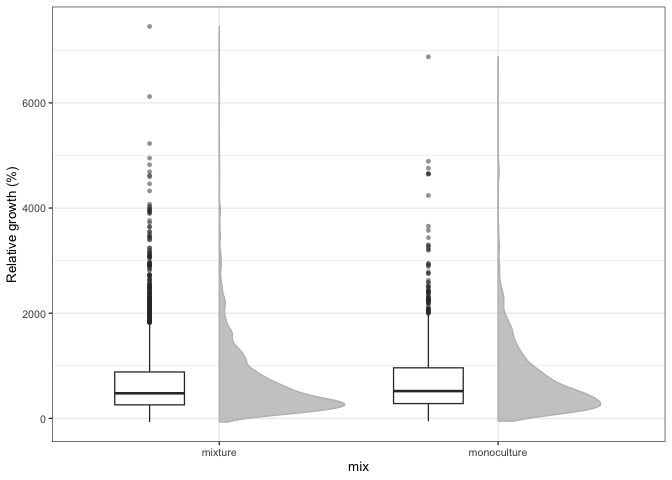

``` r
data_growth %>% 
  mutate(mix = ifelse(treatment == "monoculture", 
                      "monoculture", "mixture")) %>% 
  ggplot(aes(x = mix, y = rgr)) +
  see::geom_violinhalf(fill = "grey", 
                       colour = "grey", 
                       alpha = 0.8) +
  geom_boxplot(position = position_nudge(-0.25),
               width = 0.25,
               outlier.alpha = 0.5, 
               outlier.shape = 16) +
  facet_wrap(~genus_species, scales = "free_y") +
  ylab("Relative growth (%)")
```

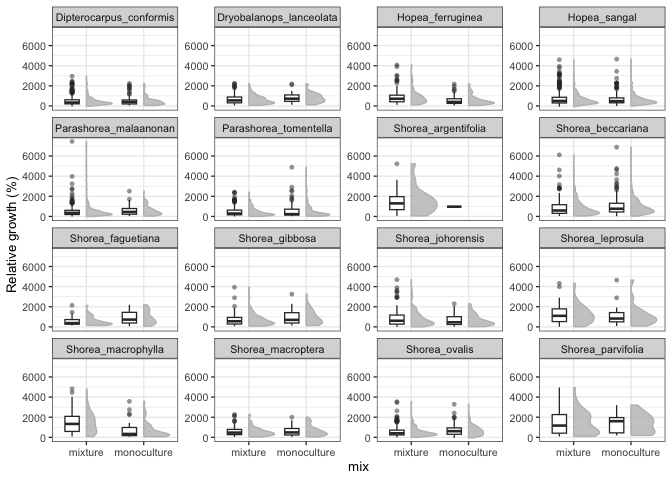

## Liana cutting

``` r
data_growth %>% 
  mutate(lianas = ifelse(treatment == "16-species-cut", 
                      "cut", "not")) %>% 
  ggplot(aes(x = lianas, y = rgr)) +
  see::geom_violinhalf(fill = "grey", 
                       colour = "grey", 
                       alpha = 0.8) +
  geom_boxplot(position = position_nudge(-0.25),
               width = 0.25,
               outlier.alpha = 0.5, 
               outlier.shape = 16) +
  ylab("Relative growth (%)")
```

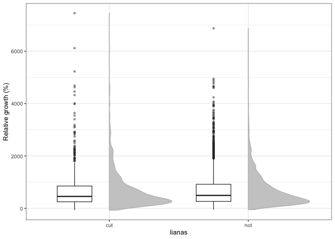

``` r
data_growth %>% 
  mutate(lianas = ifelse(treatment == "16-species-cut", 
                      "cut", "not")) %>%
  ggplot(aes(x = lianas, y = rgr)) +
  see::geom_violinhalf(fill = "grey", 
                       colour = "grey", 
                       alpha = 0.8) +
  geom_boxplot(position = position_nudge(-0.25),
               width = 0.25,
               outlier.alpha = 0.5, 
               outlier.shape = 16) +
  facet_wrap(~genus_species, scales = "free_y") +
  ylab("Relative growth (%)")
```

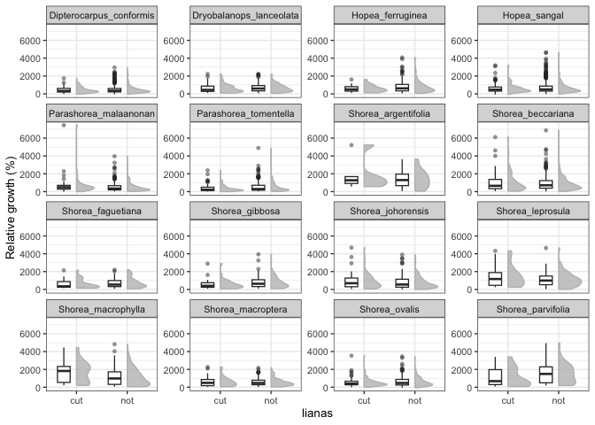

# Survival

## By treatment

``` r
data %>% 
  filter(census_id == "full_measurement_03") %>% 
  ggplot(aes(x = treatment, 
             group = survival,
             fill = survival)) +
  geom_bar(position = "fill")
```

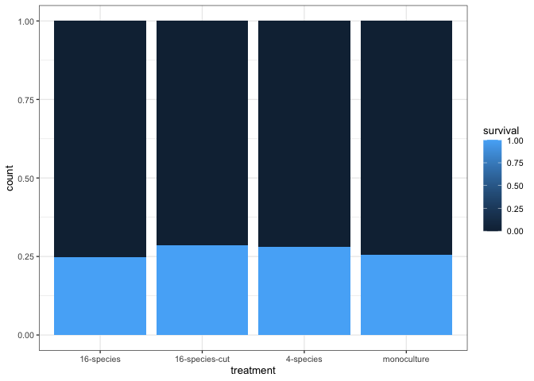

``` r
data %>% 
  filter(census_id == "full_measurement_03") %>% 
  ggplot(aes(x = treatment,
             group = survival,
             fill = survival)) +
  geom_bar(position = "fill") +
  facet_wrap(~genus_species, scales = "free_y") +
  theme(axis.text.x = element_text(angle = 90))
```

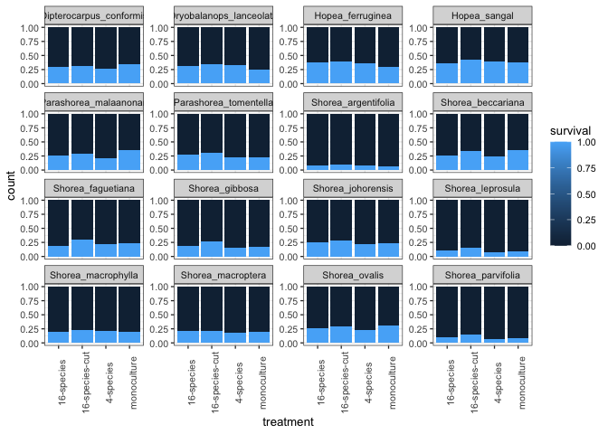

## monoculture vs mixture

``` r
data %>% 
  filter(census_id == "full_measurement_03") %>% 
  mutate(mix = ifelse(treatment == "monoculture", 
                      "monoculture", "mixture")) %>% 
  ggplot(aes(x = mix, 
             group = survival,
             fill = survival)) +
  geom_bar(position = "fill")
```

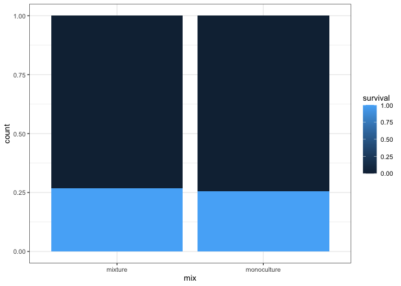

``` r
data %>% 
  filter(census_id == "full_measurement_03") %>% 
  mutate(mix = ifelse(treatment == "monoculture", 
                      "monoculture", "mixture")) %>% 
  ggplot(aes(x = mix, 
             group = survival,
             fill = survival)) +
  geom_bar(position = "fill") +
  facet_wrap(~genus_species, scales = "free_y") 
```

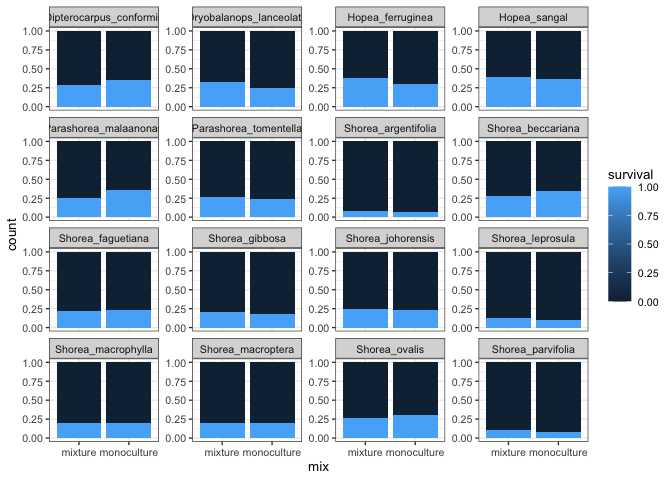

## Liana cutting

``` r
data %>% 
  filter(census_id == "full_measurement_03") %>% 
  mutate(lianas = ifelse(treatment == "16-species-cut", 
                      "cut", "not")) %>% 
  ggplot(aes(x = lianas, 
             group = survival,
             fill = survival)) +
  geom_bar(position = "fill") 
```

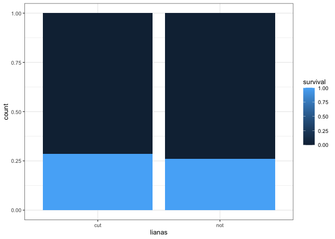

``` r
data %>% 
  filter(census_id == "full_measurement_03") %>% 
  mutate(lianas = ifelse(treatment == "16-species-cut", 
                      "cut", "not")) %>%
  ggplot(aes(x = lianas, 
             group = survival,
             fill = survival)) +
  geom_bar(position = "fill") +
  facet_wrap(~genus_species, scales = "free_y") 
```

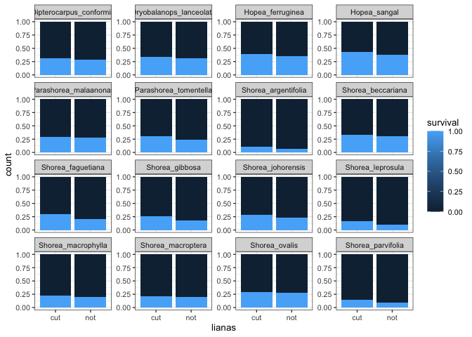
