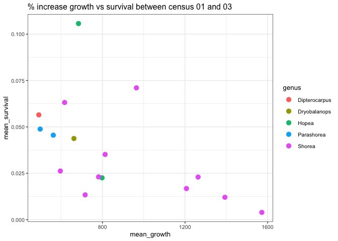
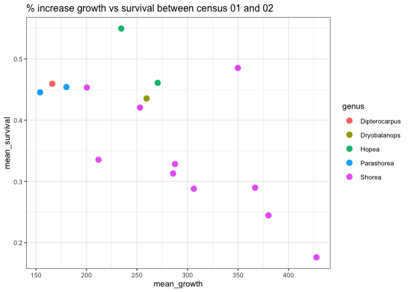
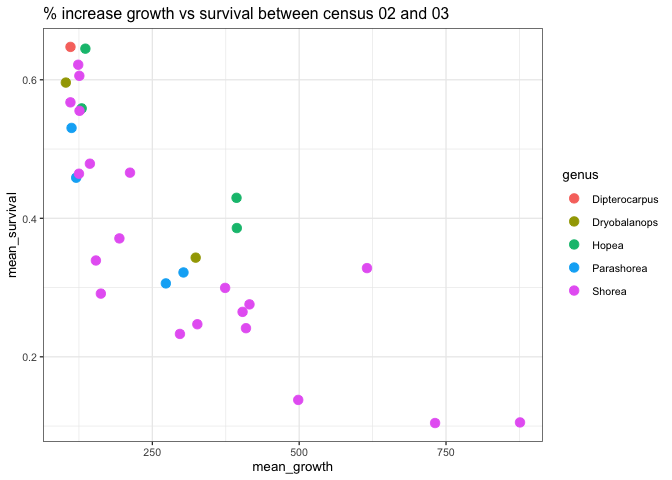
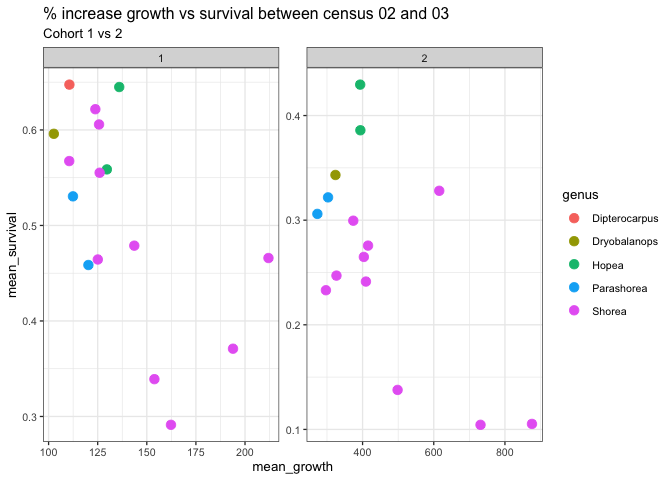
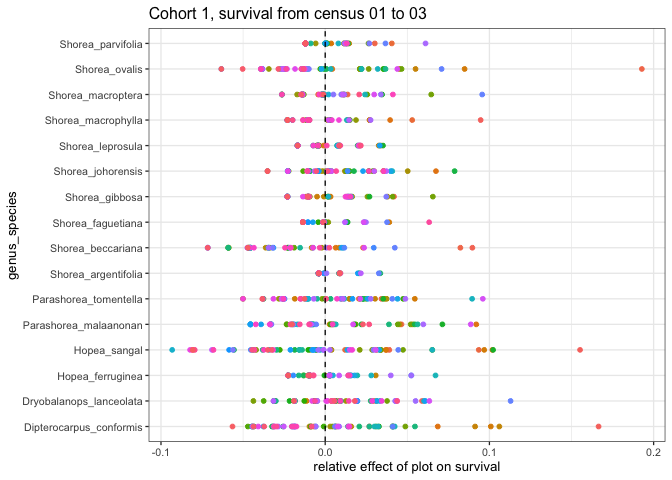
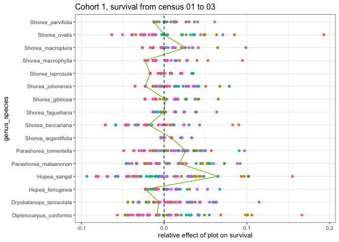
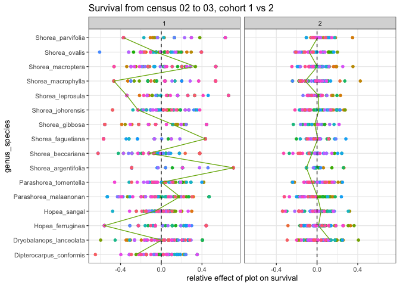
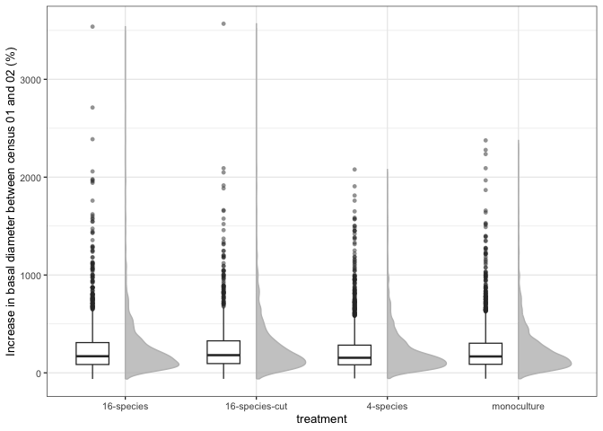

# The second decade of the Sabah biodiversity experiment
eleanorjackson
2025-11-25

- [Calculate growth](#calculate-growth)
- [Calculate survival](#calculate-survival)
- [1) Life history trade off?](#1-life-history-trade-off)
- [2) Spatial variation](#2-spatial-variation)
- [3) Complementary species
  interactions?](#3-complementary-species-interactions)

Have any results changed since [Tuck et
al. (2016)](http://dx.doi.org/10.1098/rspb.2016.1451)?

1)  life-history trade-off between survival and growth and consistent
    differences among species in their positions along this trade-off
    during the two survey periods (figure 1).
2)  not only did species differ on average, but they also responded
    differently to spatial variation, consistent with specialization on
    different conditions (figure 2).
3)  no evidence of complementary species interactions in mixtures yet
    (figure 3).
4)  the most extreme high and low seedling densities are found in
    particular monocultures (figure 4).

> “The state of the planted seedling stock also impacts survival and
> growth, so it will be interesting to compare the mortality reported
> here with the second cohort, which came from different stock.”

5)  Any cohort effects?

``` r
library("tidyverse")
library("here")
library("patchwork")
```

``` r
data <- 
  readRDS(here::here("data", "derived", "data_cleaned.rds")) 
```

## Calculate growth

Percentage increase in basal diameter relative to initial size.

Calculating for each interval, i.e. 

- from census 1 to census 2 (first ~10 years)
- from census 2 to census 3 (second ~10 years)
- from census 1 to census 3 (the full 20 years)

``` r
data_growth <- 
  data %>% 
  filter(str_detect(census_id, "full_measurement")) %>% 
  select(!survey_date:dbh_mm & !census_no) %>% 
  pivot_wider(names_from = census_id,
              values_from = dbase_mm) %>% 
  mutate(change_01_02 = full_measurement_02 - full_measurement_01,
         change_02_03 = full_measurement_03 - full_measurement_02,
         change_01_03 = full_measurement_03 - full_measurement_01) %>% 
  mutate(growth_01_02 = (change_01_02 / full_measurement_01) *100,
         growth_02_03 = (change_02_03 / full_measurement_02) *100,
         growth_01_03 = (change_01_03 / full_measurement_01) *100) %>%
  select(- c(starts_with("full_measurement_"),
             starts_with("change_")))
```

## Calculate survival

- from planting to census 1 (first ~2 years)
- from census 1 to census 2 (first ~10 years)
- from census 2 to census 3 (second ~10 years)
- from census 1 to census 3 (the full 20 years)

``` r
data_gro_surv <- 
  data %>% 
  filter(str_detect(census_id, "full_measurement")) %>% 
  select(plant_id, census_id, survival) %>% 
  pivot_wider(names_from = census_id,
              values_from = survival) %>% 
  mutate(survival_00_01 = full_measurement_01,
         survival_01_02 = ifelse(full_measurement_01 == 0, NA, 
                                 full_measurement_02),
         survival_02_03 = ifelse(full_measurement_02 == 0, NA, 
                                 full_measurement_03),
         survival_01_03 = ifelse(is.na(full_measurement_01), NA, 
                                 full_measurement_03),) %>% 
  select(- starts_with("full_measurement_")) %>% 
  left_join(data_growth)
```

``` r
glimpse(data_gro_surv)
```

    Rows: 174,254
    Columns: 19
    $ plant_id       <fct> 001_01_001_O, 001_01_002_N, 001_01_002_O, 001_01_003_O,…
    $ survival_00_01 <dbl> 1, NA, 1, 1, 1, 0, 0, 0, 0, 0, 1, NA, 0, 0, 0, NA, 0, N…
    $ survival_01_02 <dbl> 1, NA, 1, 1, 1, NA, NA, NA, NA, NA, 1, NA, NA, NA, NA, …
    $ survival_02_03 <dbl> 1, 1, 1, 1, 1, NA, NA, NA, NA, NA, 1, 0, NA, NA, NA, 1,…
    $ survival_01_03 <dbl> 1, NA, 1, 1, 1, 0, 0, 0, 0, 0, 1, NA, 0, 0, 0, NA, 0, N…
    $ treatment      <fct> 4-species, 4-species, 4-species, 4-species, 4-species, …
    $ species_mix    <fct> 4-species(13), 4-species(13), 4-species(13), 4-species(…
    $ plot           <fct> 001, 001, 001, 001, 001, 001, 001, 001, 001, 001, 001, …
    $ line           <fct> 01, 01, 01, 01, 01, 01, 01, 01, 01, 01, 01, 01, 01, 01,…
    $ position       <fct> 001, 002, 002, 003, 004, 005, 006, 007, 008, 009, 010, …
    $ cohort         <fct> 1, 2, 1, 1, 1, 1, 1, 1, 1, 1, 1, 2, 1, 1, 1, 2, 1, 2, 1…
    $ genus          <chr> "Dryobalanops", "Shorea", "Dryobalanops", "Shorea", "Sh…
    $ species        <chr> "lanceolata", "macrophylla", "lanceolata", "macrophylla…
    $ genus_species  <fct> Dryobalanops_lanceolata, Shorea_macrophylla, Dryobalano…
    $ planting_date  <date> 2002-07-18, NA, 2002-07-18, 2002-07-18, 2002-07-18, 20…
    $ first_survey   <date> 2003-11-18, 2011-11-25, 2003-11-18, 2003-11-18, 2003-1…
    $ growth_01_02   <dbl> 942.5938, NA, 1452.8634, 1570.1607, 838.2968, NA, NA, N…
    $ growth_02_03   <dbl> -85.00000, 420.83333, 49.64539, NaN, 182.60870, NaN, Na…
    $ growth_01_03   <dbl> 56.38907, NA, 2223.78855, NA, 2551.70831, NA, NA, NA, N…

# 1) Life history trade off?

``` r
data_gro_surv %>% 
  group_by(genus, genus_species) %>% 
  summarise(
    mean_survival = mean(survival_01_03, na.rm=TRUE),
    mean_growth = mean(growth_01_03, na.rm=TRUE)) %>% 
  ggplot(aes(
    y = mean_survival,
    x = mean_growth,
    colour = genus,
    group = genus_species)) +
  geom_point(size = 3) +
  ggtitle("% increase growth vs survival between census 01 and 03")
```



``` r
data_gro_surv %>% 
  group_by(genus, genus_species, cohort) %>% 
  summarise(
    mean_survival = mean(survival_01_02, na.rm=TRUE),
    mean_growth = mean(growth_01_02, na.rm=TRUE)) %>% 
  ggplot(aes(
    y = mean_survival,
    x = mean_growth,
    colour = genus,
    group = genus_species)) +
  geom_point(size = 3) +
  ggtitle("% increase growth vs survival between census 01 and 02") 
```



``` r
data_gro_surv %>% 
  group_by(genus, genus_species, cohort) %>% 
  summarise(
    mean_survival = mean(survival_02_03, na.rm=TRUE),
    mean_growth = mean(growth_02_03, na.rm=TRUE)) %>% 
  ggplot(aes(
    y = mean_survival,
    x = mean_growth,
    colour = genus,
    group = genus_species)) +
  geom_point(size = 3) +
  ggtitle("% increase growth vs survival between census 02 and 03") +
  labs(subtitle = "Cohort 1 vs 2") +
  facet_wrap(~cohort, scales = "free")
```



``` r
data_gro_surv %>% 
  group_by(genus, genus_species, cohort) %>% 
  summarise(
    mean_survival_01 = mean(survival_00_01, na.rm=TRUE),
    mean_survival_12 = mean(survival_01_02, na.rm=TRUE)) %>% 
  ggplot(aes(
    y = mean_survival_01,
    x = mean_survival_12,
    colour = genus,
    group = genus_species)) +
  geom_point(size = 3) +
  labs(y = "Survival from planting to census 01",
       x = "Survival from census 01 to census 02") +
  
  data_gro_surv %>% 
  group_by(genus, genus_species, cohort) %>% 
  summarise(
    mean_survival_23 = mean(survival_02_03, na.rm=TRUE),
    mean_survival_12 = mean(survival_01_02, na.rm=TRUE)) %>% 
  ggplot(aes(
    y = mean_survival_12,
    x = mean_survival_23,
    colour = genus,
    group = genus_species)) +
  geom_point(size = 3) +
  labs(y = "Survival from census 01 to census 02",
       x = "Survival from census 02 to census 03") +
  plot_layout(guides = "collect") &
  theme(legend.position = "top")
```



# 2) Spatial variation

> Spatial variation in species survival was quantified using predictions
> from the random effect—a plot-level deviation from the average
> survival for each species.

First calculate average survival per species

``` r
sp_surv_13 <- 
  data_gro_surv %>% 
  group_by(genus_species) %>% 
  summarise(
    n = n_distinct(plant_id),
    mean_survival_sp = mean(survival_01_03, na.rm = TRUE)) %>%
  filter(n > 10) %>% 
  select(-n)
```

Then plot level deviation

``` r
spatial_surv_13 <- 
  data_gro_surv %>% 
  group_by(genus_species, plot) %>% 
  summarise(
    n = n_distinct(plant_id),
    mean_survival_plot = mean(survival_01_03, na.rm = TRUE)) %>%
  filter(n > 10) %>% 
  select(-n) %>% 
  left_join(sp_surv_13) %>% 
  mutate(plot_effect = mean_survival_plot - mean_survival_sp)
```

Repeat for survival between census 2 and 3, so we can look at cohort 2.

``` r
sp_surv_23 <- 
  data_gro_surv %>% 
  group_by(genus_species, cohort) %>% 
  summarise(
    n = n_distinct(plant_id),
    mean_survival_sp = mean(survival_02_03, na.rm = TRUE)) %>%
  filter(n > 10) %>% 
  select(-n)
```

``` r
spatial_surv_23 <- 
  data_gro_surv %>% 
  group_by(genus_species, plot, cohort) %>% 
  summarise(
    n = n_distinct(plant_id),
    mean_survival_plot = mean(survival_02_03, na.rm = TRUE)) %>%
  filter(n > 10) %>% 
  select(-n) %>% 
  left_join(sp_surv_23) %>% 
  mutate(plot_effect = mean_survival_plot - mean_survival_sp)
```

``` r
spatial_surv_13 %>% 
  ggplot(aes(x = plot_effect,
             y = genus_species,
             colour = plot)) +
  geom_point() +
  theme(legend.position = "none") +
  geom_vline(xintercept = 0, linetype = 2) +
  labs(x = "relative effect of plot on survival",
       title = "Cohort 1, survival from census 01 to 03")
```



Points represent the average survival of a species in a plot relative to
the overall average of that species — so positive values show plots with
better-than-average survival.

``` r
spatial_surv_23 %>% 
  ggplot(aes(x = plot_effect,
             y = genus_species,
             colour = plot)) +
  geom_point() +
  theme(legend.position = "none") +
  geom_vline(xintercept = 0, linetype = 2) +
  labs(x = "relative effect of plot on survival",
       title = "Survival from census 02 to 03, cohort 1 vs 2") +
  facet_wrap(~cohort)
```



# 3) Complementary species interactions?

``` r
data_gro_surv %>% 
  ggplot(aes(x = treatment, y = growth_01_03)) +
  see::geom_violinhalf(fill = "grey", 
                       colour = "grey", 
                       alpha = 0.8) +
  geom_boxplot(position = position_nudge(-0.25),
               width = 0.25,
               outlier.alpha = 0.5, 
               outlier.shape = 16) +
  ylab("Increase in basal diameter between census 01 and 03 (%)")
```



``` r
data_gro_surv %>% 
  ggplot(aes(x = treatment, y = growth_01_02)) +
  see::geom_violinhalf(fill = "grey", 
                       colour = "grey", 
                       alpha = 0.8) +
  geom_boxplot(position = position_nudge(-0.25),
               width = 0.25,
               outlier.alpha = 0.5, 
               outlier.shape = 16) +
  ylab("Increase in basal diameter between census 01 and 02 (%)")
```


``` r
data_gro_surv %>% 
  ggplot(aes(x = treatment, y = growth_02_03)) +
  see::geom_violinhalf(fill = "grey", 
                       colour = "grey", 
                       alpha = 0.8) +
  geom_boxplot(position = position_nudge(-0.25),
               width = 0.25,
               outlier.alpha = 0.5, 
               outlier.shape = 16) +
  ylab("Increase in basal diameter between census 02 and 03 (%)")
```


