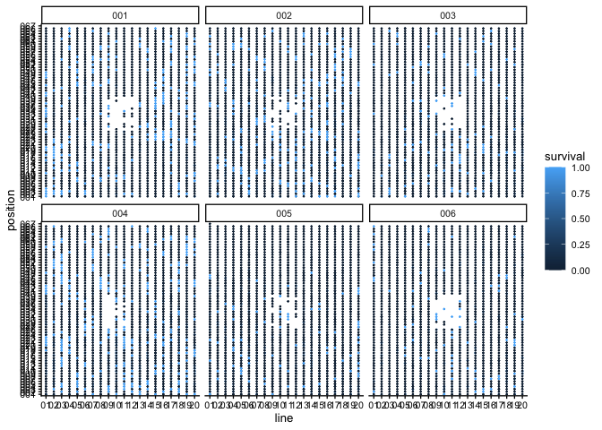
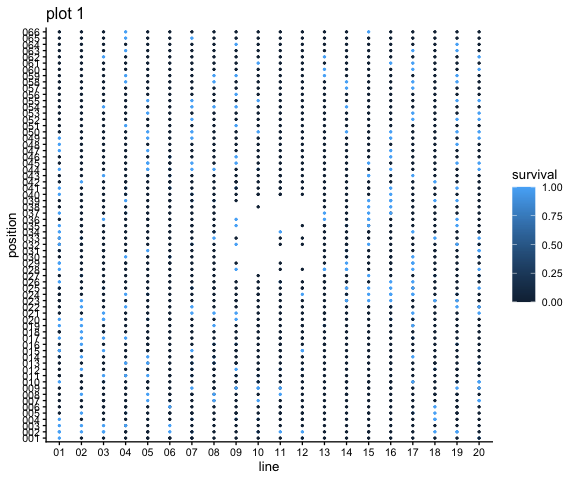

# Mapping the SBE seedlings
eleanorjackson
2025-12-18

``` r
library("tidyverse")
library("here")
library("patchwork")
```

> Andy explained the plan to compare seedling height with local canopy
> height from LiDAR, which I think is a great idea! It would be great if
> we could do this at a spatial scale finer than the 4-ha plots, because
> there are lots of gaps and spaces in between trees where the seedlings
> may grow faster / differently. Can you tell which planting line the
> seedlings are in, and roughly how far along it they are? Do you think
> we could work at a 10x10 m or 20x20 m scale for this analysis?

We know the planting line for each seedling and it’s position along the
line. There are 3 m between each planting position and 10 m between each
line.

``` r
data <- 
  readRDS(here::here("data", "derived", "data_cleaned.rds")) %>% 
  filter(census_id == "full_measurement_03")
```

``` r
data %>% 
  filter(plot %in% c("001", "002", "003", "004", "005", "006")) %>% 
  ggplot(aes(x = line, y = position, colour = survival)) +
  geom_point(size = 0.25) +
  facet_wrap(~plot)
```



``` r
data %>% 
  filter(plot == "001") %>% 
  ggplot(aes(x = line, y = position, colour = survival)) +
  geom_point(size = 0.5) +
  ggtitle("plot 1")
```


