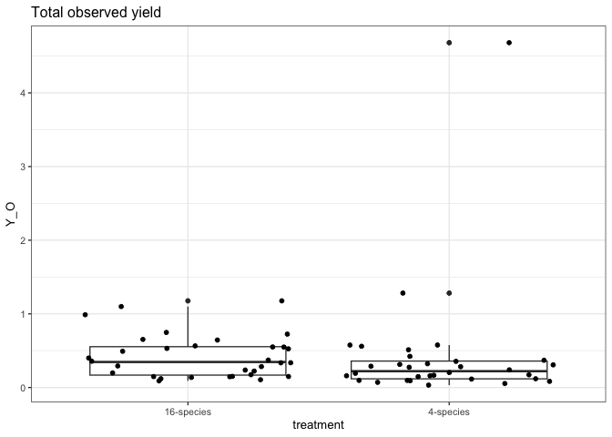
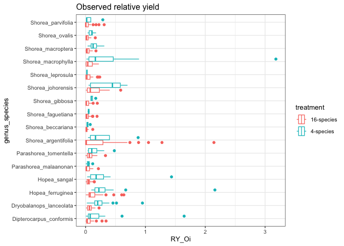
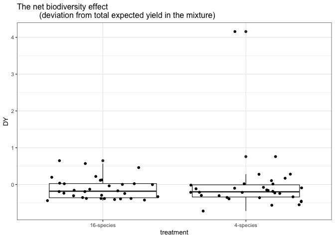
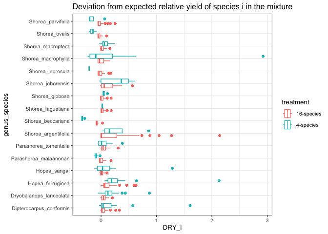
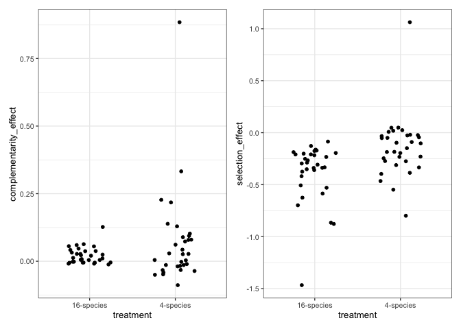

# Additive partition of biodiversity effects
eleanorjackson
2026-03-16

``` r
library("tidyverse")
library("here")
library("patchwork")
```

[Loreau & Hector 2001:](https://doi.org/10.1126/science.1064088)

> We measure the net biodiversity effect, $𝚫Y$, by the difference
> between the observed yield of a mixture and its expected yield under
> the null hypothesis that there is no selection effect or
> complementarity effect. This expected value is the weighted (by the
> initial relative abundance of species in mixture) average of the
> monoculture yields for the component species. Positive selection
> occurs if species with higher-than-average monoculture yields dominate
> the mixtures. The selection effect is measured by the covariance
> between the monoculture yield of species and their change in relative
> yield in the mixture. Finally, a positive complementarity effect
> occurs if species yields in a mixture are on average higher than
> expected on the basis of the weighted average monoculture yield of the
> component species. These various effects can be related by additive
> partition as follows.

$M_i =$ yield of species $i$ in monoculture

$Y_{O,i} =$ observed yield of species $i$ in the mixture

$Y_O = ∑_i Y_{O,i} =$ total observed yield of the mixture

$RY_{E,i} =$ expected relative yield of species $i$ in the mixture,
which is simply its proportion seeded or planted

$RY_{O,i} = Y_{O,i}/M_i =$ observed relative yield of species $i$ in the
mixture

$Y_{E,i} = RY_{E,i}M_i =$ expected yield of species $i$ in the mixture

$Y_E = ∑_iY_{E,i} =$ total expected yield of the mixture

$𝚫Y = Y_O - Y_E =$ deviation from total expected yield in the mixture

$𝚫RY_i = RY_{O,i} - RY_{E,i} =$ deviation from expected relative yield
of species $i$ in the mixture

$N =$ number of species in the mixture

$$
𝚫Y = Y_O - Y_E = ∑_i RY_{O,i} M_i - ∑_i RY_{E,i} M_i = ∑_i 𝚫RY_iM_i = N\overline{𝚫RY} \overline{M} + N cov(𝚫RY,M)
$$

$N\overline{𝚫RY} \overline{M}$ is the complementarity effect and
$N cov(𝚫RY,M)$ is the selection effect.

``` r
data <- 
  readRDS(here::here("data", "derived", "data_cleaned.rds")) 
```

``` r
data %>% 
  select(treatment, plot) %>% 
  group_by(treatment) %>% 
  summarise(n_distinct(plot))
```

    # A tibble: 4 × 2
      treatment      `n_distinct(plot)`
      <fct>                       <int>
    1 16-species                     32
    2 16-species-cut                 16
    3 4-species                      32
    4 monoculture                    32

Calculate basal area

``` r
data <- 
  data %>% 
  mutate(dbase_m = dbase_mm / 1000) %>% 
  mutate(basal_area_m2 = pi * (dbase_m/2)^2)
```

Calculate yield (summed BA) at the species x plot level

``` r
data_yield <- 
  data %>% 
  select(!survey_date:dbase_m & !census_no) %>% 
  pivot_wider(names_from = census_id,
              values_from = basal_area_m2) %>%
  # summed basal area  of each species in each treatment and plot
  group_by(genus_species, treatment, plot) %>%
  summarise(Y_Oi = sum(full_measurement_03, na.rm = TRUE),
            .groups = "drop") 
```

We now have $M_i$ (yield of species $i$ in monoculture) and $Y_{O,i}$
(observed yield of species $i$ in mixture). For $M_i$, I’m taking the
mean across plots, so yield is at the plot level (4 ha).

``` r
M_i <- 
  data_yield %>% 
  filter(treatment == "monoculture") %>% 
  group_by(genus_species) %>% 
  summarise(M_i = mean(Y_Oi))

Y_Oi <- 
  data_yield %>% 
  filter(treatment == "16-species" | treatment == "4-species") 
```

The total observed yield of the mixture $Y_O$ is the summed observed
yield of all species in mixture $∑_i Y_{O,i}$ :

``` r
Y_O <- 
  data_yield %>% 
  filter(treatment == "16-species" |
           treatment == "4-species") %>% 
  group_by(treatment, plot) %>% 
  summarise(Y_O = sum(Y_Oi),
            .groups = "drop")

glimpse(Y_O)
```

    Rows: 64
    Columns: 3
    $ treatment <fct> 16-species, 16-species, 16-species, 16-species, 16-species, …
    $ plot      <fct> 003, 008, 015, 017, 021, 030, 031, 033, 038, 042, 045, 051, …
    $ Y_O       <dbl> 0.98856651, 0.54944316, 0.74788496, 0.56512423, 1.09930576, …

``` r
Y_O %>% 
  ggplot(aes(x = treatment, y = Y_O)) +
  geom_boxplot() +
  geom_jitter() +
  ggtitle("Total observed yield")
```



We can calculate observed relative yield of species $i$ in the mixture
as $RY_{O,i} = Y_{O,i}/M_i$ (i.e., the observed yield of species $i$ in
the mixture divided by the yield of species $i$ in monoculture).

``` r
RY_Oi <- 
  left_join(Y_Oi, M_i) %>% 
  # calculating separately for 16- and 4- species mix
  mutate(RY_Oi = Y_Oi / M_i)

glimpse(RY_Oi)
```

    Rows: 640
    Columns: 6
    $ genus_species <fct> Dipterocarpus_conformis, Dipterocarpus_conformis, Dipter…
    $ treatment     <fct> 16-species, 16-species, 16-species, 16-species, 16-speci…
    $ plot          <fct> 003, 008, 015, 017, 021, 030, 031, 033, 038, 042, 045, 0…
    $ Y_Oi          <dbl> 0.0164505513, 0.0162587100, 0.0431581278, 0.0283140848, …
    $ M_i           <dbl> 0.1573138, 0.1573138, 0.1573138, 0.1573138, 0.1573138, 0…
    $ RY_Oi         <dbl> 0.104571569, 0.103352087, 0.274344186, 0.179984743, 0.06…

``` r
RY_Oi %>% 
  ggplot(aes(y = genus_species, x = RY_Oi, 
             colour = treatment)) +
  geom_boxplot() +
  ggtitle("Observed relative yield")
```



The expected relative yield ($RY_{E,i}$) for each species in the
4-species mix is 0.25 and 0.0625 for each species in the 16-species mix
(i.e., 1/4 and 1/16).

To calculate the expected yield of species $i$ in the mixture
($Y_{E,i}$) we can do $RY_{E,i}M_i$ (the expected relative yield
multiplied by the yield of the species in monoculture):

``` r
RY_Ei <- 
  data_yield %>% 
  filter(treatment == "16-species" |
           treatment == "4-species") %>% 
  select(genus_species, treatment, plot) %>% 
  left_join(M_i) %>% 
  mutate(exp_yield = case_when(
    treatment == "4-species" ~ M_i * 0.25,
    treatment == "16-species" ~ M_i * 0.0625)) 

glimpse(RY_Ei)
```

    Rows: 640
    Columns: 5
    $ genus_species <fct> Dipterocarpus_conformis, Dipterocarpus_conformis, Dipter…
    $ treatment     <fct> 16-species, 16-species, 16-species, 16-species, 16-speci…
    $ plot          <fct> 003, 008, 015, 017, 021, 030, 031, 033, 038, 042, 045, 0…
    $ M_i           <dbl> 0.1573138, 0.1573138, 0.1573138, 0.1573138, 0.1573138, 0…
    $ exp_yield     <dbl> 0.009832113, 0.009832113, 0.009832113, 0.009832113, 0.00…

and the total expected yield of the mixture ($Y_E$) is those values
summed across species $∑_iY_{E,i}$ :

``` r
Y_E <- 
  RY_Oi %>% 
  left_join(RY_Ei) %>% 
  group_by(plot, treatment) %>% 
  summarise(total_exp_yield = sum(exp_yield),
            .groups = "drop")

glimpse(Y_E)
```

    Rows: 64
    Columns: 3
    $ plot            <fct> 001, 003, 006, 008, 009, 012, 015, 016, 017, 019, 021,…
    $ treatment       <fct> 4-species, 16-species, 4-species, 16-species, 4-specie…
    $ total_exp_yield <dbl> 0.5232393, 0.5285926, 0.2992643, 0.5285926, 0.6597348,…

So now we can calculate $𝚫Y$, the deviation from total expected relative
yield in the mixture as: $Y_{O} - Y_{E}$

``` r
DY <- 
  full_join(Y_E, Y_O) %>% 
  mutate(DY = Y_O - total_exp_yield) 

glimpse(DY)
```

    Rows: 64
    Columns: 5
    $ plot            <fct> 001, 003, 006, 008, 009, 012, 015, 016, 017, 019, 021,…
    $ treatment       <fct> 4-species, 16-species, 4-species, 16-species, 4-specie…
    $ total_exp_yield <dbl> 0.5232393, 0.5285926, 0.2992643, 0.5285926, 0.6597348,…
    $ Y_O             <dbl> 4.68097845, 0.98856651, 0.57690869, 0.54944316, 0.5121…
    $ DY              <dbl> 4.157739144, 0.459973894, 0.277644347, 0.020850549, -0…

``` r
DY %>% 
  ggplot(aes(x = treatment, y = DY)) +
  geom_boxplot() +
  geom_jitter() +
  ggtitle("The net biodiversity effect 
          (deviation from total expected yield in the mixture)")
```



and $𝚫RY_i$, the deviation from expected relative yield of species $i$
in the mixture as: $RY_{O,i} - RY_{E,i}$

``` r
DRY_i <- 
  full_join(RY_Ei, RY_Oi) %>% 
  mutate(DRY_i = RY_Oi - exp_yield) 

glimpse(DRY_i)
```

    Rows: 640
    Columns: 8
    $ genus_species <fct> Dipterocarpus_conformis, Dipterocarpus_conformis, Dipter…
    $ treatment     <fct> 16-species, 16-species, 16-species, 16-species, 16-speci…
    $ plot          <fct> 003, 008, 015, 017, 021, 030, 031, 033, 038, 042, 045, 0…
    $ M_i           <dbl> 0.1573138, 0.1573138, 0.1573138, 0.1573138, 0.1573138, 0…
    $ exp_yield     <dbl> 0.009832113, 0.009832113, 0.009832113, 0.009832113, 0.00…
    $ Y_Oi          <dbl> 0.0164505513, 0.0162587100, 0.0431581278, 0.0283140848, …
    $ RY_Oi         <dbl> 0.104571569, 0.103352087, 0.274344186, 0.179984743, 0.06…
    $ DRY_i         <dbl> 0.094739456, 0.093519974, 0.264512073, 0.170152631, 0.05…

``` r
DRY_i %>% 
  ggplot(aes(y = genus_species, x = DRY_i, 
             colour = treatment)) +
  geom_boxplot() +
  ggtitle("Deviation from expected relative yield of species i in the mixture")
```



The complementarity effect is $N\overline{𝚫RY} \overline{M}$, the number
of species in the mixture ($N$) multiplied by the mean $𝚫RY_i$ and mean
$M_i$ across species.

``` r
M_i_mean <-
  M_i %>% 
  summarise(mean(M_i)) %>% 
  pluck(1,1)

complementarity_effects <-
  DRY_i %>% 
  group_by(plot, treatment) %>% 
  summarise(mean_DRY_i = mean(DRY_i),
            .groups = "drop") %>% 
  mutate(complementarity_effect = mean_DRY_i * M_i_mean) %>% 
  select(plot, treatment, complementarity_effect)

glimpse(complementarity_effects)
```

    Rows: 64
    Columns: 3
    $ plot                   <fct> 001, 003, 006, 008, 009, 012, 015, 016, 017, 01…
    $ treatment              <fct> 4-species, 16-species, 4-species, 16-species, 4…
    $ complementarity_effect <dbl> 0.884077948, 0.054961207, 0.332498965, 0.027027…

and the selection effect $N cov(𝚫RY,M)$

``` r
get_selection_effect <- function(plot, treatment, N, DRY_i_data, M_i_data) {
  DRY_i_data <- 
    DRY_i_data %>% 
    filter(treatment == !!treatment) %>% 
    filter(plot == !!plot) %>% 
    select(genus_species, DRY_i)
  
  M_i_data <- 
    M_i_data %>% 
    filter(genus_species %in% DRY_i_data$genus_species)
  
  selection_effect <- cov(x = DRY_i_data$DRY_i, y = M_i_data$M_i) * N
  
  tibble(
    plot = !!plot,
    treatment = !!treatment,
    selection_effect = selection_effect
  )
}

keys <- 
  DRY_i %>% 
  select(plot, treatment) %>% 
  distinct() %>% 
  mutate(N = as.numeric(str_extract(treatment, ".*(?=-)")))

selection_effects <- 
  purrr::pmap(
  .l = list(plot = keys$plot,
            treatment = keys$treatment,
            N = keys$N),
  .f = get_selection_effect,
  DRY_i_data = DRY_i,
  M_i_data = M_i) %>%
  list_rbind()

glimpse(selection_effects)
```

    Rows: 64
    Columns: 3
    $ plot             <fct> 003, 008, 015, 017, 021, 030, 031, 033, 038, 042, 045…
    $ treatment        <fct> 16-species, 16-species, 16-species, 16-species, 16-sp…
    $ selection_effect <dbl> -0.35999313, -0.35165074, -0.69848255, -0.41912052, -…

``` r
complementarity_effects %>% 
  ggplot(aes(x = treatment,
             y = complementarity_effect)) +
  geom_jitter(width = 0.25) +
  
  selection_effects %>% 
  ggplot(aes(x = treatment,
             y = selection_effect)) +
  geom_jitter(width = 0.25)
```



``` r
DY %>% 
  left_join(complementarity_effects) %>% 
  left_join(selection_effects) %>% glimpse
```

    Rows: 64
    Columns: 7
    $ plot                   <fct> 001, 003, 006, 008, 009, 012, 015, 016, 017, 01…
    $ treatment              <fct> 4-species, 16-species, 4-species, 16-species, 4…
    $ total_exp_yield        <dbl> 0.5232393, 0.5285926, 0.2992643, 0.5285926, 0.6…
    $ Y_O                    <dbl> 4.68097845, 0.98856651, 0.57690869, 0.54944316,…
    $ DY                     <dbl> 4.157739144, 0.459973894, 0.277644347, 0.020850…
    $ complementarity_effect <dbl> 0.884077948, 0.054961207, 0.332498965, 0.027027…
    $ selection_effect       <dbl> 1.062524644, -0.359993131, -0.396823228, -0.351…
