# Partitioning density and size components of biodiversity effects
eleanorjackson
2026-03-27

- [Create `init.dens`](#create-initdens)
- [Create `final.dens`](#create-finaldens)
- [Create `final.yield`](#create-finalyield)
- [Run function](#run-function)
- [Plotting](#plotting)
  - [Biodiversity effects over time](#biodiversity-effects-over-time)
  - [Genus richness](#genus-richness)
  - [Canopy complexity](#canopy-complexity)
- [Modelling?](#modelling)

``` r
library("tidyverse")
library("patchwork")
library("lme4")
library("broom.mixed")
library("emmeans")
```

Attempting to get the the net, complementarity, and selection effects of
biodiversity, using the [{densize}
package](https://github.com/communityecologist/densize) from [Tatsumi &
Loreau 2023.](https://doi.org/10.1111/ele.14300)

``` r
#devtools::install_github("communityecologist/densize")
library("densize")
```

> The specific data required are: (i) the initial density of each
> species sown, planted, or inoculated in each experimental unit
> (e.g. plot, chemostat) (`init.dens`); (ii) the biomass y of each
> species in each unit (`final.yield`); and (iii) the plant density d of
> each species in each unit at the time of biomass measurement
> (`final.dens`). Note that the biomass y does not have to be recorded
> at the individual level but only at the species level. Plant density d
> can be measured either by counting the individuals directly or by
> dividing the species biomass y by the mean per-plant biomass of
> representative individuals in each sampling unit.

`densize(init.dens, final.dens, final.yield)`

`init.dens` : A matrix or data frame consisting of initial plant density
(the number of plants or seeds sown per area).

`final.dens` : A matrix or data frame consisting of final plant density
(the number of plants survived per area).

`final.yield` : A matrix or data frame consisting of final yield (yield
per area).

# Create `init.dens`

``` r
data <- 
  readRDS(here::here("data", "derived", "data_cleaned.rds")) 

taxa <- 
  read_csv(here::here("data", "derived", "taxonomy.csv")) %>% 
  mutate(genus_species.ORIG = str_replace(genus_species.ORIG, " ", "_"))
```

``` r
init_dens <- 
  data %>% 
  filter(census_id == "full_measurement_01") %>% 
  group_by(plot, genus_species) %>% 
  summarise(n = n_distinct(plant_id), .groups = "drop") %>% 
  pivot_wider(id_cols = plot,
              names_from = genus_species,
              values_from = n) %>% 
  mutate(across(everything(), \(x) replace_na(x, 0))) %>% 
  arrange(plot) %>% 
  column_to_rownames(var = "plot")
```

``` r
glimpse(init_dens)
```

    Rows: 112
    Columns: 16
    $ Dipterocarpus_conformis <int> 314, 0, 84, 0, 82, 0, 0, 80, 0, 0, 89, 323, 0,…
    $ Dryobalanops_lanceolata <int> 302, 0, 79, 0, 82, 0, 0, 81, 0, 1268, 76, 309,…
    $ Hopea_sangal            <int> 326, 0, 83, 1281, 85, 329, 0, 82, 337, 0, 84, …
    $ Shorea_macrophylla      <int> 323, 0, 80, 0, 79, 0, 0, 80, 313, 0, 79, 0, 0,…
    $ Shorea_beccariana       <int> 0, 1272, 78, 0, 74, 0, 0, 77, 0, 0, 75, 0, 0, …
    $ Hopea_ferruginea        <int> 0, 0, 77, 0, 78, 312, 0, 77, 299, 0, 77, 0, 0,…
    $ Parashorea_malaanonan   <int> 0, 0, 87, 0, 81, 0, 0, 80, 0, 0, 83, 0, 0, 76,…
    $ Parashorea_tomentella   <int> 0, 0, 83, 0, 85, 0, 0, 76, 0, 0, 85, 317, 0, 8…
    $ Shorea_argentifolia     <int> 0, 0, 74, 0, 77, 0, 0, 78, 0, 0, 78, 0, 0, 77,…
    $ Shorea_faguetiana       <int> 0, 0, 75, 0, 74, 0, 0, 76, 0, 0, 76, 0, 0, 76,…
    $ Shorea_gibbosa          <int> 0, 0, 77, 0, 78, 310, 0, 88, 0, 0, 76, 0, 1272…
    $ Shorea_johorensis       <int> 0, 0, 85, 0, 81, 0, 0, 78, 0, 0, 77, 317, 0, 7…
    $ Shorea_leprosula        <int> 0, 0, 79, 0, 76, 0, 1270, 84, 0, 0, 79, 0, 0, …
    $ Shorea_macroptera       <int> 0, 0, 75, 0, 82, 317, 0, 78, 0, 0, 80, 0, 0, 7…
    $ Shorea_ovalis           <int> 0, 0, 82, 0, 78, 0, 0, 74, 0, 0, 81, 0, 0, 87,…
    $ Shorea_parvifolia       <int> 0, 0, 71, 0, 76, 0, 0, 80, 318, 0, 73, 0, 0, 7…

# Create `final.dens`

``` r
final_dens <- 
  data %>% 
  filter(census_id == "full_measurement_03") %>% 
  filter(survival == 1) %>% 
  group_by(plot, genus_species) %>% 
  summarise(n = n_distinct(plant_id), .groups = "drop") %>% 
  pivot_wider(id_cols = plot,
              names_from = genus_species,
              values_from = n) %>% 
  mutate(across(everything(), \(x) replace_na(x, 0))) %>% 
  arrange(plot) %>% 
  column_to_rownames(var = "plot")
```

``` r
glimpse(final_dens)
```

    Rows: 112
    Columns: 16
    $ Dipterocarpus_conformis <int> 70, 0, 7, 0, 8, 0, 0, 10, 0, 0, 14, 16, 0, 13,…
    $ Dryobalanops_lanceolata <int> 96, 0, 19, 0, 17, 0, 0, 5, 0, 128, 21, 42, 0, …
    $ Hopea_sangal            <int> 85, 0, 12, 481, 24, 47, 0, 30, 108, 0, 17, 0, …
    $ Shorea_macrophylla      <int> 67, 0, 12, 0, 13, 0, 0, 6, 3, 0, 4, 0, 0, 7, 9…
    $ Shorea_beccariana       <int> 0, 385, 12, 0, 9, 0, 0, 7, 0, 0, 6, 0, 0, 8, 2…
    $ Hopea_ferruginea        <int> 0, 0, 22, 0, 4, 86, 0, 8, 28, 0, 26, 0, 0, 6, …
    $ Parashorea_malaanonan   <int> 0, 0, 19, 0, 19, 0, 0, 20, 0, 0, 15, 0, 0, 23,…
    $ Parashorea_tomentella   <int> 0, 0, 24, 0, 25, 0, 0, 18, 0, 0, 23, 37, 0, 11…
    $ Shorea_argentifolia     <int> 0, 0, 1, 0, 2, 0, 0, 0, 0, 0, 8, 0, 0, 1, 3, 0…
    $ Shorea_faguetiana       <int> 0, 0, 2, 0, 2, 0, 0, 1, 0, 0, 5, 0, 0, 1, 1, 0…
    $ Shorea_gibbosa          <int> 0, 0, 9, 0, 6, 13, 0, 3, 0, 0, 9, 0, 55, 4, 4,…
    $ Shorea_johorensis       <int> 0, 0, 20, 0, 23, 0, 0, 22, 0, 0, 21, 47, 0, 18…
    $ Shorea_leprosula        <int> 0, 0, 6, 0, 10, 0, 57, 3, 0, 0, 11, 0, 0, 8, 4…
    $ Shorea_macroptera       <int> 0, 0, 9, 0, 9, 20, 0, 10, 0, 0, 8, 0, 0, 20, 5…
    $ Shorea_ovalis           <int> 0, 0, 21, 0, 9, 0, 0, 9, 0, 0, 13, 0, 0, 17, 1…
    $ Shorea_parvifolia       <int> 0, 0, 4, 0, 6, 0, 0, 4, 7, 0, 5, 0, 0, 5, 6, 0…

# Create `final.yield`

``` r
final_yield <- 
  data %>% 
  filter(census_id == "full_measurement_03") %>% 
  filter(survival == 1) %>% 
  mutate(dbase_m = dbase_mm / 1000) %>% 
  mutate(basal_area_m2 = pi * (dbase_m/2)^2) %>% 
  group_by(plot, genus_species) %>% 
  summarise(sum = sum(basal_area_m2, na.rm = TRUE), .groups = "drop") %>% 
  pivot_wider(id_cols = plot,
              names_from = genus_species,
              values_from = sum) %>% 
  mutate(across(everything(), \(x) replace_na(x, 0))) %>% 
  arrange(plot) %>% 
  column_to_rownames(var = "plot")
```

``` r
glimpse(final_yield)
```

    Rows: 112
    Columns: 16
    $ Dipterocarpus_conformis <dbl> 0.259095416, 0.000000000, 0.016450551, 0.00000…
    $ Dryobalanops_lanceolata <dbl> 0.295162123, 0.000000000, 0.033694920, 0.00000…
    $ Hopea_sangal            <dbl> 0.85706200, 0.00000000, 0.05385986, 0.97681950…
    $ Shorea_macrophylla      <dbl> 3.26965891, 0.00000000, 0.11301091, 0.00000000…
    $ Shorea_beccariana       <dbl> 0.000000000, 2.120669269, 0.177934159, 0.00000…
    $ Hopea_ferruginea        <dbl> 0.0000000000, 0.0000000000, 0.0799620291, 0.00…
    $ Parashorea_malaanonan   <dbl> 0.000000000, 0.000000000, 0.038769019, 0.00000…
    $ Parashorea_tomentella   <dbl> 0.000000000, 0.000000000, 0.041547323, 0.00000…
    $ Shorea_argentifolia     <dbl> 0.0000000000, 0.0000000000, 0.0141026094, 0.00…
    $ Shorea_faguetiana       <dbl> 0.0000000000, 0.0000000000, 0.0019938923, 0.00…
    $ Shorea_gibbosa          <dbl> 0.000000000, 0.000000000, 0.011692073, 0.00000…
    $ Shorea_johorensis       <dbl> 0.00000000, 0.00000000, 0.05324520, 0.00000000…
    $ Shorea_leprosula        <dbl> 0.000000000, 0.000000000, 0.099505771, 0.00000…
    $ Shorea_macroptera       <dbl> 0.0000000000, 0.0000000000, 0.0068039828, 0.00…
    $ Shorea_ovalis           <dbl> 0.00000000, 0.00000000, 0.16324853, 0.00000000…
    $ Shorea_parvifolia       <dbl> 0.0000000000, 0.0000000000, 0.0827456726, 0.00…

# Run function

``` r
densize_out <- 
  densize(init.dens = init_dens, 
        final.dens = final_dens, 
        final.yield = final_yield) %>% 
  as_tibble()

metadata <- 
  data %>% 
  select(plot, treatment) %>% 
  distinct() %>% 
  filter(treatment != "monoculture") %>% 
  arrange(plot)

result <- 
  bind_cols(densize_out, metadata) %>% 
  mutate(compl = dens.compl + size.compl,
         selec = dens.selec + size.selec,
         net = compl + selec) %>% 
  mutate(treatment = fct_relevel(treatment, 
                                 "4-species", 
                                 "16-species",
                                 "16-species-cut"))

glimpse(result)
```

    Rows: 80
    Columns: 9
    $ dens.compl <dbl> 1.35505896, 0.36043854, 0.40540960, 0.21731195, 0.13462639,…
    $ dens.selec <dbl> 0.03616328, -0.11432901, -0.01144327, -0.24130539, -0.04686…
    $ size.compl <dbl> 1.929240655, 0.269758307, 0.092856783, 0.742280214, 0.04862…
    $ size.selec <dbl> 0.8309713672, -0.0569433693, 0.0684097378, -0.4446343157, -…
    $ plot       <fct> 001, 003, 005, 006, 008, 009, 011, 012, 014, 015, 016, 017,…
    $ treatment  <fct> 4-species, 16-species, 16-species-cut, 4-species, 16-specie…
    $ compl      <dbl> 3.28429961, 0.63019685, 0.49826638, 0.95959217, 0.18325251,…
    $ selec      <dbl> 0.867134643, -0.171272382, 0.056966463, -0.685939709, -0.16…
    $ net        <dbl> 4.151434253, 0.458924465, 0.555232847, 0.273652459, 0.02194…

# Plotting

``` r
result %>% 
  ggplot(aes(x = treatment, y = net)) +
  geom_boxplot(outliers = FALSE) +
  geom_jitter(width = 0.25, shape = 16, alpha = 0.5) +
  geom_hline(yintercept = 0, colour = "red", linetype = 2) +
  ggtitle("Net biodiversity effect") +
  
  result %>% 
  ggplot(aes(x = treatment, y = selec)) +
  geom_boxplot(outliers = FALSE) +
  geom_jitter(width = 0.25, shape = 16, alpha = 0.5) +
  geom_hline(yintercept = 0, colour = "red", linetype = 2) +
  ggtitle("Selection effect") +
  
  result %>% 
  ggplot(aes(x = treatment, y = compl)) +
  geom_boxplot(outliers = FALSE) +
  geom_jitter(width = 0.25, shape = 16, alpha = 0.5) +
  geom_hline(yintercept = 0, colour = "red", linetype = 2) +
  ggtitle("Complementarity effect")
```

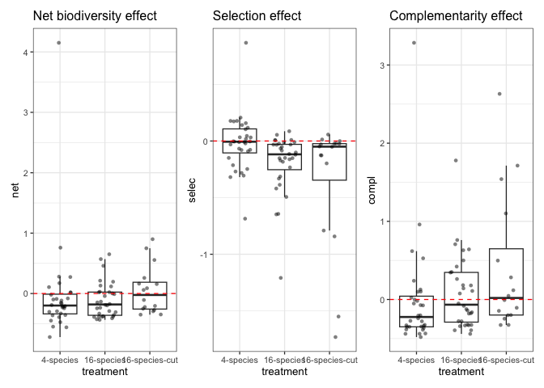

Looks like:

- Net biodiversity effect might increase with Liana cutting
- Selection effect might decrease with species richness
- Complementarity effect might increase with species richness

``` r
result %>% 
  ggplot(aes(x = treatment, y = dens.selec)) +
  geom_boxplot(outliers = FALSE) +
  geom_jitter(width = 0.25, shape = 16, alpha = 0.5) +
  geom_hline(yintercept = 0, colour = "red", linetype = 2) +
  ggtitle("Selection effect - density") +
  
  result %>% 
  ggplot(aes(x = treatment, y = size.selec)) +
  geom_boxplot(outliers = FALSE) +
  geom_jitter(width = 0.25, shape = 16, alpha = 0.5) +
  geom_hline(yintercept = 0, colour = "red", linetype = 2) +
  ggtitle("Selection effect - size") 
```

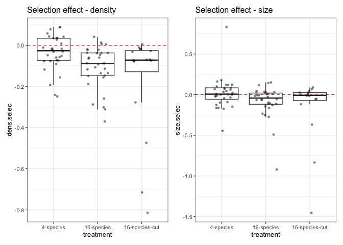

Differences in selection effect are mostly driven by density rather than
size?

``` r
result %>% 
  ggplot(aes(x = treatment, y = dens.compl)) +
  geom_boxplot(outliers = FALSE) +
  geom_jitter(width = 0.25, shape = 16, alpha = 0.5) +
  geom_hline(yintercept = 0, colour = "red", linetype = 2) +
  ggtitle("Complementarity effect - density") +
  
  result %>% 
  ggplot(aes(x = treatment, y = size.compl)) +
  geom_boxplot(outliers = FALSE) +
  geom_jitter(width = 0.25, shape = 16, alpha = 0.5) +
  geom_hline(yintercept = 0, colour = "red", linetype = 2) +
  ggtitle("Complementarity effect - size") 
```

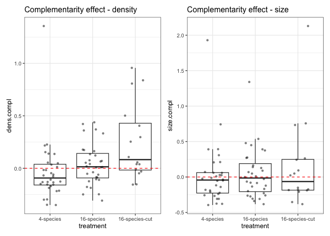

``` r
dens_size <-
  data %>% 
  filter(survival == 1) %>% 
  mutate(dbase_m = dbase_mm / 1000) %>% 
  mutate(basal_area_m2 = pi * (dbase_m/2)^2) %>% 
  filter(census_id == "full_measurement_03") %>% 
  group_by(plot, treatment) %>% 
  summarise(dens = n_distinct(plant_id),
            size = sum(basal_area_m2)) %>% 
  mutate(size = size / dens) 

dens_size %>% 
  ggplot(aes(x = dens, y = size, colour = treatment)) +
  geom_point() +
  geom_text(data = 
              filter(dens_size, size > 0.015 | dens > 300),
            aes(label = plot),
            position = position_nudge(y = -0.001) ) +
  labs(y = "Plant size (mean basal area per plant m2)",
       x = "Plant density (number per plot)",
       title = "Density–size relationships")
```

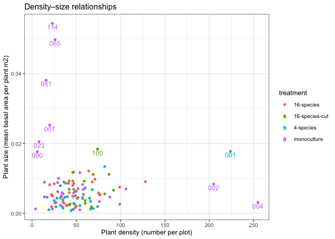

No clear density-size pattern!

Taking a look at which species are included in those outlier plots:

``` r
data %>%
  filter(plot == "114" |
           plot == "065" |
           plot == "001" |
           plot == "002" |
           plot == "004") %>% 
  select(plot, treatment, genus_species) %>% 
  distinct()
```

    # A tibble: 8 × 3
      plot  treatment   genus_species          
      <fct> <fct>       <fct>                  
    1 001   4-species   Dryobalanops_lanceolata
    2 001   4-species   Shorea_macrophylla     
    3 001   4-species   Dipterocarpus_conformis
    4 001   4-species   Hopea_sangal           
    5 002   monoculture Shorea_beccariana      
    6 004   monoculture Hopea_sangal           
    7 065   monoculture Shorea_parvifolia      
    8 114   monoculture Shorea_leprosula       

## Biodiversity effects over time

Above we are looking from the 1st census to the 3rd. We can also break
it down to look between the 1st and 2nd censuses and the 2nd and 3rd
censuses.

``` r
# Census 1 to 2
init_dens_01 <- 
  data %>% 
  filter(census_id == "full_measurement_01") %>% 
  group_by(plot, genus_species) %>% 
  summarise(n = n_distinct(plant_id), .groups = "drop") %>% 
  pivot_wider(id_cols = plot,
              names_from = genus_species,
              values_from = n) %>% 
  mutate(across(everything(), \(x) replace_na(x, 0))) %>% 
  arrange(plot) %>% 
  column_to_rownames(var = "plot")

final_dens_02 <- 
  data %>% 
  filter(census_id == "full_measurement_02") %>% 
  filter(survival == 1) %>% 
  group_by(plot, genus_species) %>% 
  summarise(n = n_distinct(plant_id), .groups = "drop") %>% 
  pivot_wider(id_cols = plot,
              names_from = genus_species,
              values_from = n) %>% 
  mutate(across(everything(), \(x) replace_na(x, 0))) %>% 
  arrange(plot) %>% 
  column_to_rownames(var = "plot")

final_yield_02 <- 
  data %>% 
  filter(census_id == "full_measurement_02") %>% 
  filter(survival == 1) %>% 
  mutate(dbase_m = dbase_mm / 1000) %>% 
  mutate(basal_area_m2 = pi * (dbase_m/2)^2) %>% 
  group_by(plot, genus_species) %>% 
  summarise(sum = sum(basal_area_m2, na.rm = TRUE), .groups = "drop") %>% 
  pivot_wider(id_cols = plot,
              names_from = genus_species,
              values_from = sum) %>% 
  mutate(across(everything(), \(x) replace_na(x, 0))) %>% 
  arrange(plot) %>% 
  column_to_rownames(var = "plot")

densize_out_1_2 <- 
  densize(init.dens = init_dens_01, 
        final.dens = final_dens_02, 
        final.yield = final_yield_02) %>% 
  as_tibble()

result_1_2 <- 
  bind_cols(densize_out_1_2, metadata) %>% 
  mutate(compl = dens.compl + size.compl,
         selec = dens.selec + size.selec,
         net = compl + selec) %>% 
  mutate(treatment = fct_relevel(treatment, 
                                 "4-species", 
                                 "16-species",
                                 "16-species-cut"))

# Census 2 to 3

init_dens_02 <- 
  data %>% 
  filter(census_id == "full_measurement_02") %>% 
  group_by(plot, genus_species) %>% 
  summarise(n = n_distinct(plant_id), .groups = "drop") %>% 
  pivot_wider(id_cols = plot,
              names_from = genus_species,
              values_from = n) %>% 
  mutate(across(everything(), \(x) replace_na(x, 0))) %>% 
  arrange(plot) %>% 
  column_to_rownames(var = "plot")

final_dens_03 <- 
  data %>% 
  filter(census_id == "full_measurement_03") %>% 
  filter(survival == 1) %>% 
  group_by(plot, genus_species) %>% 
  summarise(n = n_distinct(plant_id), .groups = "drop") %>% 
  pivot_wider(id_cols = plot,
              names_from = genus_species,
              values_from = n) %>% 
  mutate(across(everything(), \(x) replace_na(x, 0))) %>% 
  arrange(plot) %>% 
  column_to_rownames(var = "plot")

final_yield_03 <- 
  data %>% 
  filter(census_id == "full_measurement_03") %>% 
  filter(survival == 1) %>% 
  mutate(dbase_m = dbase_mm / 1000) %>% 
  mutate(basal_area_m2 = pi * (dbase_m/2)^2) %>% 
  group_by(plot, genus_species) %>% 
  summarise(sum = sum(basal_area_m2, na.rm = TRUE), .groups = "drop") %>% 
  pivot_wider(id_cols = plot,
              names_from = genus_species,
              values_from = sum) %>% 
  mutate(across(everything(), \(x) replace_na(x, 0))) %>% 
  arrange(plot) %>% 
  column_to_rownames(var = "plot")

densize_out_2_3 <- 
  densize(init.dens = init_dens_02, 
        final.dens = final_dens_03, 
        final.yield = final_yield_03) %>% 
  as_tibble()

result_2_3 <- 
  bind_cols(densize_out_2_3, metadata) %>% 
  mutate(compl = dens.compl + size.compl,
         selec = dens.selec + size.selec,
         net = compl + selec) %>% 
  mutate(treatment = fct_relevel(treatment, 
                                 "4-species", 
                                 "16-species",
                                 "16-species-cut"))
```

``` r
result_cens <- 
  bind_rows(list("02" = result_1_2, "03" = result_2_3),
          .id = "census") %>% glimpse
```

    Rows: 160
    Columns: 10
    $ census     <chr> "02", "02", "02", "02", "02", "02", "02", "02", "02", "02",…
    $ dens.compl <dbl> 0.248408051, -0.006814508, 0.038841999, -0.026840657, 0.028…
    $ dens.selec <dbl> -8.568370e-02, -8.964600e-03, -1.091363e-02, -9.503623e-03,…
    $ size.compl <dbl> 0.81752641, 0.15143264, 0.10598530, 0.12157327, 0.10551430,…
    $ size.selec <dbl> -2.743032e-02, 2.360767e-02, 6.642728e-03, -5.291699e-02, -…
    $ plot       <fct> 001, 003, 005, 006, 008, 009, 011, 012, 014, 015, 016, 017,…
    $ treatment  <fct> 4-species, 16-species, 16-species-cut, 4-species, 16-specie…
    $ compl      <dbl> 1.065934457, 0.144618132, 0.144827297, 0.094732615, 0.13381…
    $ selec      <dbl> -0.1131140203, 0.0146430671, -0.0042709001, -0.0624206133, …
    $ net        <dbl> 0.95282044, 0.15926120, 0.14055640, 0.03231200, 0.07224543,…

``` r
delta <- 
  result_cens %>% 
  select(census, treatment, census, net, plot) %>%
  pivot_wider(names_from = census, values_from = net, id_cols = c(treatment, plot)) %>%
  mutate(delta = `03` - `02`) %>% 
  select(treatment, plot, delta)

result_cens %>% 
  pivot_longer(cols = where(is.numeric)) %>%
  filter(name == "net") %>% 
  left_join(delta) %>% 
  ggplot(aes(x = census, y = value, colour = delta)) +
  geom_line(aes(group = plot, colour = delta)) +
  geom_point() +
  scale_colour_gradientn(colours = colorspace::divergingx_hcl(n = 20, palette = "RdBu"),
                           limits = c(-1, 1)) +
  labs(y = "basal area m2 per plot") +
  facet_wrap(~treatment) +
  ggtitle("Net biodiversity effect")
```

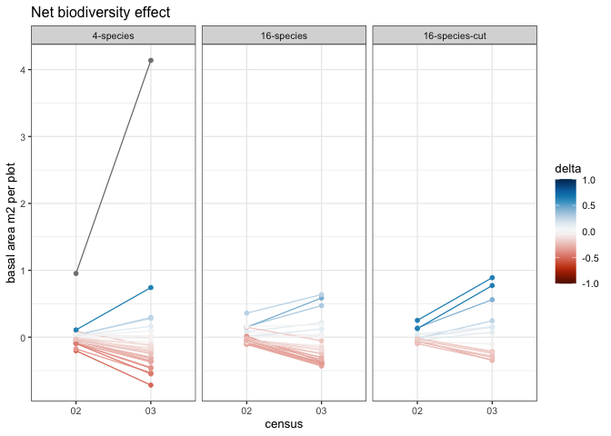

``` r
result %>% 
  filter(net == max(net)) %>% glimpse
```

    Rows: 1
    Columns: 9
    $ dens.compl <dbl> 1.355059
    $ dens.selec <dbl> 0.03616328
    $ size.compl <dbl> 1.929241
    $ size.selec <dbl> 0.8309714
    $ plot       <fct> 001
    $ treatment  <fct> 4-species
    $ compl      <dbl> 3.2843
    $ selec      <dbl> 0.8671346
    $ net        <dbl> 4.151434

The big outlier in the above figure is plot 1, with these 4 species:

``` r
data %>% 
  filter(plot == "001") %>% 
  distinct(genus_species)
```

    # A tibble: 4 × 1
      genus_species          
      <fct>                  
    1 Dryobalanops_lanceolata
    2 Shorea_macrophylla     
    3 Dipterocarpus_conformis
    4 Hopea_sangal           

Plot 105 has the same species mix

``` r
result_cens %>% 
  pivot_longer(cols = where(is.numeric)) %>%
  filter(name == "compl" | name == "selec" ) %>% 
  ggplot(aes(x = census, y = value, colour = name)) +
  geom_line(aes(group = interaction(plot, name), colour = name),
              linewidth = 0.25,
              alpha = 0.4) +
  geom_point() +
  labs(y = "basal area m2 per plot") +
  facet_wrap(~treatment)
```

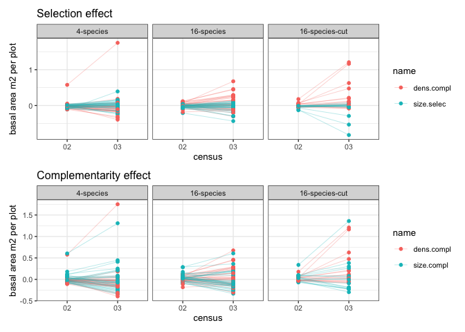

Selection and complementarity effects increase in magnitude over time.

``` r
result_cens %>% 
  pivot_longer(cols = where(is.numeric)) %>%
  filter(name == "size.selec" | name == "dens.compl" ) %>% 
  ggplot(aes(x = census, y = value, colour = name)) +
  geom_line(aes(group = interaction(plot, name), colour = name),
              linewidth = 0.25,
              alpha = 0.4) +
  geom_point() +
  labs(y = "basal area m2 per plot",
       title = "Selection effect") +
  facet_wrap(~treatment) +
  
  result_cens %>% 
  pivot_longer(cols = where(is.numeric)) %>%
  filter(name == "size.compl" |name == "dens.compl") %>% 
  ggplot(aes(x = census, y = value, colour = name)) +
  geom_line(aes(group = interaction(plot, name), colour = name),
              linewidth = 0.25,
              alpha = 0.4) +
  geom_point() +
  labs(y = "basal area m2 per plot",
       title = "Complementarity effect") +
  facet_wrap(~treatment) +
  
  plot_layout(ncol = 1)
```

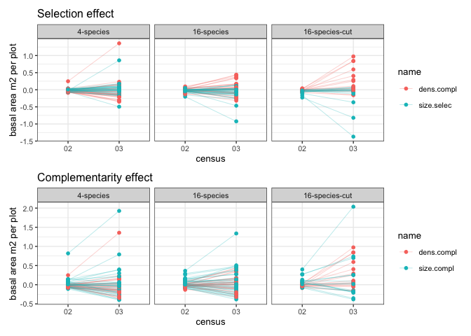

## Genus richness

``` r
genus_data <- 
  data %>% 
  left_join(taxa, by = c("genus_species" = "genus_species.ORIG")) %>% 
  mutate(genus = case_when(is.na(genus.y) ~ genus.x,
                           .default = genus.y)) %>% 
  group_by(plot) %>% 
  summarise(n_genus = n_distinct(genus)) %>% 
  mutate(n_genus = as.factor(n_genus))
```

``` r
result %>% 
  left_join(genus_data) %>% 
  group_by(n_genus) %>% 
  summarise(n_distinct(plot))
```

    # A tibble: 4 × 2
      n_genus `n_distinct(plot)`
      <fct>                <int>
    1 2                       12
    2 3                        4
    3 4                       16
    4 6                       48

After taxonomy change, only 4 plots with 3 genus.

``` r
result %>% 
  left_join(genus_data) %>% 
  ggplot(aes(x = n_genus, y = net)) +
  geom_boxplot(outliers = FALSE) +
  geom_jitter(width = 0.25, shape = 16, alpha = 0.5) +
  geom_hline(yintercept = 0, colour = "red", linetype = 2) +
  ggtitle("Net biodiversity effect") +
  
  result %>% 
  left_join(genus_data) %>% 
  ggplot(aes(x = n_genus, y = selec)) +
  geom_boxplot(outliers = FALSE) +
  geom_jitter(width = 0.25, shape = 16, alpha = 0.5) +
  geom_hline(yintercept = 0, colour = "red", linetype = 2) +
  ggtitle("Selection effect") +
  
  result %>% 
  left_join(genus_data) %>% 
  ggplot(aes(x = n_genus, y = compl)) +
  geom_boxplot(outliers = FALSE) +
  geom_jitter(width = 0.25, shape = 16, alpha = 0.5) +
  geom_hline(yintercept = 0, colour = "red", linetype = 2) +
  ggtitle("Complementarity effect") +
  
  plot_annotation(title = "Genus richness")
```

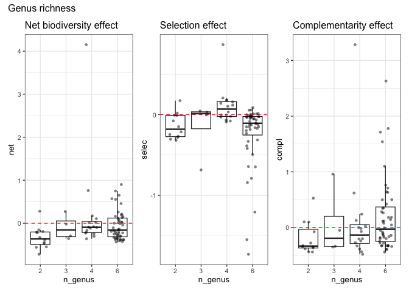

``` r
result %>% 
  left_join(genus_data) %>%
  ggplot(aes(x = n_genus, y = dens.selec)) +
  geom_boxplot(outliers = FALSE) +
  geom_jitter(width = 0.25, shape = 16, alpha = 0.5) +
  geom_hline(yintercept = 0, colour = "red", linetype = 2) +
  ggtitle("Selection effect - density") +
  
  result %>% 
  left_join(genus_data) %>%
  ggplot(aes(x = n_genus, y = size.selec)) +
  geom_boxplot(outliers = FALSE) +
  geom_jitter(width = 0.25, shape = 16, alpha = 0.5) +
  geom_hline(yintercept = 0, colour = "red", linetype = 2) +
  ggtitle("Selection effect - size") +
  
  plot_annotation(title = "Genus richness")
```

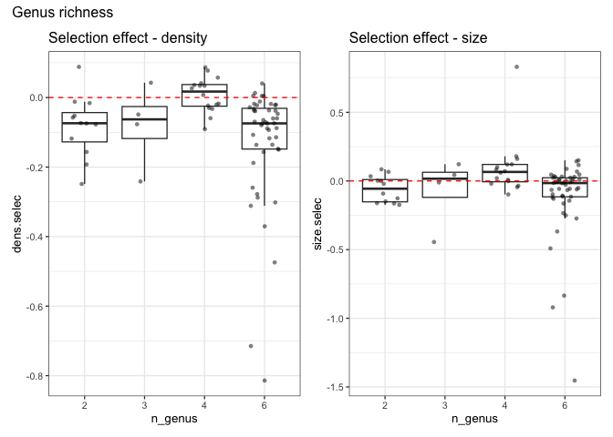

``` r
result %>% 
  left_join(genus_data) %>%
  ggplot(aes(x = n_genus, y = dens.compl)) +
  geom_boxplot(outliers = FALSE) +
  geom_jitter(width = 0.25, shape = 16, alpha = 0.5) +
  geom_hline(yintercept = 0, colour = "red", linetype = 2) +
  ggtitle("Complementarity effect - density") +
  
  result %>% 
  left_join(genus_data) %>%
  ggplot(aes(x = n_genus, y = size.compl)) +
  geom_boxplot(outliers = FALSE) +
  geom_jitter(width = 0.25, shape = 16, alpha = 0.5) +
  geom_hline(yintercept = 0, colour = "red", linetype = 2) +
  ggtitle("Complementarity effect - size") +
  
  plot_annotation(title = "Genus richness")
```


``` r
result_cens %>% 
  left_join(genus_data) %>%
  pivot_longer(cols = where(is.numeric)) %>%
  filter(name == "net") %>% 
  left_join(delta) %>% 
  ggplot(aes(x = census, y = value, colour = delta)) +
  geom_line(aes(group = plot, colour = delta)) +
  geom_point() +
  scale_colour_gradientn(colours = colorspace::divergingx_hcl(n = 20, palette = "RdBu"),
                           limits = c(-1, 1)) +
  labs(y = "basal area m2 per plot") +
  facet_wrap(~n_genus) +
  ggtitle("Net biodiversity effect") +
  plot_annotation(title = "Genus richness")
```

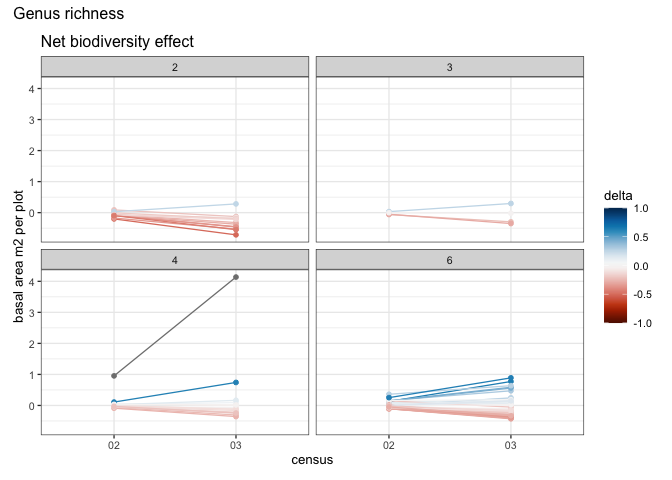

``` r
result_cens %>% 
  left_join(genus_data) %>%
  pivot_longer(cols = where(is.numeric)) %>%
  filter(name == "compl" | name == "selec" ) %>% 
  ggplot(aes(x = census, y = value, colour = name)) +
  geom_line(aes(group = interaction(plot, name), colour = name),
              linewidth = 0.25,
              alpha = 0.4) +
  geom_point() +
  labs(y = "basal area m2 per plot") +
  facet_wrap(~n_genus) +
  plot_annotation(title = "Genus richness")
```

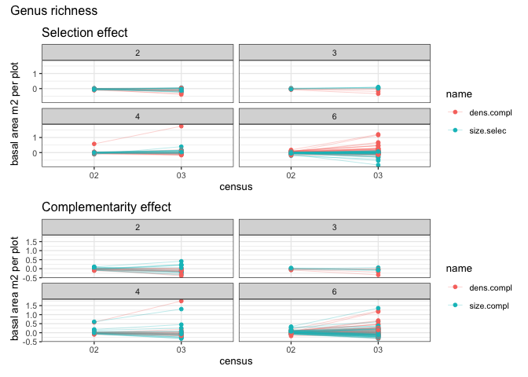

``` r
result_cens %>% 
  left_join(genus_data) %>%
  pivot_longer(cols = where(is.numeric)) %>%
  filter(name == "size.selec" | name == "dens.compl" ) %>% 
  ggplot(aes(x = census, y = value, colour = name)) +
  geom_line(aes(group = interaction(plot, name), colour = name),
              linewidth = 0.25,
              alpha = 0.4) +
  geom_point() +
  labs(y = "basal area m2 per plot",
       title = "Selection effect") +
  facet_wrap(~n_genus) +
  
  result_cens %>% 
  left_join(genus_data) %>%
  pivot_longer(cols = where(is.numeric)) %>%
  filter(name == "size.compl" |name == "dens.compl") %>% 
  ggplot(aes(x = census, y = value, colour = name)) +
  geom_line(aes(group = interaction(plot, name), colour = name),
              linewidth = 0.25,
              alpha = 0.4) +
  geom_point() +
  labs(y = "basal area m2 per plot",
       title = "Complementarity effect") +
  facet_wrap(~n_genus) +
  
  plot_layout(ncol = 1) +
  plot_annotation(title = "Genus richness")
```

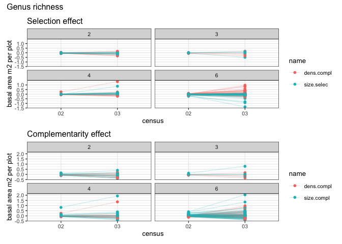

## Canopy complexity

``` r
canopy_data <- 
  data %>% 
  select(plot, species_mix) %>% 
  distinct() %>% 
  mutate(canopy = case_when(
    species_mix == "4-species(1)" |
      species_mix == "4-species(2)" ~ "2_tall_med",
    species_mix == "4-species(3)" |
      species_mix == "4-species(4)" ~ "2_short_med",
    species_mix == "4-species(5)" |
      species_mix == "4-species(6)" |
      species_mix == "4-species(7)" |
      species_mix == "4-species(8)" ~ "3_short_med_tall",
    species_mix == "4-species(9)" |
      species_mix == "4-species(10)" |
      species_mix == "4-species(11)" |
      species_mix == "4-species(12)" ~ "1_tall",
    species_mix == "4-species(13)" |
      species_mix == "4-species(14)" |
      species_mix == "4-species(15)" |
      species_mix == "4-species(16)" ~ "3_tall_med_short",
    .default = NA
  ))
```

- `tall_med` 2 tall species and 2 medium species
- `short_med` 2 short species and 2 medium species
- `short_med_tall` 2 short species, 1 medium and 1 tall
- `tall` 4 tall species
- `tall_med_short` 2 tall species, 1 medium and 1 short

``` r
result %>% 
  left_join(canopy_data) %>% 
  drop_na(canopy) %>% 
  ggplot(aes(x = canopy, y = net)) +
  geom_boxplot(outliers = FALSE) +
  geom_jitter(width = 0.25, shape = 16, alpha = 0.5) +
  geom_hline(yintercept = 0, colour = "red", linetype = 2) +
  ggtitle("Net biodiversity effect") +
  
  result %>% 
  left_join(canopy_data) %>% 
  drop_na(canopy) %>% 
  ggplot(aes(x = canopy, y = selec)) +
  geom_boxplot(outliers = FALSE) +
  geom_jitter(width = 0.25, shape = 16, alpha = 0.5) +
  geom_hline(yintercept = 0, colour = "red", linetype = 2) +
  ggtitle("Selection effect") +
  
  result %>% 
  left_join(canopy_data) %>% 
  drop_na(canopy) %>% 
  ggplot(aes(x = canopy, y = compl)) +
  geom_boxplot(outliers = FALSE) +
  geom_jitter(width = 0.25, shape = 16, alpha = 0.5) +
  geom_hline(yintercept = 0, colour = "red", linetype = 2) +
  ggtitle("Complementarity effect") +
  
  plot_annotation(title = "Canopy complexity") &
  theme(axis.text.x = element_text(angle = 90, vjust = 0.5, hjust = 1))
```

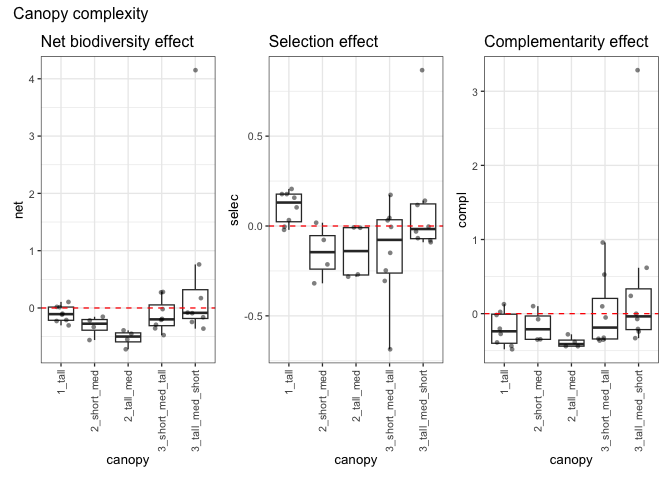

``` r
result %>% 
  left_join(canopy_data) %>%
  drop_na(canopy) %>% 
  ggplot(aes(x = canopy, y = dens.selec)) +
  geom_boxplot(outliers = FALSE) +
  geom_jitter(width = 0.25, shape = 16, alpha = 0.5) +
  geom_hline(yintercept = 0, colour = "red", linetype = 2) +
  ggtitle("Selection effect - density") +
  
  result %>% 
  left_join(canopy_data) %>%
  drop_na(canopy) %>% 
  ggplot(aes(x = canopy, y = size.selec)) +
  geom_boxplot(outliers = FALSE) +
  geom_jitter(width = 0.25, shape = 16, alpha = 0.5) +
  geom_hline(yintercept = 0, colour = "red", linetype = 2) +
  ggtitle("Selection effect - size") +
  
  plot_annotation(title = "Canopy complexity") &
  theme(axis.text.x = element_text(angle = 90, vjust = 0.5, hjust = 1))
```

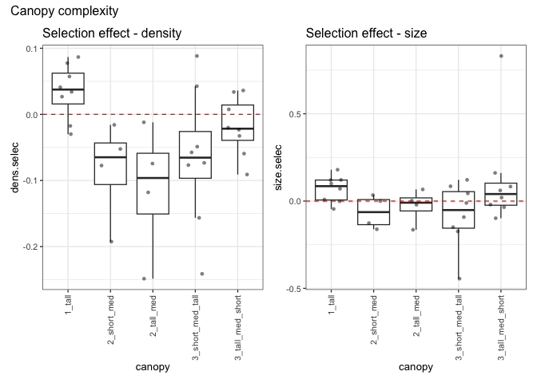

``` r
result %>% 
  left_join(canopy_data) %>%
  drop_na(canopy) %>% 
  ggplot(aes(x = canopy, y = dens.compl)) +
  geom_boxplot(outliers = FALSE) +
  geom_jitter(width = 0.25, shape = 16, alpha = 0.5) +
  geom_hline(yintercept = 0, colour = "red", linetype = 2) +
  ggtitle("Complementarity effect - density") +
  
  result %>% 
  left_join(canopy_data) %>%
  drop_na(canopy) %>% 
  ggplot(aes(x = canopy, y = size.compl)) +
  geom_boxplot(outliers = FALSE) +
  geom_jitter(width = 0.25, shape = 16, alpha = 0.5) +
  geom_hline(yintercept = 0, colour = "red", linetype = 2) +
  ggtitle("Complementarity effect - size") +
  
  plot_annotation(title = "Canopy complexity") &
  theme(axis.text.x = element_text(angle = 90, vjust = 0.5, hjust = 1))
```


``` r
result_cens %>% 
  left_join(canopy_data) %>%
  drop_na(canopy) %>% 
  pivot_longer(cols = where(is.numeric)) %>%
  filter(name == "net") %>% 
  left_join(delta) %>% 
  ggplot(aes(x = census, y = value, colour = delta)) +
  geom_line(aes(group = plot, colour = delta)) +
  geom_point() +
  scale_colour_gradientn(colours = colorspace::divergingx_hcl(n = 20, palette = "RdBu"),
                           limits = c(-1, 1)) +
  labs(y = "basal area m2 per plot") +
  facet_wrap(~canopy) +
  ggtitle("Net biodiversity effect") +
  plot_annotation(title = "Canopy complexity") 
```

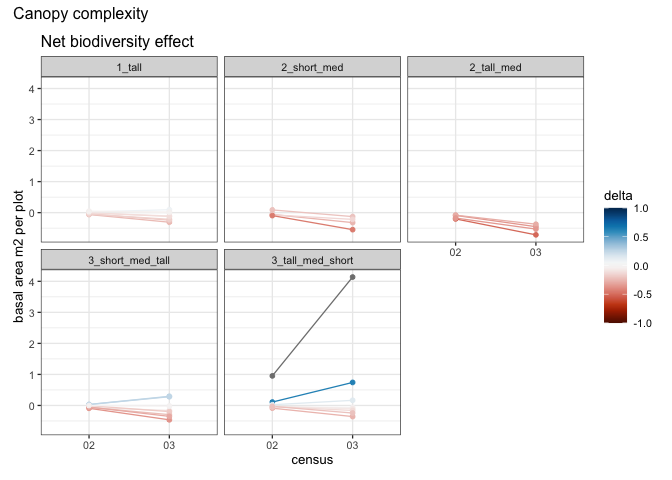

``` r
result_cens %>% 
  left_join(canopy_data) %>%
  drop_na(canopy) %>% 
  pivot_longer(cols = where(is.numeric)) %>%
  filter(name == "compl" | name == "selec" ) %>% 
  ggplot(aes(x = census, y = value, colour = name)) +
  geom_line(aes(group = interaction(plot, name), colour = name),
              linewidth = 0.25,
              alpha = 0.4) +
  geom_point() +
  labs(y = "basal area m2 per plot") +
  facet_wrap(~canopy) +
  plot_annotation(title = "Canopy complexity")
```

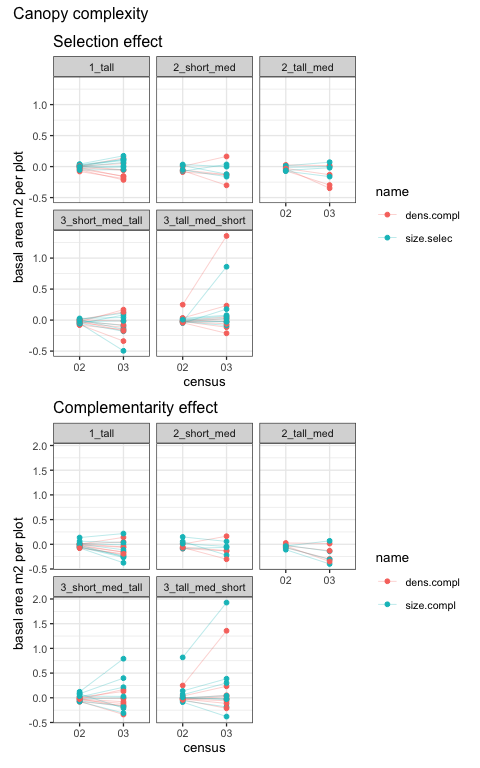

``` r
result_cens %>% 
  left_join(canopy_data) %>%
  drop_na(canopy) %>% 
  pivot_longer(cols = where(is.numeric)) %>%
  filter(name == "size.selec" | name == "dens.compl" ) %>% 
  ggplot(aes(x = census, y = value, colour = name)) +
  geom_line(aes(group = interaction(plot, name), colour = name),
              linewidth = 0.25,
              alpha = 0.4) +
  geom_point() +
  labs(y = "basal area m2 per plot",
       title = "Selection effect") +
  facet_wrap(~canopy) +
  
  result_cens %>% 
  left_join(canopy_data) %>%
  drop_na(canopy) %>% 
  pivot_longer(cols = where(is.numeric)) %>%
  filter(name == "size.compl" |name == "dens.compl") %>% 
  ggplot(aes(x = census, y = value, colour = name)) +
  geom_line(aes(group = interaction(plot, name), colour = name),
              linewidth = 0.25,
              alpha = 0.4) +
  geom_point() +
  labs(y = "basal area m2 per plot",
       title = "Complementarity effect") +
  facet_wrap(~canopy) +
  
  plot_layout(ncol = 1) +
  plot_annotation(title = "Canopy complexity")
```


# Modelling?

Try some quick models

``` r
data_mod <- 
  result %>% 
  left_join(genus_data) %>% 
  left_join(canopy_data) 
```

``` r
data_mod %>% 
  ggplot(aes(x = net)) + geom_density() +
  
  data_mod %>% 
  ggplot(aes(x = compl)) + geom_density() +
  
  data_mod %>% 
  ggplot(aes(x = selec)) + geom_density() +
  
  data_mod %>% 
  ggplot(aes(x = size.compl)) + geom_density() +
  
  data_mod %>% 
  ggplot(aes(x = dens.compl)) + geom_density() +
  
  data_mod %>% 
  ggplot(aes(x = size.selec)) + geom_density() +
  
  data_mod %>% 
  ggplot(aes(x = dens.selec)) + geom_density() 
```

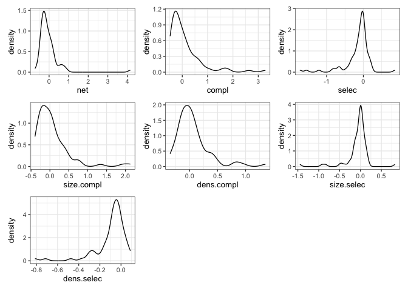

Some long tails - suggests a student’s T response distribution may be
better but will try Gaussian first.

``` r
m_NE <- 
  lme4::lmer(net ~ 0 + treatment + (1 |species_mix), data_mod) 

m_CE <- 
  lme4::lmer(compl ~ 0 + treatment + (1 |species_mix), data_mod) 

m_CE_size <- 
  lme4::lmer(size.compl ~ 0 + treatment + (1 |species_mix), data_mod) 

m_CE_dens <- 
  lme4::lmer(dens.compl ~ 0 + treatment + (1 |species_mix), data_mod) 

m_SE <- 
  lme4::lmer(selec ~ 0 + treatment + (1 |species_mix), data_mod) 
```

    boundary (singular) fit: see help('isSingular')

``` r
m_SE_size <- 
  lme4::lmer(size.selec ~ 0 + treatment + (1 |species_mix), data_mod) 
```

    boundary (singular) fit: see help('isSingular')

``` r
m_SE_dens <- 
  lme4::lmer(dens.selec ~ 0 + treatment + (1 |species_mix), data_mod) 
```

    boundary (singular) fit: see help('isSingular')

Getting singular fits for all the selection effect models

``` r
my_coef_tab <-
  tibble(fit = c(m_NE, m_CE, m_CE_size, m_CE_dens, m_SE, m_SE_size, m_SE_dens),
         model = c("m_NE", "m_CE", "m_CE_size", 
                   "m_CE_dens", "m_SE", "m_SE_size", "m_SE_dens")) %>%
  mutate(tidy = purrr::map(
    fit,
    tidy,
    effects = "fixed",
    robust = TRUE,
    conf.int = TRUE
  )) %>%
  unnest(tidy) %>% 
  mutate(term = fct_relevel(term, 
                            "treatment4-species", 
                            "treatment16-species",
                            "treatment16-species-cut"))
```

``` r
my_coef_tab %>% 
  ggplot(aes(x = term, y = estimate, ymin = conf.low, ymax = conf.high)) +
  geom_pointrange(shape = 21, fill = "white") +
  labs(x = "Term",
       y = "Estimate ± CI [95%]") +
  geom_hline(yintercept = 0,  color = "blue") +
  coord_flip() +
  facet_wrap(~model, ncol = 1)
```

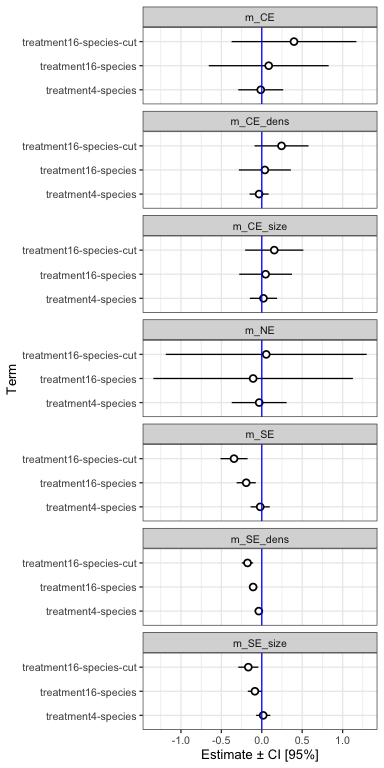

Let’s try using the 2 time points

``` r
data_mod2 <- 
  result_cens %>% 
  left_join(genus_data) %>% 
  left_join(canopy_data) %>% 
  mutate(census = as.factor(census))
```

``` r
m_NE <- 
  lme4::lmer(net ~ treatment * census + (1 |species_mix) + (1 |plot), data_mod2) 

m_CE <- 
  lme4::lmer(compl ~ treatment * census + (1 |species_mix) + (1 |plot), data_mod2) 

m_CE_size <- 
  lme4::lmer(size.compl ~ treatment * census + (1 |species_mix) + (1 |plot), data_mod2) 

m_CE_dens <- 
  lme4::lmer(dens.compl ~ treatment * census + (1 |species_mix) + (1 |plot), data_mod2) 

m_SE <- 
  lme4::lmer(selec ~ treatment * census + (1 |species_mix) + (1 |plot), data_mod2) 
```

    boundary (singular) fit: see help('isSingular')

``` r
m_SE_size <- 
  lme4::lmer(size.selec ~ treatment * census + (1 |species_mix) + (1 |plot), data_mod2) 
```

    boundary (singular) fit: see help('isSingular')

``` r
m_SE_dens <- 
  lme4::lmer(dens.selec ~ treatment * census + (1 |species_mix) + (1 |plot), data_mod2) 
```

    boundary (singular) fit: see help('isSingular')

``` r
my_coef_tab2 <-
  tibble(fit = c(m_NE, m_CE, m_CE_size, m_CE_dens, m_SE, m_SE_size, m_SE_dens),
         model = c("m_NE", "m_CE", "m_CE_size", 
                   "m_CE_dens", "m_SE", "m_SE_size", "m_SE_dens")) %>%
  mutate(tidy = purrr::map(
    fit,
    emmeans,
    ~ treatment * census
  )) %>%
  mutate(tidy = purrr::map(
    tidy,
    as_tibble
  )) %>%
  unnest(tidy) %>% 
  mutate(treatment = fct_relevel(treatment, 
                            "4-species", 
                            "16-species",
                            "16-species-cut"))
```

``` r
delta_emmeans <- 
  my_coef_tab2 %>% 
  select( - fit) %>% 
  pivot_wider(names_from = census, 
              id_cols = c("treatment", "model"),
              values_from = c("emmean", "lower.CL", "upper.CL")) %>% 
  mutate(emmean = emmean_03 - emmean_02,
         lower.CL = lower.CL_03 - lower.CL_02,
         upper.CL = upper.CL_03 - upper.CL_02,
         census = "delta, 03 - 02") %>% 
  select(model, treatment, census, emmean, lower.CL, upper.CL)
```

``` r
my_coef_tab2 %>% 
  select(model, treatment, census, emmean, lower.CL, upper.CL) %>% 
  bind_rows(delta_emmeans) %>% 
  ggplot(aes(x = treatment, y = emmean, ymin = lower.CL, ymax = upper.CL)) +
  geom_pointrange(shape = 21, fill = "white") +
  labs(x = "Treatment",
       y = "Estimated marginal means [95%]") +
  geom_hline(yintercept = 0,  color = "blue") +
  coord_flip() +
  facet_wrap(model~census, scales = "free_x", ncol = 3)
```

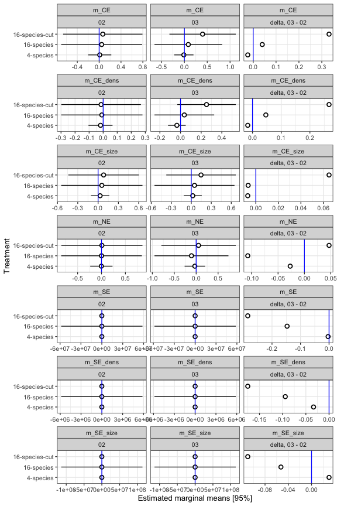
