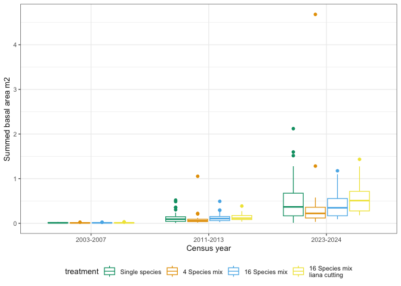
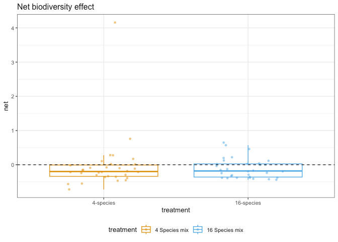
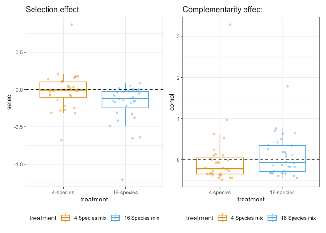
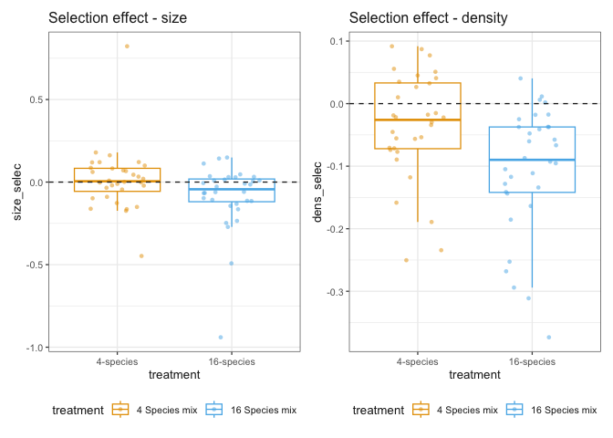
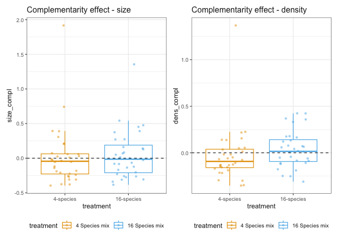

# Results report
eleanorjackson
2026-07-20

``` r
library("tidyverse")
library("patchwork")
library("here")
library("gt")
```

``` r
data <-
    readRDS(here::here("data", "derived", "data_cleaned.rds"))
```

# Summed basal diameter

``` r
seedling_ba <-
    data |>
    filter(survival == 1) |> # only alive seedlings
    mutate(dbase_m = dbase_mm / 1000) |>
    mutate(basal_area = pi * (dbase_m / 2)^2) |>
    group_by(plot, census_yr, treatment) |>
    summarise(sum_basal_area = sum(basal_area, na.rm = TRUE), .groups = "drop")
```

``` r
seedling_ba |>
    ggplot(aes(
        x = census_yr,
        y = sum_basal_area,
        colour = treatment
    )) +
    geom_boxplot() +
    labs(y = "Summed basal area m2", x = "Census year") +
    scale_colour_sbe()
```



Remember *n plots* for liana cut plots is smaller than other treatments.
Calcluate per ha:

``` r
seedling_ba |>
    filter(census_yr == "2023-2024") |>
    group_by(treatment) |>
    summarise(
        sum_basal_area = sum(sum_basal_area, na.rm = TRUE),
        n_plots = n_distinct(plot)
    ) |>
    mutate(basal_area_per_ha = (sum_basal_area / n_plots) / 4) |> # 1 plot is 4ha
    gt::gt()
```

<div id="abusuqllyi" style="padding-left:0px;padding-right:0px;padding-top:10px;padding-bottom:10px;overflow-x:auto;overflow-y:auto;width:auto;height:auto;">
<style>#abusuqllyi table {
  font-family: system-ui, 'Segoe UI', Roboto, Helvetica, Arial, sans-serif, 'Apple Color Emoji', 'Segoe UI Emoji', 'Segoe UI Symbol', 'Noto Color Emoji';
  -webkit-font-smoothing: antialiased;
  -moz-osx-font-smoothing: grayscale;
}
&#10;#abusuqllyi thead, #abusuqllyi tbody, #abusuqllyi tfoot, #abusuqllyi tr, #abusuqllyi td, #abusuqllyi th {
  border-style: none;
}
&#10;#abusuqllyi p {
  margin: 0;
  padding: 0;
}
&#10;#abusuqllyi .gt_table {
  display: table;
  border-collapse: collapse;
  line-height: normal;
  margin-left: auto;
  margin-right: auto;
  color: #333333;
  font-size: 16px;
  font-weight: normal;
  font-style: normal;
  background-color: #FFFFFF;
  width: auto;
  border-top-style: solid;
  border-top-width: 2px;
  border-top-color: #A8A8A8;
  border-right-style: none;
  border-right-width: 2px;
  border-right-color: #D3D3D3;
  border-bottom-style: solid;
  border-bottom-width: 2px;
  border-bottom-color: #A8A8A8;
  border-left-style: none;
  border-left-width: 2px;
  border-left-color: #D3D3D3;
}
&#10;#abusuqllyi .gt_caption {
  padding-top: 4px;
  padding-bottom: 4px;
}
&#10;#abusuqllyi .gt_title {
  color: #333333;
  font-size: 125%;
  font-weight: initial;
  padding-top: 4px;
  padding-bottom: 4px;
  padding-left: 5px;
  padding-right: 5px;
  border-bottom-color: #FFFFFF;
  border-bottom-width: 0;
}
&#10;#abusuqllyi .gt_subtitle {
  color: #333333;
  font-size: 85%;
  font-weight: initial;
  padding-top: 3px;
  padding-bottom: 5px;
  padding-left: 5px;
  padding-right: 5px;
  border-top-color: #FFFFFF;
  border-top-width: 0;
}
&#10;#abusuqllyi .gt_heading {
  background-color: #FFFFFF;
  text-align: center;
  border-bottom-color: #FFFFFF;
  border-left-style: none;
  border-left-width: 1px;
  border-left-color: #D3D3D3;
  border-right-style: none;
  border-right-width: 1px;
  border-right-color: #D3D3D3;
}
&#10;#abusuqllyi .gt_bottom_border {
  border-bottom-style: solid;
  border-bottom-width: 2px;
  border-bottom-color: #D3D3D3;
}
&#10;#abusuqllyi .gt_col_headings {
  border-top-style: solid;
  border-top-width: 2px;
  border-top-color: #D3D3D3;
  border-bottom-style: solid;
  border-bottom-width: 2px;
  border-bottom-color: #D3D3D3;
  border-left-style: none;
  border-left-width: 1px;
  border-left-color: #D3D3D3;
  border-right-style: none;
  border-right-width: 1px;
  border-right-color: #D3D3D3;
}
&#10;#abusuqllyi .gt_col_heading {
  color: #333333;
  background-color: #FFFFFF;
  font-size: 100%;
  font-weight: normal;
  text-transform: inherit;
  border-left-style: none;
  border-left-width: 1px;
  border-left-color: #D3D3D3;
  border-right-style: none;
  border-right-width: 1px;
  border-right-color: #D3D3D3;
  vertical-align: bottom;
  padding-top: 5px;
  padding-bottom: 6px;
  padding-left: 5px;
  padding-right: 5px;
  overflow-x: hidden;
}
&#10;#abusuqllyi .gt_column_spanner_outer {
  color: #333333;
  background-color: #FFFFFF;
  font-size: 100%;
  font-weight: normal;
  text-transform: inherit;
  padding-top: 0;
  padding-bottom: 0;
  padding-left: 4px;
  padding-right: 4px;
}
&#10;#abusuqllyi .gt_column_spanner_outer:first-child {
  padding-left: 0;
}
&#10;#abusuqllyi .gt_column_spanner_outer:last-child {
  padding-right: 0;
}
&#10;#abusuqllyi .gt_column_spanner {
  border-bottom-style: solid;
  border-bottom-width: 2px;
  border-bottom-color: #D3D3D3;
  vertical-align: bottom;
  padding-top: 5px;
  padding-bottom: 5px;
  overflow-x: hidden;
  display: inline-block;
  width: 100%;
}
&#10;#abusuqllyi .gt_spanner_row {
  border-bottom-style: hidden;
}
&#10;#abusuqllyi .gt_group_heading {
  padding-top: 8px;
  padding-bottom: 8px;
  padding-left: 5px;
  padding-right: 5px;
  color: #333333;
  background-color: #FFFFFF;
  font-size: 100%;
  font-weight: initial;
  text-transform: inherit;
  border-top-style: solid;
  border-top-width: 2px;
  border-top-color: #D3D3D3;
  border-bottom-style: solid;
  border-bottom-width: 2px;
  border-bottom-color: #D3D3D3;
  border-left-style: none;
  border-left-width: 1px;
  border-left-color: #D3D3D3;
  border-right-style: none;
  border-right-width: 1px;
  border-right-color: #D3D3D3;
  vertical-align: middle;
  text-align: left;
}
&#10;#abusuqllyi .gt_empty_group_heading {
  padding: 0.5px;
  color: #333333;
  background-color: #FFFFFF;
  font-size: 100%;
  font-weight: initial;
  border-top-style: solid;
  border-top-width: 2px;
  border-top-color: #D3D3D3;
  border-bottom-style: solid;
  border-bottom-width: 2px;
  border-bottom-color: #D3D3D3;
  vertical-align: middle;
}
&#10;#abusuqllyi .gt_from_md > :first-child {
  margin-top: 0;
}
&#10;#abusuqllyi .gt_from_md > :last-child {
  margin-bottom: 0;
}
&#10;#abusuqllyi .gt_row {
  padding-top: 8px;
  padding-bottom: 8px;
  padding-left: 5px;
  padding-right: 5px;
  margin: 10px;
  border-top-style: solid;
  border-top-width: 1px;
  border-top-color: #D3D3D3;
  border-left-style: none;
  border-left-width: 1px;
  border-left-color: #D3D3D3;
  border-right-style: none;
  border-right-width: 1px;
  border-right-color: #D3D3D3;
  vertical-align: middle;
  overflow-x: hidden;
}
&#10;#abusuqllyi .gt_stub {
  color: #333333;
  background-color: #FFFFFF;
  font-size: 100%;
  font-weight: initial;
  text-transform: inherit;
  border-right-style: solid;
  border-right-width: 2px;
  border-right-color: #D3D3D3;
  padding-left: 5px;
  padding-right: 5px;
}
&#10;#abusuqllyi .gt_stub_row_group {
  color: #333333;
  background-color: #FFFFFF;
  font-size: 100%;
  font-weight: initial;
  text-transform: inherit;
  border-right-style: solid;
  border-right-width: 2px;
  border-right-color: #D3D3D3;
  padding-left: 5px;
  padding-right: 5px;
  vertical-align: top;
}
&#10;#abusuqllyi .gt_row_group_first td {
  border-top-width: 2px;
}
&#10;#abusuqllyi .gt_row_group_first th {
  border-top-width: 2px;
}
&#10;#abusuqllyi .gt_summary_row {
  color: #333333;
  background-color: #FFFFFF;
  text-transform: inherit;
  padding-top: 8px;
  padding-bottom: 8px;
  padding-left: 5px;
  padding-right: 5px;
}
&#10;#abusuqllyi .gt_first_summary_row {
  border-top-style: solid;
  border-top-color: #D3D3D3;
}
&#10;#abusuqllyi .gt_first_summary_row.thick {
  border-top-width: 2px;
}
&#10;#abusuqllyi .gt_last_summary_row {
  padding-top: 8px;
  padding-bottom: 8px;
  padding-left: 5px;
  padding-right: 5px;
  border-bottom-style: solid;
  border-bottom-width: 2px;
  border-bottom-color: #D3D3D3;
}
&#10;#abusuqllyi .gt_grand_summary_row {
  color: #333333;
  background-color: #FFFFFF;
  text-transform: inherit;
  padding-top: 8px;
  padding-bottom: 8px;
  padding-left: 5px;
  padding-right: 5px;
}
&#10;#abusuqllyi .gt_first_grand_summary_row {
  padding-top: 8px;
  padding-bottom: 8px;
  padding-left: 5px;
  padding-right: 5px;
  border-top-style: double;
  border-top-width: 6px;
  border-top-color: #D3D3D3;
}
&#10;#abusuqllyi .gt_last_grand_summary_row_top {
  padding-top: 8px;
  padding-bottom: 8px;
  padding-left: 5px;
  padding-right: 5px;
  border-bottom-style: double;
  border-bottom-width: 6px;
  border-bottom-color: #D3D3D3;
}
&#10;#abusuqllyi .gt_striped {
  background-color: rgba(128, 128, 128, 0.05);
}
&#10;#abusuqllyi .gt_table_body {
  border-top-style: solid;
  border-top-width: 2px;
  border-top-color: #D3D3D3;
  border-bottom-style: solid;
  border-bottom-width: 2px;
  border-bottom-color: #D3D3D3;
}
&#10;#abusuqllyi .gt_footnotes {
  color: #333333;
  background-color: #FFFFFF;
  border-bottom-style: none;
  border-bottom-width: 2px;
  border-bottom-color: #D3D3D3;
  border-left-style: none;
  border-left-width: 2px;
  border-left-color: #D3D3D3;
  border-right-style: none;
  border-right-width: 2px;
  border-right-color: #D3D3D3;
}
&#10;#abusuqllyi .gt_footnote {
  margin: 0px;
  font-size: 90%;
  padding-top: 4px;
  padding-bottom: 4px;
  padding-left: 5px;
  padding-right: 5px;
}
&#10;#abusuqllyi .gt_sourcenotes {
  color: #333333;
  background-color: #FFFFFF;
  border-bottom-style: none;
  border-bottom-width: 2px;
  border-bottom-color: #D3D3D3;
  border-left-style: none;
  border-left-width: 2px;
  border-left-color: #D3D3D3;
  border-right-style: none;
  border-right-width: 2px;
  border-right-color: #D3D3D3;
}
&#10;#abusuqllyi .gt_sourcenote {
  font-size: 90%;
  padding-top: 4px;
  padding-bottom: 4px;
  padding-left: 5px;
  padding-right: 5px;
}
&#10;#abusuqllyi .gt_left {
  text-align: left;
}
&#10;#abusuqllyi .gt_center {
  text-align: center;
}
&#10;#abusuqllyi .gt_right {
  text-align: right;
  font-variant-numeric: tabular-nums;
}
&#10;#abusuqllyi .gt_font_normal {
  font-weight: normal;
}
&#10;#abusuqllyi .gt_font_bold {
  font-weight: bold;
}
&#10;#abusuqllyi .gt_font_italic {
  font-style: italic;
}
&#10;#abusuqllyi .gt_super {
  font-size: 65%;
}
&#10;#abusuqllyi .gt_footnote_marks {
  font-size: 75%;
  vertical-align: 0.4em;
  position: initial;
}
&#10;#abusuqllyi .gt_asterisk {
  font-size: 100%;
  vertical-align: 0;
}
&#10;#abusuqllyi .gt_indent_1 {
  text-indent: 5px;
}
&#10;#abusuqllyi .gt_indent_2 {
  text-indent: 10px;
}
&#10;#abusuqllyi .gt_indent_3 {
  text-indent: 15px;
}
&#10;#abusuqllyi .gt_indent_4 {
  text-indent: 20px;
}
&#10;#abusuqllyi .gt_indent_5 {
  text-indent: 25px;
}
&#10;#abusuqllyi .katex-display {
  display: inline-flex !important;
  margin-bottom: 0.75em !important;
}
&#10;#abusuqllyi div.Reactable > div.rt-table > div.rt-thead > div.rt-tr.rt-tr-group-header > div.rt-th-group:after {
  height: 0px !important;
}
</style>

| treatment      | sum_basal_area | n_plots | basal_area_per_ha |
|----------------|----------------|---------|-------------------|
| 1-species      | 16.914964      | 32      | 0.1321482         |
| 4-species      | 13.334538      | 32      | 0.1041761         |
| 16-species     | 13.508257      | 32      | 0.1055333         |
| 16-species-cut | 9.350543       | 16      | 0.1461022         |

</div>

# Net biodiversity effects

``` r
biodiv_data <-
    readRDS(here::here("data", "derived", "biodiv_effects.rds"))
```

``` r
biodiv_data |>
    ggplot(aes(x = treatment, y = net, colour = treatment)) +
    geom_boxplot(outliers = FALSE) +
    geom_jitter(width = 0.25, shape = 16, alpha = 0.5) +
    geom_hline(yintercept = 0, linetype = 2) +
    scale_colour_sbe() +
    ggtitle("Net biodiversity effect")
```



# Selection and complementarity effects

``` r
biodiv_data |>
    ggplot(aes(x = treatment, y = selec, colour = treatment)) +
    geom_boxplot(outliers = FALSE) +
    geom_jitter(width = 0.25, shape = 16, alpha = 0.5) +
    geom_hline(yintercept = 0, linetype = 2) +
    scale_colour_sbe() +
    ggtitle("Selection effect") +

    biodiv_data |>
        ggplot(aes(x = treatment, y = compl, colour = treatment)) +
    geom_boxplot(outliers = FALSE) +
    geom_jitter(width = 0.25, shape = 16, alpha = 0.5) +
    geom_hline(yintercept = 0, linetype = 2) +
    scale_colour_sbe() +
    ggtitle("Complementarity effect")
```



## Selection - size and density

``` r
biodiv_data |>
    ggplot(aes(x = treatment, y = size_selec, colour = treatment)) +
    geom_boxplot(outliers = FALSE) +
    geom_jitter(width = 0.25, shape = 16, alpha = 0.5) +
    geom_hline(yintercept = 0, linetype = 2) +
    scale_colour_sbe() +
    ggtitle("Selection effect - size") +

    biodiv_data |>
        ggplot(aes(x = treatment, y = dens_selec, colour = treatment)) +
    geom_boxplot(outliers = FALSE) +
    geom_jitter(width = 0.25, shape = 16, alpha = 0.5) +
    geom_hline(yintercept = 0, linetype = 2) +
    scale_colour_sbe() +
    ggtitle("Selection effect - density")
```



## Complementarity - size and density

``` r
biodiv_data |>
    ggplot(aes(x = treatment, y = size_compl, colour = treatment)) +
    geom_boxplot(outliers = FALSE) +
    geom_jitter(width = 0.25, shape = 16, alpha = 0.5) +
    geom_hline(yintercept = 0, linetype = 2) +
    scale_colour_sbe() +
    ggtitle("Complementarity effect - size") +

    biodiv_data |>
        ggplot(aes(x = treatment, y = dens_compl, colour = treatment)) +
    geom_boxplot(outliers = FALSE) +
    geom_jitter(width = 0.25, shape = 16, alpha = 0.5) +
    geom_hline(yintercept = 0, linetype = 2) +
    scale_colour_sbe() +
    ggtitle("Complementarity effect - density")
```


