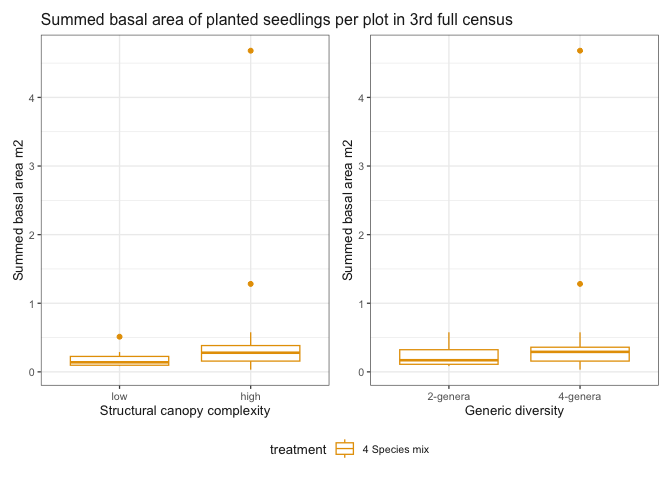
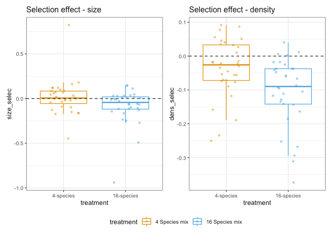
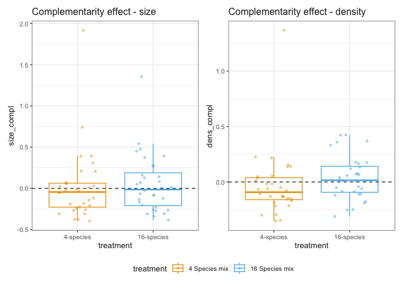

# Results report
eleanorjackson
2026-07-21

- [Summed basal diameter plots](#summed-basal-diameter-plots)
  - [Planting treatment](#planting-treatment)
  - [Structural canopy complexity + generic
    diversity](#structural-canopy-complexity--generic-diversity)
- [Biodiversity effects](#biodiversity-effects)
  - [Net biodiversity effects](#net-biodiversity-effects)
  - [Selection and complementarity
    effects](#selection-and-complementarity-effects)
  - [Selection - size and density](#selection---size-and-density)
  - [Complementarity - size and
    density](#complementarity---size-and-density)

Boxplot figures of basal area and output data from the
[`densize`](https://doi.org/10.1111/ele.14300) package.

``` r
library("tidyverse")
library("patchwork")
library("here")
```

``` r
data <-
    readRDS(here::here("data", "derived", "data_cleaned.rds"))
```

# Summed basal diameter plots

``` r
seedling_ba <-
    data |>
    filter(survival == 1) |> # only alive seedlings
    mutate(dbase_m = dbase_mm / 1000) |>
    mutate(basal_area = pi * (dbase_m / 2)^2) |>
    group_by(
        plot,
        census_yr,
        species_mix,
        treatment,
        generic_diversity,
        struc_complexity
    ) |>
    summarise(sum_basal_area = sum(basal_area, na.rm = TRUE), .groups = "drop")
```

## Planting treatment

``` r
seedling_ba |>
    ggplot(aes(
        x = census_yr,
        y = sum_basal_area,
        colour = treatment
    )) +
    geom_boxplot() +
    labs(y = "Summed basal area m2", x = "Census year") +
    scale_colour_sbe() +
    ggtitle("Summed basal area of planted seedlings per plot in 3rd full census")
```


Remember *n plots* for liana cut plots is smaller than other treatments.
Calcluate per ha:

``` r
seedling_ba |>
    filter(census_yr == "2023-2024") |>
    group_by(treatment) |>
    summarise(
        sum_basal_area = sum(sum_basal_area, na.rm = TRUE),
        n_plots = n_distinct(plot)
    ) |>
    # 1 plot is 4ha
    mutate(basal_area_per_ha = (sum_basal_area / n_plots) / 4)
```

    # A tibble: 4 × 4
      treatment      sum_basal_area n_plots basal_area_per_ha
      <fct>                   <dbl>   <int>             <dbl>
    1 1-species               16.9       32             0.132
    2 4-species               13.3       32             0.104
    3 16-species              13.5       32             0.106
    4 16-species-cut           9.35      16             0.146

## Structural canopy complexity + generic diversity

``` r
seedling_ba |>
    filter(census_yr == "2023-2024") |>
    filter(treatment == "4-species") |>
    ggplot(aes(
        x = struc_complexity,
        y = sum_basal_area,
        colour = treatment
    )) +
    geom_boxplot() +
    labs(y = "Summed basal area m2", x = "Structural canopy complexity") +
    scale_colour_sbe() +
    ggtitle(
        "Summed basal area of planted seedlings per plot in 3rd full census"
    ) +
    seedling_ba |>
        filter(census_yr == "2023-2024") |>
        filter(treatment == "4-species") |>
        ggplot(aes(
            x = generic_diversity,
            y = sum_basal_area,
            colour = treatment
        )) +
    geom_boxplot() +
    labs(y = "Summed basal area m2", x = "Generic diversity") +
    scale_colour_sbe() +
    plot_layout(guides = "collect")
```



``` r
seedling_ba |>
    filter(census_yr == "2023-2024") |>
    filter(treatment == "4-species") |>
    summarise(
        median_ba = median(sum_basal_area, na.rm = TRUE),
        q1 = quantile(sum_basal_area, 0.25, na.rm = TRUE),
        q3 = quantile(sum_basal_area, 0.75, na.rm = TRUE),
        .by = c(generic_diversity, struc_complexity)
    ) |>
    mutate(tile_label = sprintf("%.1f\nIQR: %.1f–%.1f", median_ba, q1, q3)) |>
    ggplot(aes(
        x = generic_diversity,
        y = struc_complexity,
        fill = median_ba
    )) +
    geom_tile() +
    geom_text(
        aes(label = tile_label),
        size = 6,
        colour = "white"
    ) +
    labs(fill = "Median basal area")
```


# Biodiversity effects

## Net biodiversity effects

``` r
biodiv_data <-
    readRDS(here::here("data", "derived", "biodiv_effects.rds"))
```

``` r
biodiv_data |>
    ggplot(aes(x = treatment, y = net, colour = treatment)) +
    geom_boxplot(outliers = FALSE) +
    geom_jitter(width = 0.25, shape = 16, alpha = 0.5) +
    geom_hline(yintercept = 0, linetype = 2) +
    scale_colour_sbe() +
    ggtitle("Net biodiversity effect")
```


## Selection and complementarity effects

``` r
biodiv_data |>
    ggplot(aes(x = treatment, y = selec, colour = treatment)) +
    geom_boxplot(outliers = FALSE) +
    geom_jitter(width = 0.25, shape = 16, alpha = 0.5) +
    geom_hline(yintercept = 0, linetype = 2) +
    scale_colour_sbe() +
    ggtitle("Selection effect") +
    biodiv_data |>
        ggplot(aes(x = treatment, y = compl, colour = treatment)) +
    geom_boxplot(outliers = FALSE) +
    geom_jitter(width = 0.25, shape = 16, alpha = 0.5) +
    geom_hline(yintercept = 0, linetype = 2) +
    scale_colour_sbe() +
    ggtitle("Complementarity effect") +
    plot_layout(guides = "collect")
```


## Selection - size and density

``` r
biodiv_data |>
    ggplot(aes(x = treatment, y = size_selec, colour = treatment)) +
    geom_boxplot(outliers = FALSE) +
    geom_jitter(width = 0.25, shape = 16, alpha = 0.5) +
    geom_hline(yintercept = 0, linetype = 2) +
    scale_colour_sbe() +
    ggtitle("Selection effect - size") +
    biodiv_data |>
        ggplot(aes(x = treatment, y = dens_selec, colour = treatment)) +
    geom_boxplot(outliers = FALSE) +
    geom_jitter(width = 0.25, shape = 16, alpha = 0.5) +
    geom_hline(yintercept = 0, linetype = 2) +
    scale_colour_sbe() +
    ggtitle("Selection effect - density") +
    plot_layout(guides = "collect")
```



## Complementarity - size and density

``` r
biodiv_data |>
    ggplot(aes(x = treatment, y = size_compl, colour = treatment)) +
    geom_boxplot(outliers = FALSE) +
    geom_jitter(width = 0.25, shape = 16, alpha = 0.5) +
    geom_hline(yintercept = 0, linetype = 2) +
    scale_colour_sbe() +
    ggtitle("Complementarity effect - size") +
    biodiv_data |>
        ggplot(aes(x = treatment, y = dens_compl, colour = treatment)) +
    geom_boxplot(outliers = FALSE) +
    geom_jitter(width = 0.25, shape = 16, alpha = 0.5) +
    geom_hline(yintercept = 0, linetype = 2) +
    scale_colour_sbe() +
    ggtitle("Complementarity effect - density") +
    plot_layout(guides = "collect")
```


