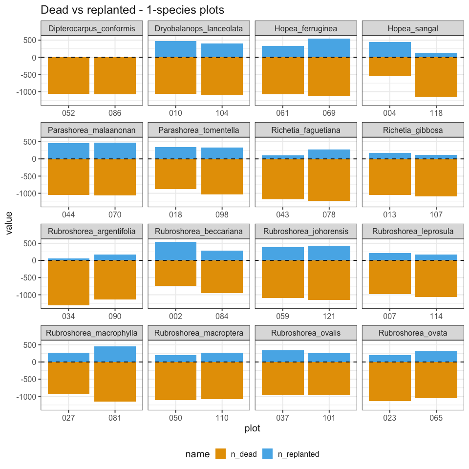
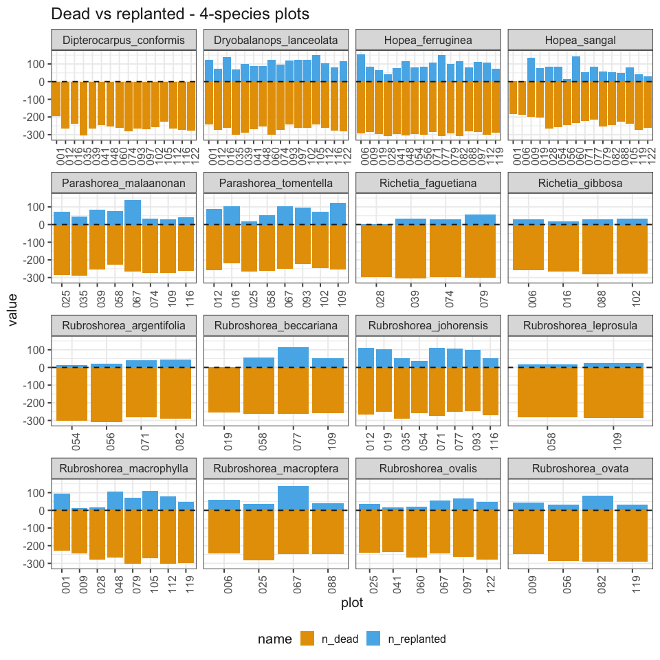
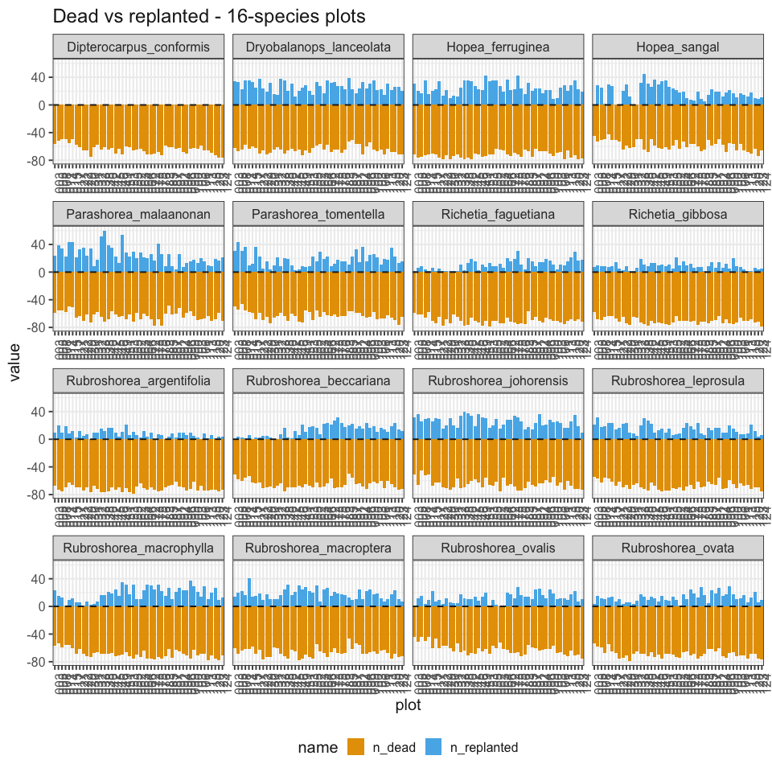

# *Dipterocarpus conformis* check
eleanorjackson
22 July, 2026

> “*Dipterocarpus conformis* seedlings were not available for
> replanting, meaning this one species was not planted. Do we know: were
> the dead individuals of that species left unreplaced or replaced with
> seedlings of the other species?”

``` r
library("tidyverse")
library("patchwork")
library("here")
```

``` r
data <-
    readRDS(here("data", "derived", "data_cleaned.rds"))
```

``` r
data |>
    filter(genus_species == "Dipterocarpus_conformis") |>
    group_by(cohort) |>
    summarise(n_distinct(plant_id))
```

    # A tibble: 1 × 2
      cohort `n_distinct(plant_id)`
      <fct>                   <int>
    1 1                       11541

*Dipterocarpus conformis* seedlings exist only in cohort 1.

``` r
# find D. conformis seedlings which were dead in 1st census
dead_dc <-
    data |>
    filter(genus_species == "Dipterocarpus_conformis") |>
    filter(census_no == "01") |>
    filter(survival == "0") |>
    distinct(plant_id, plot, line, position)
```

``` r
# find any cohort 2 seedlings in the same position
# as the dead D. conformis seedlings

empty_positions <-
    dead_dc |>
    select(plot, line, position)

data |>
    filter(census_no != "01", cohort == 2) |>
    inner_join(empty_positions) |>
    distinct(genus_species)
```

    # A tibble: 15 × 1
       genus_species           
       <fct>                   
     1 Rubroshorea_macrophylla 
     2 Dryobalanops_lanceolata 
     3 Rubroshorea_johorensis  
     4 Parashorea_tomentella   
     5 Richetia_faguetiana     
     6 Hopea_ferruginea        
     7 Rubroshorea_argentifolia
     8 Rubroshorea_macroptera  
     9 Rubroshorea_ovalis      
    10 Parashorea_malaanonan   
    11 Rubroshorea_ovata       
    12 Hopea_sangal            
    13 Rubroshorea_leprosula   
    14 Richetia_gibbosa        
    15 Rubroshorea_beccariana  

Hmm, it looks like other species were planted in place of the dead *D.
conformis.*

But surely not in the *D. conformis* 1-species mixes?

``` r
data |>
    filter(census_no != "01", cohort == 2) |>
    inner_join(empty_positions) |>
    distinct(treatment)
```

    # A tibble: 3 × 1
      treatment     
      <fct>         
    1 4-species     
    2 16-species    
    3 16-species-cut

No, just the other mixes.

Did the replanting exactly replace seedlings which had died?

``` r
data |>
    group_by(cohort) |>
    summarise(n_distinct(plant_id))
```

    # A tibble: 2 × 2
      cohort `n_distinct(plant_id)`
      <fct>                   <int>
    1 1                      143255
    2 2                       29323

There are fewer seedlings in cohort 2 than cohort 1.

``` r
n_dead <-
    data |>
    filter(census_no == "01") |>
    filter(survival == 0) |>
    summarise(n_distinct(plant_id)) |>
    pluck(1, 1)
```

118406 cohort 1 seedlings died in the first census - fewer than the
total number of cohort 2 seedlings. I initially thought that this meant
not all seedlings were replanted, however, some of the replanted
seedlings might have died between planting (2009-2010) and their first
census (the second full census of the SBE, 2011-2013).

Some figures comparing numbers of dead cohort 1 seedlings in the first
census with numbers of cohort 2 seedlings in the second census:

``` r
# find seedlings (of any sp) which were dead in the 1st census
dead_cen1 <-
    data |>
    filter(census_no == "01") |>
    filter(survival == 0) |>
    distinct(plant_id, plot, genus_species, treatment) |>
    group_by(plot, genus_species, treatment) |>
    summarise(n_dead = n_distinct(plant_id))

# find replanted seedlings in cohort 2
replanted <-
    data |>
    filter(cohort == 2) |>
    distinct(plant_id, plot, genus_species, treatment) |>
    group_by(plot, genus_species, treatment) |>
    summarise(n_replanted = n_distinct(plant_id))

dead_v_replant <-
    full_join(dead_cen1, replanted) |>
    mutate(
        n_dead = replace_na(n_dead, 0),
        n_replanted = replace_na(n_replanted, 0)
    ) |>
    mutate(n_dead = -n_dead) |>
    pivot_longer(cols = c(n_dead, n_replanted))
```

``` r
dead_v_replant |>
    filter(treatment == "1-species") |>
    ggplot(aes(x = plot, y = value, fill = name)) +
    geom_col() +
    facet_wrap(~genus_species, scales = "free_x") +
    geom_hline(yintercept = 0, linetype = 2) +
    ggtitle("Dead vs replanted - 1-species plots") +
    theme_sbe(base_size = 15)
```



``` r
dead_v_replant |>
    filter(treatment == "4-species") |>
    ggplot(aes(x = plot, y = value, fill = name)) +
    geom_col() +
    facet_wrap(~genus_species, scales = "free_x") +
    geom_hline(yintercept = 0, linetype = 2) +
    ggtitle("Dead vs replanted - 4-species plots") +
    theme_sbe(base_size = 15) +
    theme(axis.text.x = element_text(angle = 90))
```



``` r
dead_v_replant |>
    filter(treatment == "16-species" | treatment == "16-species-cut") |>
    ggplot(aes(x = plot, y = value, fill = name)) +
    geom_col() +
    facet_wrap(~genus_species, scales = "free_x") +
    geom_hline(yintercept = 0, linetype = 2) +
    ggtitle("Dead vs replanted - 16-species plots") +
    theme_sbe(base_size = 15) +
    theme(axis.text.x = element_text(angle = 90))
```


