# First models - SBE 2nd decade
eleanorjackson
25 August, 2026

- [`lmer` models](#lmer-models)
- [`lm` models](#lm-models)
- [`glmmTMB` models](#glmmtmb-models)

First step to fit:

`partitioning_component ~ treatment + block + (1 | species_mix)`

Later we will fit models for the 4-species plots only:

`partitioning_component ~ structural_complexity * generic_richness + block + (1 | species_mix)`

The 4-species analysis is treated as a separate subanalysis because
structural complexity and generic richness are only defined within that
subset.

``` r
library("tidyverse")
library("patchwork")
library("lme4")
library("glmmTMB")
library("broom.mixed")
library("DHARMa")
```

``` r
partitions <- readRDS(here::here("data", "derived", "biodiv_effects.rds"))
```

Create model fitting function that we can run over multiple
`partitioning_component`s

``` r
fit_models <- function(data, formula, method = c("lmer", "lm", "glmmTMB")) {
    responses <- c(
        m_NE = "net",
        m_CE = "compl",
        m_CE_size = "size_compl",
        m_CE_dens = "dens_compl",
        m_SE = "selec",
        m_SE_size = "size_selec",
        m_SE_dens = "dens_selec"
    )

    fit_one <- purrr::quietly(\(response) {
        if (method == "lmer") {
            lme4::lmer(
                stats::as.formula(
                    paste(response, formula)
                ),
                data = data
            )
        } else if (method == "glmmTMB") {
            glmmTMB::glmmTMB(
                stats::as.formula(
                    paste(response, formula)
                ),
                data = data,
                family = t_family(link = "identity")
            )
        } else {
            stats::lm(
                stats::as.formula(
                    paste(response, formula)
                ),
                data = data
            )
        }
    })

    results <- purrr::map(responses, fit_one)

    # check for warnings and singular fits
    tibble::tibble(
        name = names(responses),
        fit = purrr::map(results, "result"),
        singular = purrr::map_lgl(
            results,
            \(x) method == "lmer" && lme4::isSingular(x$result)
        ),
        warning = purrr::map_chr(
            results,
            \(x) {
                warnings <- x$warnings

                if (method == "lmer" && lme4::isSingular(x$result)) {
                    warnings <- c(
                        warnings,
                        "boundary (singular) fit: see help('isSingular')"
                    )
                }

                paste(unique(warnings), collapse = "\n")
            }
        )
    )
}
```

## `lmer` models

``` r
models_lmer <- fit_models(
    data = partitions,
    formula = "~ 0 + treatment + block + (1 | species_mix)",
    method = "lmer"
)
```

``` r
models_lmer |>
    dplyr::filter(warning != "")
```

    # A tibble: 1 × 4
      name      fit          singular warning                                       
      <chr>     <named list> <lgl>    <chr>                                         
    1 m_SE_dens <lmerMod>    TRUE     boundary (singular) fit: see help('isSingular…

The selection density effect model is giving us a sigular fit, but
others are ok.

``` r
models_lmer |>
    dplyr::filter(warning != "") |>
    pull(fit)
```

    $m_SE_dens
    Linear mixed model fit by REML ['lmerMod']
    Formula: dens_selec ~ 0 + treatment + block + (1 | species_mix)
       Data: data
    REML criterion at convergence: -114.392
    Random effects:
     Groups      Name        Std.Dev.
     species_mix (Intercept) 0.0000  
     Residual                0.0875  
    Number of obs: 64, groups:  species_mix, 17
    Fixed Effects:
     treatment4-species  treatment16-species           blocksouth  
               -0.01582             -0.08733             -0.03701  
    optimizer (nloptwrap) convergence code: 0 (OK) ; 0 optimizer warnings; 1 lme4 warnings 

The model estimates the species_mix variance as exactly zero – suggests
that the data don’t support between-mixture random-intercept variation
for this response.

Most of the `species_mix` levels have only 2 observations (4-species
plots), while one level has 32 observations (the 16-species plots). We
probably shouldn’t have it as a random effect, but I’m not sure it works
as a fixed effect either since it’s confounded with treatment. The
`species_mix` terms might absorb most of the treatment effect.

The cleanest model is probably `reponse ~ 0 + treatment + block`.

We could do a separate exploratory model with species composition for
only the 4-species plots, like `dens_selec ~ species_mix + block`, but
will leave this for now.

## `lm` models

``` r
models_lm <- fit_models(
    data = partitions,
    formula = "~ 0 + treatment + block",
    method = "lm"
)
```

Extract the coefficients and plot them

``` r
results_lm <-
    models_lm |>
    mutate(
        tidy = purrr::map(
            fit,
            tidy,
            effects = "fixed",
            conf.int = TRUE
        )
    ) |>
    unnest(tidy) |>
    mutate(
        term = fct_relevel(
            term,
            "treatment4-species",
            "treatment16-species",
            "blocksouth"
        )
    )
```

``` r
results_lm |>
    ggplot(aes(x = term, y = estimate, ymin = conf.low, ymax = conf.high)) +
    geom_pointrange(shape = 21, fill = "white") +
    labs(x = "Term", y = "Estimate ± CI [95%]") +
    geom_hline(yintercept = 0, color = "blue") +
    coord_flip() +
    facet_wrap(~name, ncol = 1)
```

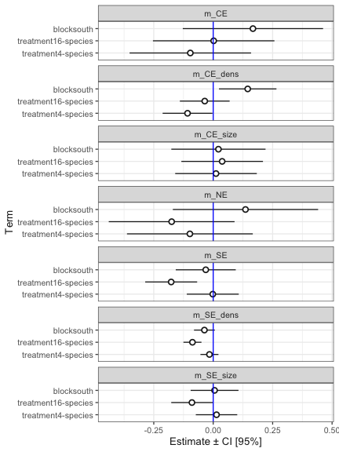

``` r
models_lm <-
    models_lm |>
    mutate(
        resids = purrr::map(
            fit,
            DHARMa::simulateResiduals,
            plot = FALSE
        )
    )
```

``` r
purrr::walk2(
    models_lm$resids,
    models_lm$name,
    \(resids, name) plot(resids, title = name)
)
```

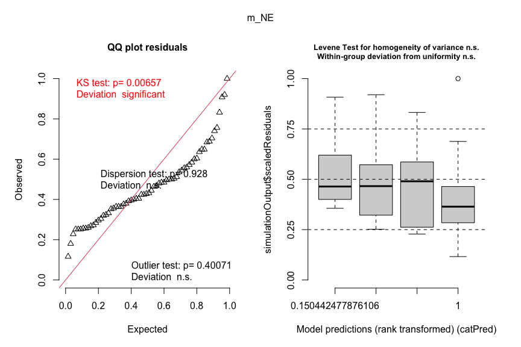

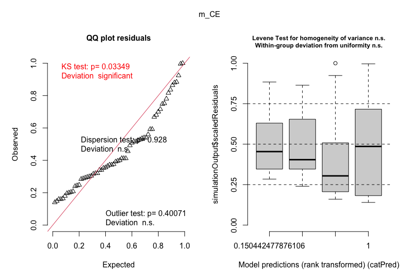

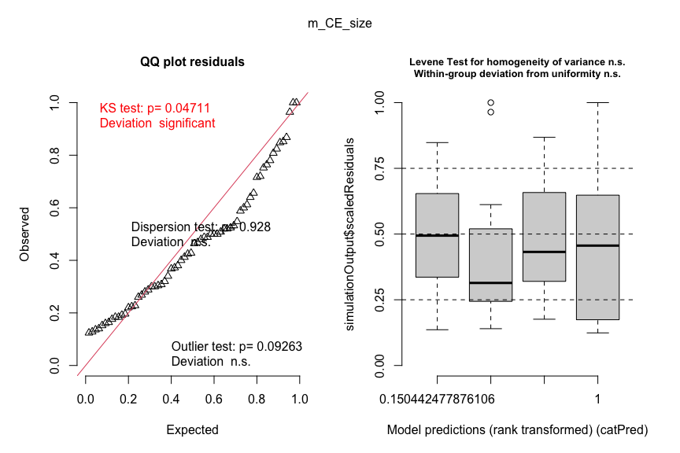

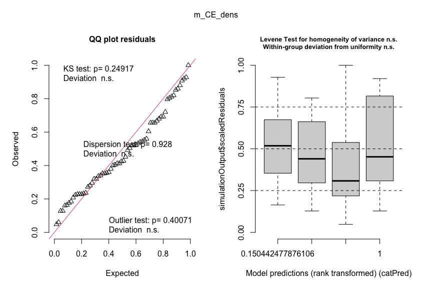

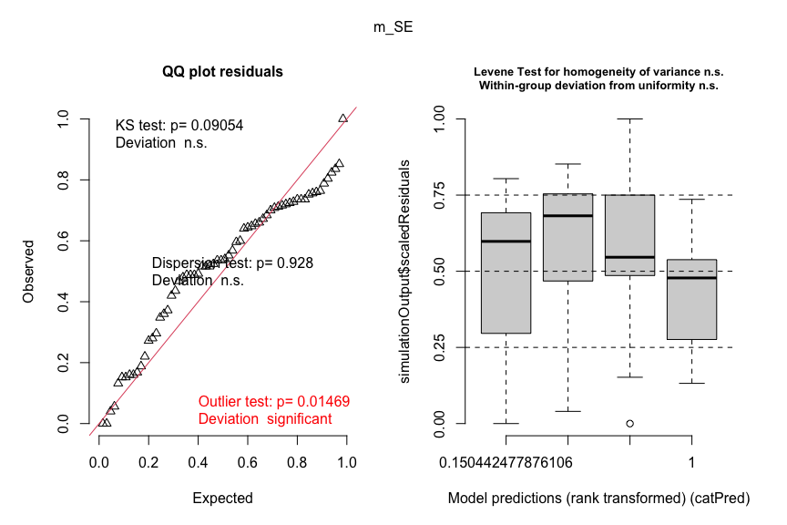

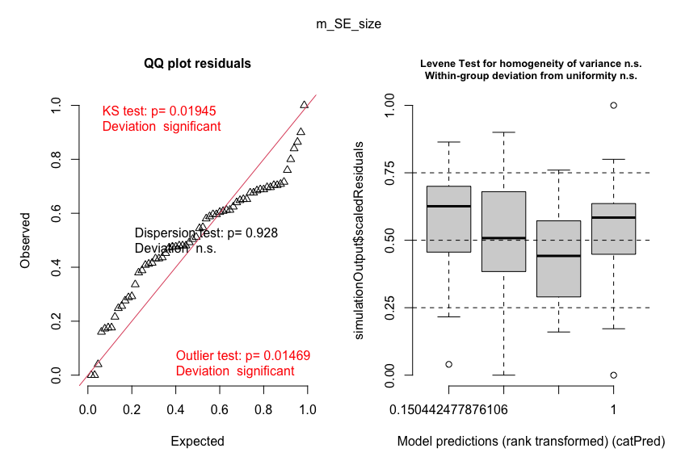

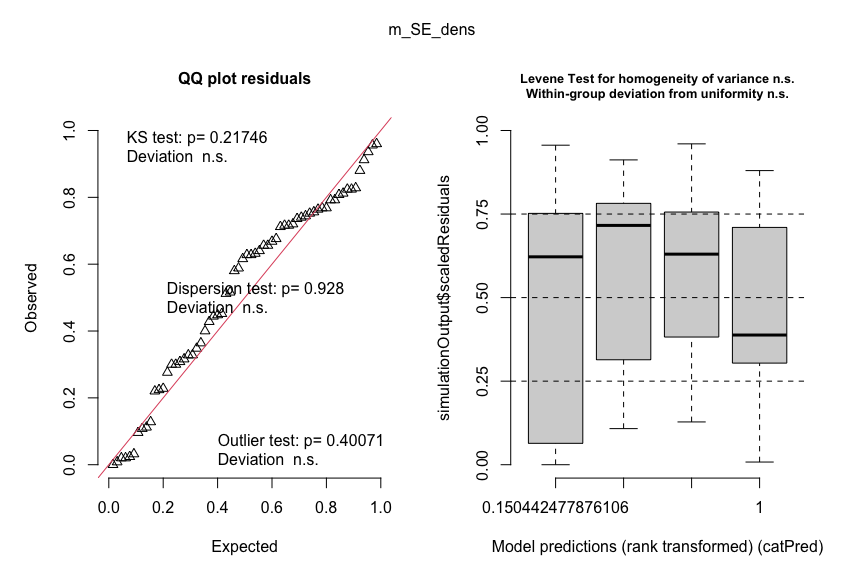

A fair ammount of deviation in the qq plots. Could be due to long tails
in the distribution of the response, see here:

``` r
partitions |>
    ggplot(aes(x = net)) +
    geom_density() +

    partitions |>
        ggplot(aes(x = compl)) +
    geom_density() +

    partitions |>
        ggplot(aes(x = selec)) +
    geom_density() +

    partitions |>
        ggplot(aes(x = size_compl)) +
    geom_density() +

    partitions |>
        ggplot(aes(x = dens_compl)) +
    geom_density() +

    partitions |>
        ggplot(aes(x = size_selec)) +
    geom_density() +

    partitions |>
        ggplot(aes(x = dens_selec)) +
    geom_density()
```

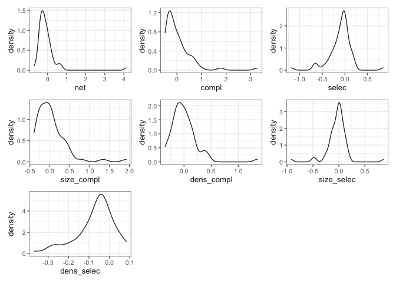

## `glmmTMB` models

Let’s try a t response distribution rather than Gaussian.

``` r
models_tmb <- fit_models(
    data = partitions,
    formula = "~ 0 + treatment + block",
    method = "glmmTMB"
)
```

``` r
models_tmb |>
    dplyr::filter(warning != "")
```

    # A tibble: 0 × 4
    # ℹ 4 variables: name <chr>, fit <named list>, singular <lgl>, warning <chr>

No warnings

``` r
results_tmb <-
    models_tmb |>
    mutate(
        tidy = purrr::map(
            fit,
            tidy,
            effects = "fixed",
            conf.int = TRUE
        )
    ) |>
    unnest(tidy) |>
    mutate(
        term = fct_relevel(
            term,
            "treatment4-species",
            "treatment16-species",
            "blocksouth"
        )
    )
```

``` r
results_tmb |>
    ggplot(aes(x = term, y = estimate, ymin = conf.low, ymax = conf.high)) +
    geom_pointrange(shape = 21, fill = "white") +
    labs(x = "Term", y = "Estimate ± CI [95%]") +
    geom_hline(yintercept = 0, color = "blue") +
    coord_flip() +
    facet_wrap(~name, ncol = 1) +
    ggtitle("glmmTMB") +

    results_lm |>
        ggplot(aes(x = term, y = estimate, ymin = conf.low, ymax = conf.high)) +
    geom_pointrange(shape = 21, fill = "white") +
    labs(x = "Term", y = "Estimate ± CI [95%]") +
    geom_hline(yintercept = 0, color = "blue") +
    coord_flip() +
    facet_wrap(~name, ncol = 1) +
    ggtitle("lm")
```

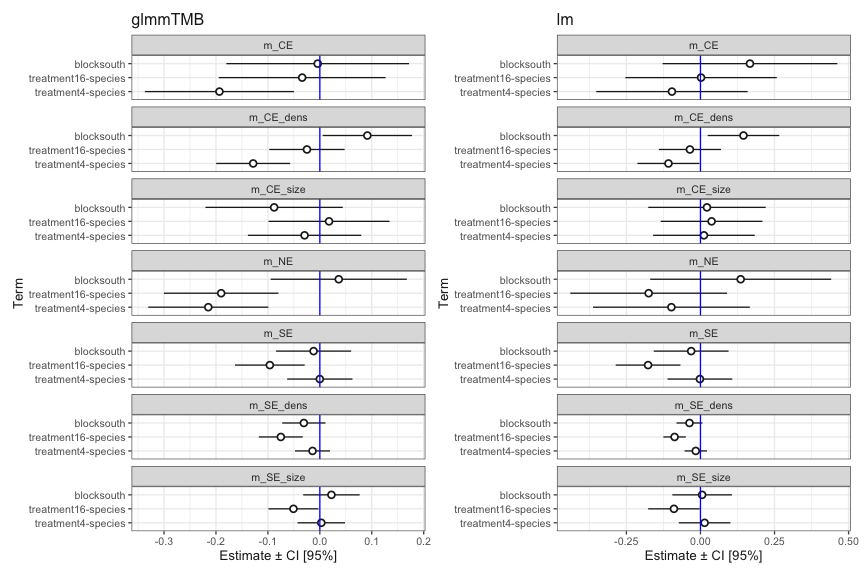

``` r
models_tmb <-
    models_tmb |>
    mutate(
        resids = purrr::map(
            fit,
            DHARMa::simulateResiduals,
            plot = FALSE
        )
    )
```

``` r
purrr::walk2(
    models_tmb$resids,
    models_tmb$name,
    \(resids, name) plot(resids, title = name)
)
```

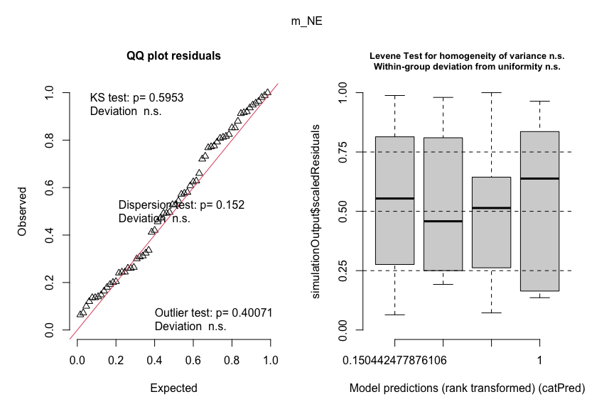

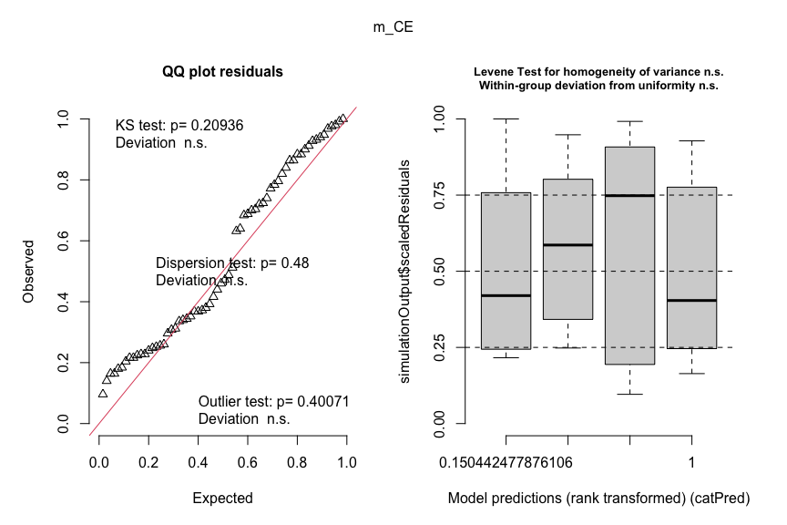

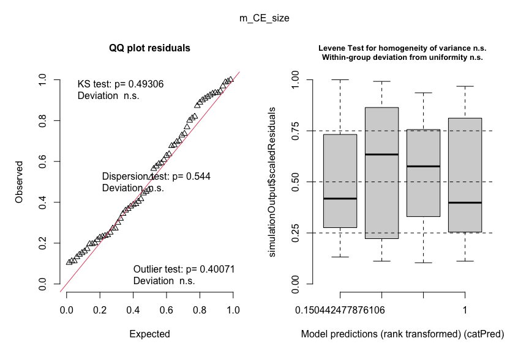

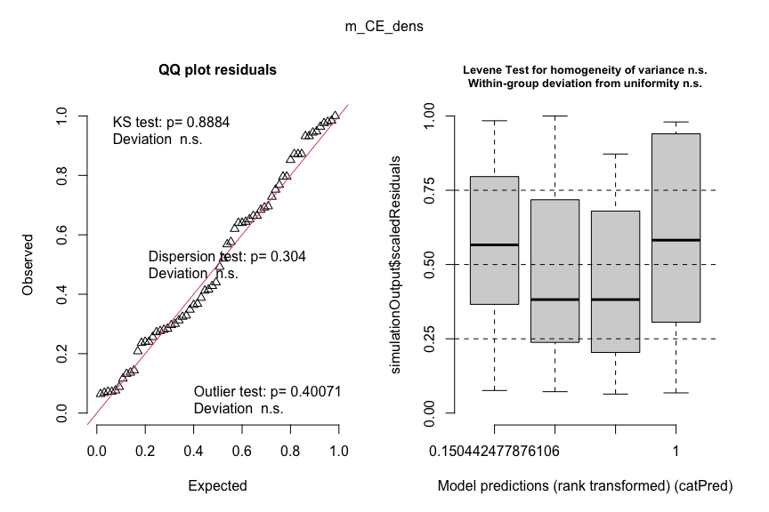

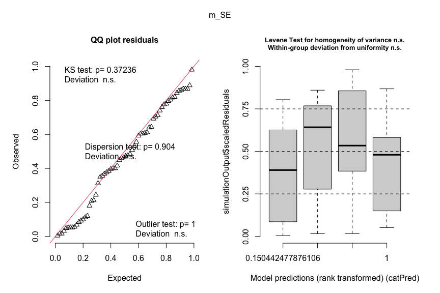

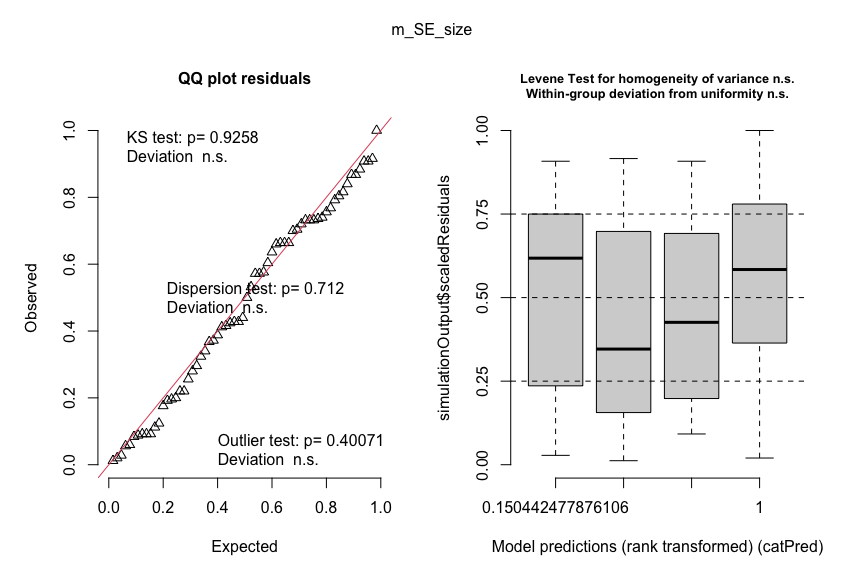

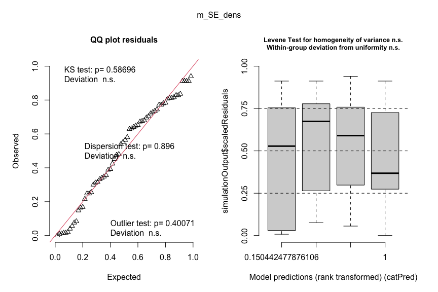

Residuals looking much better!

Printing output for all tmb models:

``` r
models_tmb$fit
```

    $m_NE
    Formula:          net ~ 0 + treatment + block
    Data: data
          AIC       BIC    logLik -2*log(L)  df.resid 
     47.14568  57.94009 -18.57284  37.14568        59 

    Number of obs: 64

    Dispersion estimate for t family (sigma^2): 0.0405 

    Student-t df estimate: 2.27 

    Fixed Effects:

    Conditional model:
     treatment4-species  treatment16-species           blocksouth  
               -0.21478             -0.18999              0.03641  

    $m_CE
    Formula:          compl ~ 0 + treatment + block
    Data: data
          AIC       BIC    logLik -2*log(L)  df.resid 
     82.71632  93.51074 -36.35816  72.71632        59 

    Number of obs: 64

    Dispersion estimate for t family (sigma^2): 0.0749 

    Student-t df estimate: 2.41 

    Fixed Effects:

    Conditional model:
     treatment4-species  treatment16-species           blocksouth  
              -0.193341            -0.033999            -0.004121  

    $m_CE_size
    Formula:          size_compl ~ 0 + treatment + block
    Data: data
          AIC       BIC    logLik -2*log(L)  df.resid 
     42.66234  53.45675 -16.33117  32.66234        59 

    Number of obs: 64

    Dispersion estimate for t family (sigma^2): 0.045 

    Student-t df estimate: 2.76 

    Fixed Effects:

    Conditional model:
     treatment4-species  treatment16-species           blocksouth  
               -0.02940              0.01770             -0.08799  

    $m_CE_dens
    Formula:          dens_compl ~ 0 + treatment + block
    Data: data
          AIC       BIC    logLik -2*log(L)  df.resid 
    -18.89767  -8.10325  14.44883 -28.89767        59 

    Number of obs: 64

    Dispersion estimate for t family (sigma^2): 0.0203 

    Student-t df estimate: 3.48 

    Fixed Effects:

    Conditional model:
     treatment4-species  treatment16-species           blocksouth  
               -0.12838             -0.02480              0.09146  

    $m_SE
    Formula:          selec ~ 0 + treatment + block
    Data: data
          AIC       BIC    logLik -2*log(L)  df.resid 
    -11.72287  -0.92846  10.86144 -21.72287        59 

    Number of obs: 64

    Dispersion estimate for t family (sigma^2): 0.0129 

    Student-t df estimate: 1.85 

    Fixed Effects:

    Conditional model:
     treatment4-species  treatment16-species           blocksouth  
             -8.995e-05           -9.628e-02           -1.203e-02  

    $m_SE_size
    Formula:          size_selec ~ 0 + treatment + block
    Data: data
          AIC       BIC    logLik -2*log(L)  df.resid 
    -56.47047 -45.67606  33.23524 -66.47047        59 

    Number of obs: 64

    Dispersion estimate for t family (sigma^2): 0.00712 

    Student-t df estimate: 2.02 

    Fixed Effects:

    Conditional model:
     treatment4-species  treatment16-species           blocksouth  
               0.002812            -0.050827             0.022321  

    $m_SE_dens
    Formula:          dens_selec ~ 0 + treatment + block
    Data: data
           AIC        BIC     logLik  -2*log(L)   df.resid 
    -124.07817 -113.28376   67.03909 -134.07817         59 

    Number of obs: 64

    Dispersion estimate for t family (sigma^2): 0.00507 

    Student-t df estimate:  5.9 

    Fixed Effects:

    Conditional model:
     treatment4-species  treatment16-species           blocksouth  
               -0.01410             -0.07512             -0.03077  
