# Basal area and density models
eleanorjackson
01 September, 2026

- [1. Including all plots](#1-including-all-plots)
  - [Results](#results)
- [2. 16-species plots only](#2-16-species-plots-only)
  - [Results](#results-1)
- [3. 4-species plots only:](#3-4-species-plots-only)
  - [Results](#results-2)
- [Results summary](#results-summary)

I’m going to fit six models (as listed below) and create accompanying
figures.

1.  Including all plots:

- m1: `basal area ~ treatment + (1|block)`
- m2: `seedling density ~ treatment + (1|block)`

2.  16-species plots only:

- m3: `basal area ~ liana cutting + (1|block)`
- m4: `seedling density ~ liana cutting + (1|block)`

3.  4-species plots only:

- m5: `basal area ~ canopy complexity * generic richness + (1|block)`
- m6:
  `seedling density ~ canopy complexity * generic richness + (1|block)`

``` r
library("tidyverse")
library("patchwork")
library("glmmTMB")
library("broom.mixed")
library("DHARMa")
library("ggdist")
library("emmeans")
```

``` r
data_summed <-
    readRDS(here::here("data", "derived", "data_cleaned.rds")) |>
    filter(survival == 1) |> # only alive seedlings
    filter(census_no == '03') |>
    mutate(dbase_m = dbase_mm / 1000) |>
    mutate(basal_area = pi * (dbase_m / 2)^2) |>
    group_by(
        plot,
        block,
        species_mix,
        treatment,
        generic_diversity,
        struc_complexity
    ) |>
    summarise(
        sum_basal_area = sum(basal_area, na.rm = TRUE),
        density = sum(survival, na.rm = TRUE),
        .groups = "drop"
    )
```

``` r
data_summed |>
    ggplot(aes(x = sum_basal_area)) +
    geom_density() +
    data_summed |>
        ggplot(aes(x = density)) +
    geom_density()
```

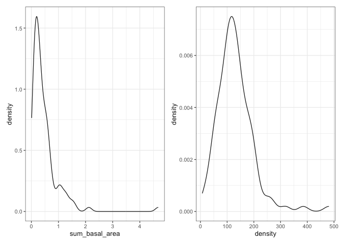

Summed basal area is continuous and non-negative with a right skew.
Lognormal distibution is usually used for e.g. size, mass (exponential
growth). The alternative way to do this would be to log the data and fit
a gaussian.

For seedling density, we probably want to model a negative binomial
response distribution (discrete, non-negative, right skew).

## 1. Including all plots

``` r
data_summed |>
    filter(treatment != "16-species-cut") |>
    group_by(treatment) |>
    summarise(n = n_distinct(plot))
```

    # A tibble: 3 × 2
      treatment      n
      <fct>      <int>
    1 1-species     32
    2 4-species     32
    3 16-species    32

``` r
data_summed |>
    filter(treatment != "16-species-cut") |>
    ggplot(aes(x = sum_basal_area, y = treatment, colour = treatment)) +
    geom_swarm(shape = 16) +
    scale_colour_sbe() +

    data_summed |>
        filter(treatment != "16-species-cut") |>
        ggplot(aes(x = density, y = treatment, colour = treatment)) +
    geom_swarm(shape = 16) +
    scale_colour_sbe() +
    plot_layout(guides = "collect")
```

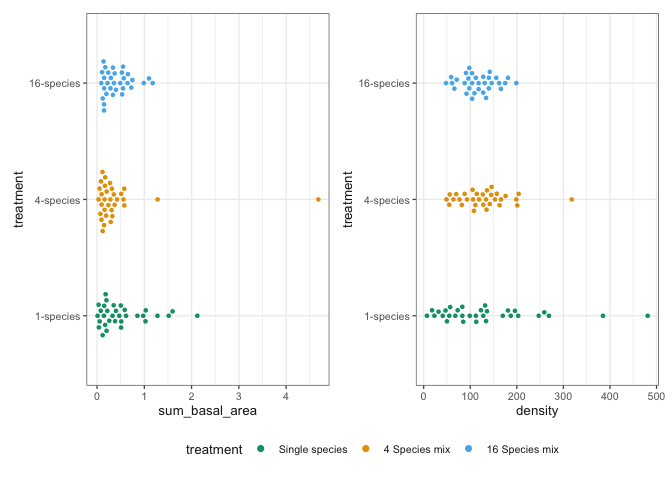

For density, I’m modelling the dispersion parameter as a function of
treatment. The single-species plots have a more variance than the other
two groups (see figure above). When I ran the model treating the
dispersion parameter as a constant, it “violated the assumption of a
homogeneous dispersion parameter across groups” - DHARMa.

``` r
m1 <-
    glmmTMB(
        sum_basal_area ~ 0 + treatment + (1 | block),
        data = filter(data_summed, treatment != "16-species-cut"),
        family = lognormal(link = "log")
    )

m2 <-
    glmmTMB(
        density ~ 0 + treatment + (1 | block),
        dispformula = ~treatment,
        data = filter(data_summed, treatment != "16-species-cut"),
        family = nbinom2(link = "log")
    )
```

Because we used a log link, we need to back transform estimates with
`exp()` to get them on the response scale.

``` r
results_1 <-
    tibble(name = factor(c("Basal area", "Density")), fit = list(m1, m2)) |>
    mutate(
        tidy = purrr::map(
            fit,
            tidy,
            effects = "fixed",
            conf.int = TRUE,
            exponentiate = TRUE
        )
    )
```

``` r
results_1 <-
    results_1 |>
    mutate(
        resids = purrr::map(
            fit,
            DHARMa::simulateResiduals,
            plot = FALSE
        )
    )
```

``` r
purrr::walk2(
    results_1$resids,
    results_1$name,
    \(resids, name) plot(resids, title = name)
)
```

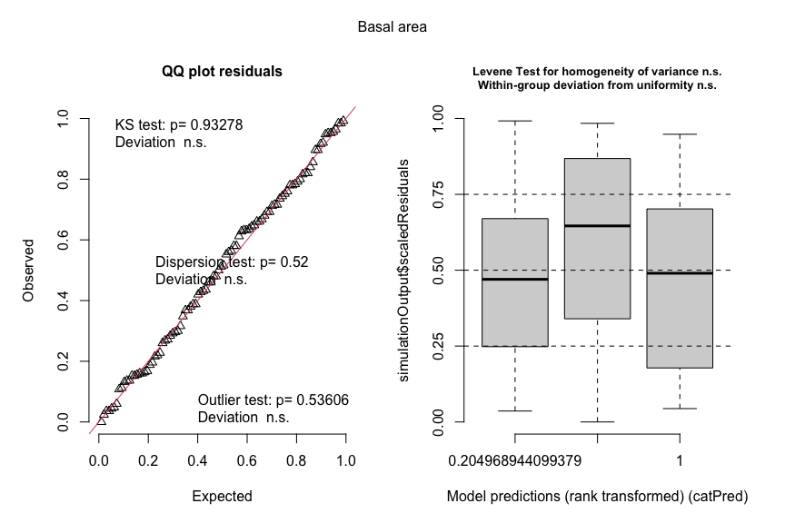

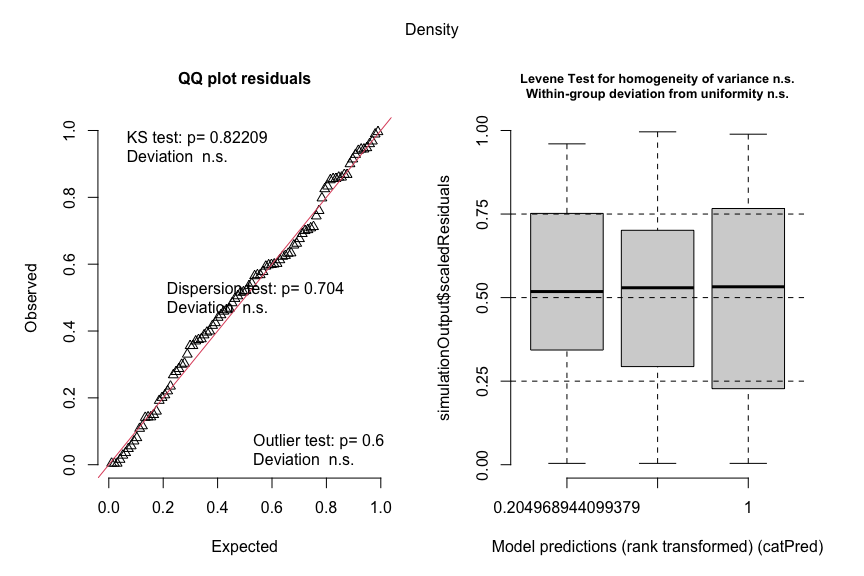

``` r
results_1 |>
    unnest(tidy) |>
    mutate(term = str_remove(term, "treatment")) |>
    mutate(
        term = fct_relevel(
            term,
            "1-species",
            "4-species",
            "16-species"
        ),
        name = fct_relevel(
            name,
            "Basal area",
            "Density"
        )
    ) |>
    ggplot(aes(
        x = term,
        y = estimate,
        ymin = conf.low,
        ymax = conf.high,
        colour = term
    )) +
    geom_pointrange(shape = 21, fill = "white") +
    labs(x = "Term", y = "Estimate ± CI [95%]") +
    coord_flip() +
    scale_colour_sbe() +
    facet_wrap(~name, ncol = 2, scales = "free_x")
```

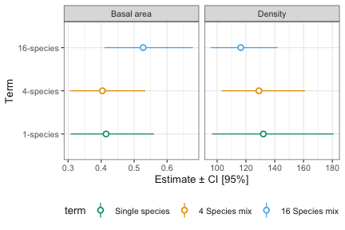

Test if any difference between treatments:

``` r
# basal area
emm_m1 <- emmeans(m1, ~treatment)
pairs(
    emm_m1,
    type = "response",
    side = "two-sided",
    infer = TRUE,
    level = 0.95,
    adjust = "tukey"
)
```

     contrast                   ratio     SE  df asymp.LCL asymp.UCL null z.ratio
     (1-species) / (4-species)  1.027 0.1410 Inf     0.745      1.42    1   0.196
     (1-species) / (16-species) 0.787 0.1030 Inf     0.579      1.07    1  -1.830
     (4-species) / (16-species) 0.766 0.0983 Inf     0.567      1.03    1  -2.077
     p.value
      0.9791
      0.1597
      0.0946

    Confidence level used: 0.95 
    Conf-level adjustment: tukey method for comparing a family of 3 estimates 
    Intervals are back-transformed from the log scale 
    P value adjustment: tukey method for comparing a family of 3 estimates 
    Tests are performed on the log scale 

``` r
# seedling density
emm_m2 <- emmeans(m2, ~treatment)
pairs(
    emm_m2,
    type = "response",
    side = "two-sided",
    infer = TRUE,
    level = 0.95,
    adjust = "tukey"
)
```

     contrast                   ratio     SE  df asymp.LCL asymp.UCL null z.ratio
     (1-species) / (4-species)   1.02 0.1560 Inf     0.717      1.46    1   0.155
     (1-species) / (16-species)  1.13 0.1630 Inf     0.811      1.59    1   0.880
     (4-species) / (16-species)  1.11 0.0978 Inf     0.901      1.36    1   1.161
     p.value
      0.9868
      0.6530
      0.4765

    Confidence level used: 0.95 
    Conf-level adjustment: tukey method for comparing a family of 3 estimates 
    Intervals are back-transformed from the log scale 
    P value adjustment: tukey method for comparing a family of 3 estimates 
    Tests are performed on the log scale 

Beacuse we use a log-link in all our models, contrasts become ratios
after back-transformation, so:

- ratio of `1` = groups have the same estimated response
- `1.25` = first group is 25% higher than the second
- `0.80` = first group is 20% lower than the second
- `2` = first group has twice the estimated response
- `0.50` = first group has half the estimated response

For confidence intervals:

- If the entire ratio CI is above `1`, the first group is estimated to
  have the higher response
- If the entire CI is below `1`, the first group is estimated to have
  the lower response
- If the CI includes `1`, the results are compatible with no difference,
  as well as the range of effects covered by the interval

### Results

- Basal area
  - Basal area was estimated to be similar in 1- and 4-species plots
    (ratio: 1.03; Tukey-adjusted 95% CI: 0.75–1.42). The interval was
    compatible with basal area being approximately 25% lower to 42%
    higher in 1-species plots
  - Basal area in 1-species plots was estimated to be 0.79 times that in
    16-species plots (95% CI: 0.58–1.07), corresponding to an estimated
    21% lower basal area. However, the interval ranged from
    approximately 42% lower to 7% higher
  - Basal area in 4-species plots was estimated to be 0.77 times that in
    16-species plots (95% CI: 0.57–1.03), corresponding to an estimated
    23% lower basal area. The interval ranged from approximately 43%
    lower to 3% higher
- Seedling density
  - Seedling density was estimated to be similar in 1- and 4-species
    plots (ratio: 1.02; Tukey-adjusted 95% CI: 0.72–1.46)
  - Seedling density in 1-species plots was estimated to be 1.13 times
    that in 16-species plots (95% CI: 0.81–1.59), corresponding to an
    estimated 13% higher density, with the interval ranging from
    approximately 19% lower to 59% higher
  - Seedling density in 4-species plots was estimated to be 1.11 times
    that in 16-species plots (95% CI: 0.90–1.36), corresponding to an
    estimated 11% higher density, with the interval ranging from
    approximately 10% lower to 36% higher
- All intervals include a ratio of one, suggesting that there is no
  clear difference in the estimated response between groups

## 2. 16-species plots only

``` r
data_summed |>
    filter(species_mix == "16-species") |>
    group_by(treatment) |>
    summarise(n = n_distinct(plot))
```

    # A tibble: 2 × 2
      treatment          n
      <fct>          <int>
    1 16-species        32
    2 16-species-cut    16

``` r
data_summed |>
    filter(species_mix == "16-species") |>
    ggplot(aes(x = sum_basal_area, y = treatment, colour = treatment)) +
    geom_swarm(shape = 16) +
    scale_colour_sbe() +
    data_summed |>
        filter(species_mix == "16-species") |>
        ggplot(aes(x = density, y = treatment, colour = treatment)) +
    geom_swarm(shape = 16) +
    scale_colour_sbe() +
    plot_layout(guides = "collect")
```


``` r
m3 <-
    glmmTMB(
        sum_basal_area ~ 0 + treatment + (1 | block),
        data = filter(data_summed, species_mix == "16-species"),
        family = lognormal(link = "log")
    )

m4 <-
    glmmTMB(
        density ~ 0 + treatment + (1 | block),
        data = filter(data_summed, species_mix == "16-species"),
        family = nbinom2(link = "log")
    )
```

``` r
results_2 <-
    tibble(name = factor(c("Basal area", "Density")), fit = list(m3, m4)) |>
    mutate(
        tidy = purrr::map(
            fit,
            tidy,
            effects = "fixed",
            conf.int = TRUE,
            exponentiate = TRUE
        )
    )
```

``` r
results_2 <-
    results_2 |>
    mutate(
        resids = purrr::map(
            fit,
            DHARMa::simulateResiduals,
            plot = FALSE
        )
    )
```

``` r
purrr::walk2(
    results_2$resids,
    results_2$name,
    \(resids, name) plot(resids, title = name)
)
```

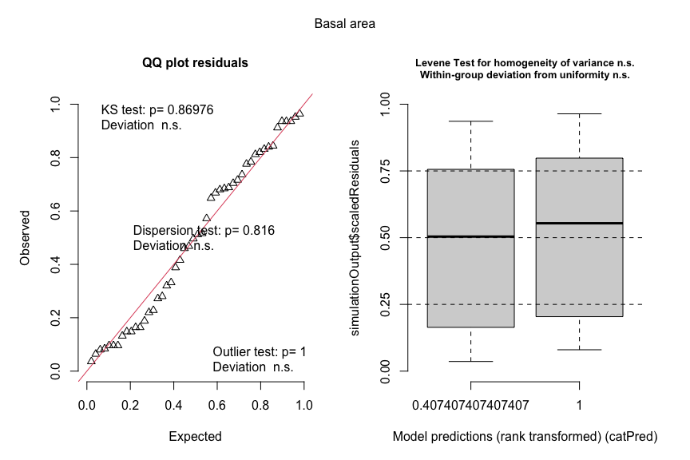

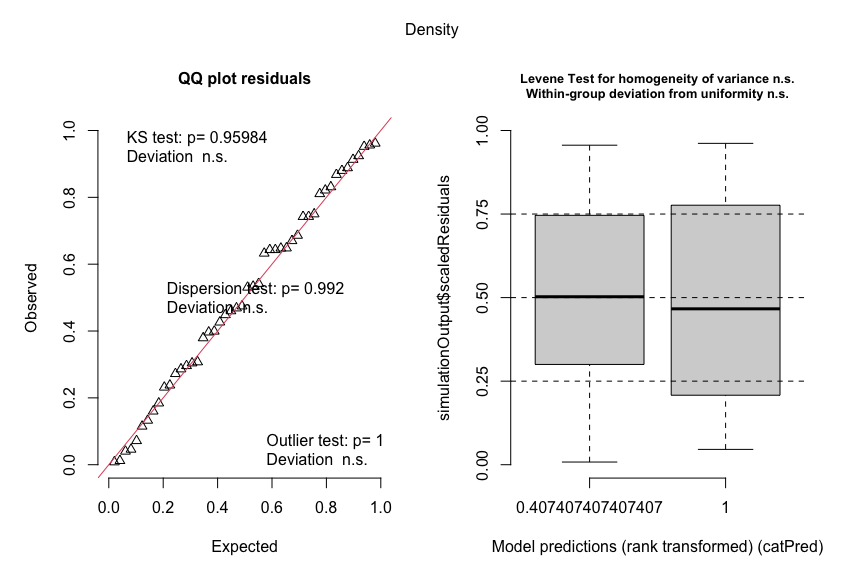

``` r
results_2 |>
    unnest(tidy) |>
    mutate(term = str_remove(term, "treatment")) |>
    mutate(
        term = fct_relevel(
            term,
            "16-species",
            "16-species-cut"
        ),
        name = fct_relevel(
            name,
            "Basal area",
            "Density"
        )
    ) |>
    ggplot(aes(
        x = term,
        y = estimate,
        ymin = conf.low,
        ymax = conf.high,
        colour = term
    )) +
    geom_pointrange(shape = 21, fill = "white") +
    labs(x = "Term", y = "Estimate ± CI [95%]") +
    coord_flip() +
    scale_colour_sbe() +
    facet_wrap(~name, ncol = 2, scales = "free_x")
```

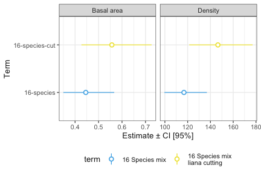

Test if any difference between treatments:

``` r
# basal area
emm_m3 <- emmeans(m3, ~treatment)
pairs(
    emm_m3,
    type = "response",
    side = "two-sided",
    infer = TRUE,
    level = 0.95,
    reverse = TRUE,
    adjust = "none" # only 2 groups so no adjustment needed
)
```

     contrast                        ratio    SE  df asymp.LCL asymp.UCL null
     (16-species-cut) / (16-species)  1.25 0.163 Inf     0.967      1.61    1
     z.ratio p.value
       1.703  0.0885

    Confidence level used: 0.95 
    Intervals are back-transformed from the log scale 
    Tests are performed on the log scale 

``` r
# seedling density
emm_m4 <- emmeans(m4, ~treatment)
pairs(
    emm_m4,
    type = "response",
    side = "two-sided",
    infer = TRUE,
    level = 0.95,
    reverse = TRUE,
    adjust = "none"
)
```

     contrast                        ratio    SE  df asymp.LCL asymp.UCL null
     (16-species-cut) / (16-species)  1.26 0.113 Inf      1.05       1.5    1
     z.ratio p.value
       2.522  0.0117

    Confidence level used: 0.95 
    Intervals are back-transformed from the log scale 
    Tests are performed on the log scale 

### Results

- Basal area
  - Basal area in liana-cut plots was estimated to be 1.25 times that in
    uncut 16-species plots (95% CI: 0.97–1.61), corresponding to an
    estimated 25% increase
  - The confidence interval ranged from approximately 3% lower to 61%
    higher and included a ratio of 1. The data therefore remain
    compatible with no difference, although the point estimate suggests
    higher basal area following liana cutting
- Seedling density
  - Seedling density in liana-cut plots was estimated to be 1.26 times
    that in uncut 16-species plots (95% CI: 1.05–1.50), corresponding to
    an estimated 26% increase
  - The entire confidence interval was above 1, indicating that density
    was estimated to be approximately 5–50% higher in liana-cut plots
  - the results support higher seedling density following liana cutting,
    but the confidence interval around the magnitude of that increase is
    large

Even though the confidence intervals for the two seedling density
estimates overlap (see figure above), this does not directly measure
uncertainty in their difference. The model contrast incorporates the
covariance between the estimates and supports higher seedling density in
liana-cut plots.

## 3. 4-species plots only:

Generic diversity is confounded with structural complexity, and the full
interaction model might be overparameterised beause one of the four
combinations is missing - there is no 4-genera, low-complexity
combination.

So I don’t think we can get clean, independent main effects.

We can try treating the 3 observed combinations as one 3-level factor.

``` r
data_summed <- data_summed |>
    mutate(
        grichness_ccomplexity = interaction(
            generic_diversity,
            struc_complexity,
            sep = ", ",
            drop = TRUE
        )
    )
```

``` r
data_summed |>
    filter(treatment == "4-species") |>
    group_by(grichness_ccomplexity) |>
    summarise(n = n_distinct(plot))
```

    # A tibble: 3 × 2
      grichness_ccomplexity     n
      <fct>                 <int>
    1 2-genera, low             8
    2 2-genera, high            8
    3 4-genera, high           16

``` r
data_summed |>
    filter(treatment == "4-species" & generic_diversity == "2-genera") |>
    ggplot(aes(
        x = sum_basal_area,
        y = struc_complexity,
        colour = treatment
    )) +
    geom_swarm(shape = 16) +
    scale_colour_sbe() +
    data_summed |>
        filter(treatment == "4-species" & generic_diversity == "2-genera") |>
        ggplot(aes(
            x = density,
            y = struc_complexity,
            colour = treatment
        )) +
    geom_swarm(shape = 16) +
    scale_colour_sbe() +
    plot_layout(guides = "collect") +
    plot_annotation(title = "Generic richness held at two")
```

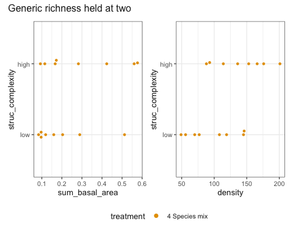

``` r
data_summed |>
    filter(treatment == "4-species" & struc_complexity == "high") |>
    ggplot(aes(
        x = sum_basal_area,
        y = generic_diversity,
        colour = treatment
    )) +
    geom_swarm(shape = 16) +
    scale_colour_sbe() +
    data_summed |>
        filter(treatment == "4-species" & struc_complexity == "high") |>
        ggplot(aes(
            x = density,
            y = generic_diversity,
            colour = treatment
        )) +
    geom_swarm(shape = 16) +
    scale_colour_sbe() +
    plot_layout(guides = "collect") +
    plot_annotation(title = "Canopy structural complexity held at `high`")
```

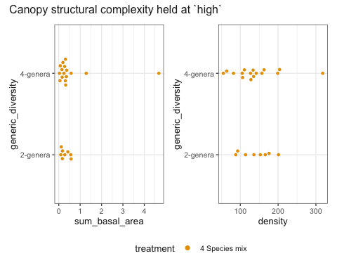

``` r
m5 <-
    glmmTMB(
        sum_basal_area ~ 0 + grichness_ccomplexity + (1 | block),
        data = filter(data_summed, treatment == "4-species"),
        family = lognormal(link = "log")
    )

m6 <-
    glmmTMB(
        density ~ 0 + grichness_ccomplexity + (1 | block),
        data = filter(data_summed, treatment == "4-species"),
        family = nbinom2(link = "log")
    )
```

``` r
results_3 <-
    tibble(name = factor(c("Basal area", "Density")), fit = list(m5, m6)) |>
    mutate(
        tidy = purrr::map(
            fit,
            tidy,
            effects = "fixed",
            conf.int = TRUE,
            exponentiate = TRUE
        )
    )
```

``` r
results_3 <-
    results_3 |>
    mutate(
        resids = purrr::map(
            fit,
            DHARMa::simulateResiduals,
            plot = FALSE
        )
    )
```

``` r
purrr::walk2(
    results_3$resids,
    results_3$name,
    \(resids, name) plot(resids, title = name)
)
```

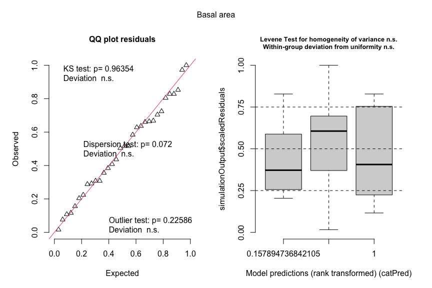

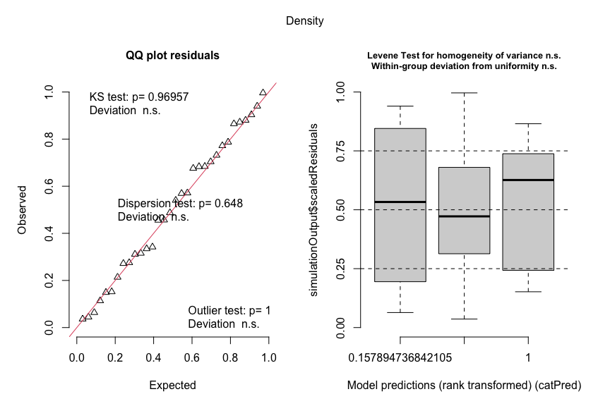

``` r
results_3 |>
    unnest(tidy) |>
    mutate(
        name = fct_relevel(
            name,
            "Basal area",
            "Density"
        ),
        treatment = "4-species"
    ) |>
    ggplot(aes(
        x = term,
        y = estimate,
        ymin = conf.low,
        ymax = conf.high,
        colour = treatment
    )) +
    geom_pointrange(shape = 21, fill = "white") +
    labs(x = "Term", y = "Estimate ± CI [95%]") +
    coord_flip() +
    scale_colour_sbe() +
    facet_wrap(~name, ncol = 2, scales = "free_x")
```

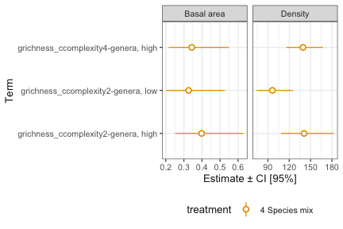

Test if any difference between treatments:

``` r
# basal area
emm_m5 <- emmeans(m5, ~grichness_ccomplexity)
contrast(
    emm_m5,
    method = list(
        "canopy complexity low vs high (at 2 genera)" = c(1, -1, 0),
        "generic richness 2 vs 4 (at high complexity)" = c(0, 1, -1)
    ),
    type = "response",
    side = "two-sided",
    infer = TRUE,
    level = 0.95,
    adjust = "holm"
)
```

     contrast                                     ratio    SE  df asymp.LCL
     canopy complexity low vs high (at 2 genera)  0.819 0.205 Inf     0.467
     generic richness 2 vs 4 (at high complexity) 1.159 0.254 Inf     0.709
     asymp.UCL null z.ratio p.value
          1.43    1  -0.800  0.8475
          1.90    1   0.673  0.8475

    Confidence level used: 0.95 
    Conf-level adjustment: bonferroni method for 2 estimates 
    Intervals are back-transformed from the log scale 
    P value adjustment: holm method for 2 tests 
    Tests are performed on the log scale 

``` r
# seedling density
emm_m6 <- emmeans(m6, ~grichness_ccomplexity)
contrast(
    emm_m6,
    method = list(
        "canopy complexity low vs high (at 2 genera)" = c(1, -1, 0),
        "generic richness 2 vs 4 (at high complexity)" = c(0, 1, -1)
    ),
    type = "response",
    side = "two-sided",
    infer = TRUE,
    level = 0.95,
    adjust = "holm"
)
```

     contrast                                     ratio    SE  df asymp.LCL
     canopy complexity low vs high (at 2 genera)  0.683 0.129 Inf     0.447
     generic richness 2 vs 4 (at high complexity) 1.011 0.164 Inf     0.702
     asymp.UCL null z.ratio p.value
          1.04    1  -2.017  0.0874
          1.46    1   0.066  0.9475

    Confidence level used: 0.95 
    Conf-level adjustment: bonferroni method for 2 estimates 
    Intervals are back-transformed from the log scale 
    P value adjustment: holm method for 2 tests 
    Tests are performed on the log scale 

### Results

- Basal area
  - Basal area under low canopy complexity was 0.82 times (0.47-1.43)
    that under high complexity when generic richness was held at 2
    genera
  - Basal area under generic richness 2 was 1.16 times (0.71-1.90) that
    in the 4 genera treatment when canopy complexity was held at `high`
- Seedling density
  - Seedling density under low canopy complexity was 0.68 times
    (0.45-1.04) that under high complexity when generic richness was
    held at 2 genera
  - When canopy complexity was held at `high` seedling density was
    nearly identical between the two- and four- genera treatments (ratio
    1.01, 0.70-1.46)
- All intervals include one, suggesting that there is no clear
  difference in the estimated response between groups.

## Results summary

Across the species richness treatments (all plots), all 95% confidence
intervals for the basal area and seedling density ratios included 1,
meaning the estimates remained compatible with no difference.

The confidence intervals for comparisons among the observed generic
richness and canopy complexity combinations (4-species plots) likewise
included 1.

In the liana cutting comparisons (16-species plots), the basal area
ratio also showed no difference between groups. However, seedling
density was estimated to be 26% higher in liana-cut plots than in uncut
plots, with the 95% confidence interval indicating an increase of
approximately 5% to 50%.
