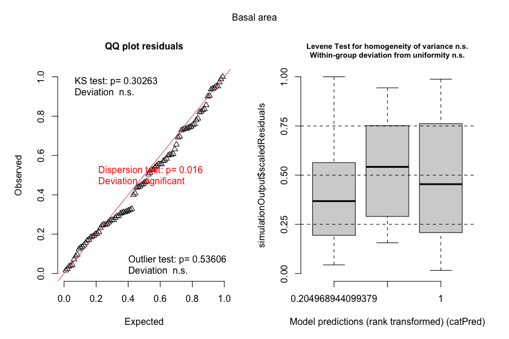
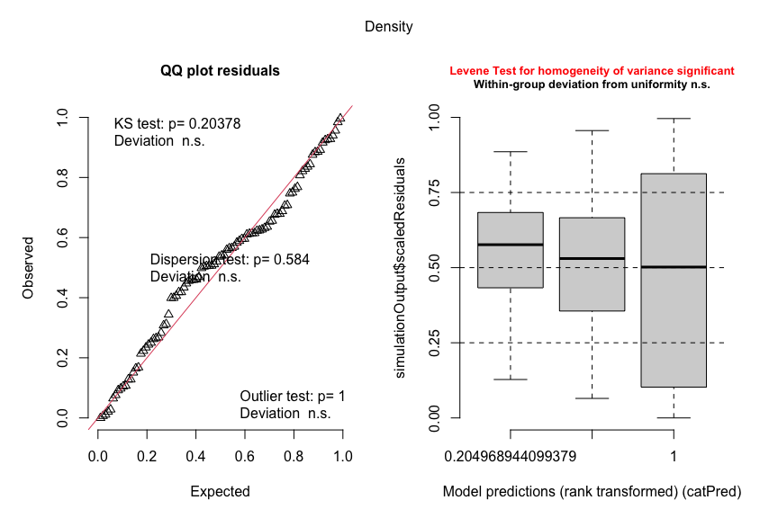
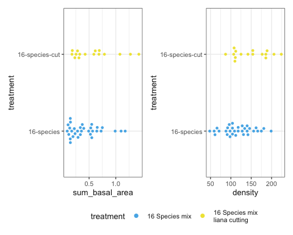
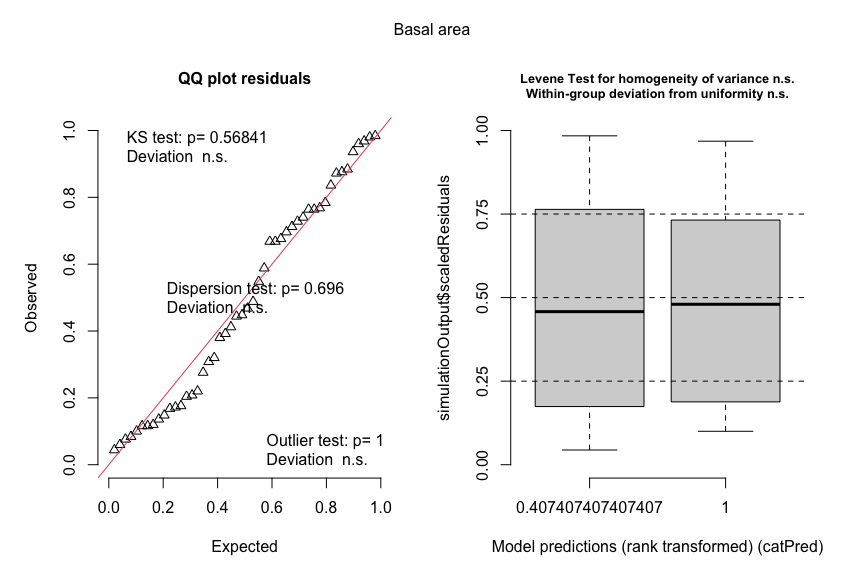
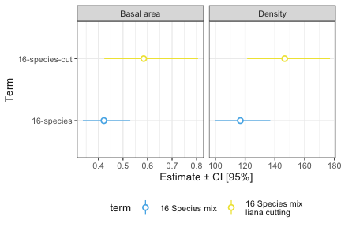
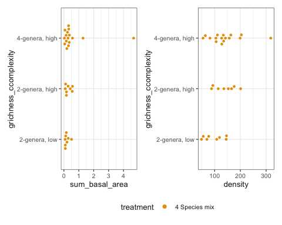
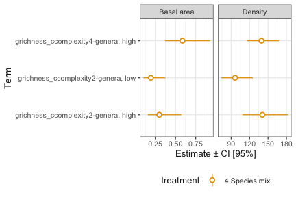

# Basal area and density models
eleanorjackson
28 August, 2026

- [1. Including all plots](#1-including-all-plots)
- [2. 16-species plots only](#2-16-species-plots-only)
- [3. 4-species plots only:](#3-4-species-plots-only)

I’m going to fit six models (as listed below) and create accompanying
figures.

1.  Including all plots:

- m1: `basal area ~ treatment + (1|block)`
- m2: `seedling density ~ treatment + (1|block)`

2.  16-species plots only:

- m3: `basal area ~ liana cutting + (1|block)`
- m4: `seedling density ~ liana cutting + (1|block)`

3.  4-species plots only:

- m5: `basal area ~ canopy complexity * generic richness + (1|block)`
- m6:
  `seedling density ~ canopy complexity * generic richness + (1|block)`

``` r
library("tidyverse")
library("patchwork")
library("glmmTMB")
library("broom.mixed")
library("DHARMa")
library("ggdist")
library("emmeans")
```

``` r
data_summed <-
    readRDS(here::here("data", "derived", "data_cleaned.rds")) |>
    filter(survival == 1) |> # only alive seedlings
    filter(census_no == '03') |>
    mutate(dbase_m = dbase_mm / 1000) |>
    mutate(basal_area = pi * (dbase_m / 2)^2) |>
    group_by(
        plot,
        block,
        species_mix,
        treatment,
        generic_diversity,
        struc_complexity
    ) |>
    summarise(
        sum_basal_area = sum(basal_area, na.rm = TRUE),
        density = sum(survival, na.rm = TRUE),
        .groups = "drop"
    )
```

``` r
data_summed |>
    ggplot(aes(x = sum_basal_area)) +
    geom_density() +
    data_summed |>
        ggplot(aes(x = density)) +
    geom_density()
```


Summed basal area is continuous and non-negative. If all values are
positive and right-skewed, a Gamma model with a log link?

For seedling density, probably negative binomial

## 1. Including all plots

``` r
data_summed |>
    filter(treatment != "16-species-cut") |>
    ggplot(aes(x = sum_basal_area, y = treatment, colour = treatment)) +
    geom_swarm(shape = 16) +
    scale_colour_sbe() +

    data_summed |>
        filter(treatment != "16-species-cut") |>
        ggplot(aes(x = density, y = treatment, colour = treatment)) +
    geom_swarm(shape = 16) +
    scale_colour_sbe() +
    plot_layout(guides = "collect")
```


``` r
m1 <-
    glmmTMB(
        sum_basal_area ~ 0 + treatment + (1 | block),
        data = filter(data_summed, treatment != "16-species-cut"),
        family = Gamma(link = "log")
    )

m2 <-
    glmmTMB(
        density ~ 0 + treatment + (1 | block),
        data = filter(data_summed, treatment != "16-species-cut"),
        family = nbinom2(link = "log")
    )
```

Because we used a log link, we need to back transform estimates with
`exp()` to get them on the response scale.

``` r
results_1 <-
    tibble(name = factor(c("Basal area", "Density")), fit = list(m1, m2)) |>
    mutate(
        tidy = purrr::map(
            fit,
            tidy,
            effects = "fixed",
            conf.int = TRUE,
            exponentiate = TRUE
        )
    )
```

``` r
results_1 <-
    results_1 |>
    mutate(
        resids = purrr::map(
            fit,
            DHARMa::simulateResiduals,
            plot = FALSE
        )
    )
```

``` r
purrr::walk2(
    results_1$resids,
    results_1$name,
    \(resids, name) plot(resids, title = name)
)
```





``` r
results_1 |>
    unnest(tidy) |>
    mutate(term = str_remove(term, "treatment")) |>
    mutate(
        term = fct_relevel(
            term,
            "1-species",
            "4-species",
            "16-species"
        ),
        name = fct_relevel(
            name,
            "Basal area",
            "Density"
        )
    ) |>
    ggplot(aes(
        x = term,
        y = estimate,
        ymin = conf.low,
        ymax = conf.high,
        colour = term
    )) +
    geom_pointrange(shape = 21, fill = "white") +
    labs(x = "Term", y = "Estimate ± CI [95%]") +
    coord_flip() +
    scale_colour_sbe() +
    facet_wrap(~name, ncol = 2, scales = "free_x")
```


Test if any difference between treatments:

``` r
# basal area
emm_m1 <- emmeans(m1, ~treatment)
pairs(emm_m1, type = "response", infer = TRUE, level = 0.95)
```

     contrast                   ratio    SE  df asymp.LCL asymp.UCL null z.ratio
     (1-species) / (4-species)  1.269 0.288 Inf     0.745      2.16    1   1.047
     (1-species) / (16-species) 1.252 0.284 Inf     0.735      2.13    1   0.990
     (4-species) / (16-species) 0.987 0.224 Inf     0.580      1.68    1  -0.057
     p.value
      0.5470
      0.5830
      0.9982

    Confidence level used: 0.95 
    Conf-level adjustment: tukey method for comparing a family of 3 estimates 
    Intervals are back-transformed from the log scale 
    P value adjustment: tukey method for comparing a family of 3 estimates 
    Tests are performed on the log scale 

``` r
# seedling density
emm_m2 <- emmeans(m2, ~treatment)
pairs(emm_m2, type = "response", infer = TRUE, level = 0.95)
```

     contrast                   ratio    SE  df asymp.LCL asymp.UCL null z.ratio
     (1-species) / (4-species)   1.03 0.136 Inf     0.752      1.40    1   0.195
     (1-species) / (16-species)  1.14 0.150 Inf     0.832      1.55    1   0.956
     (4-species) / (16-species)  1.11 0.147 Inf     0.810      1.51    1   0.760
     p.value
      0.9793
      0.6048
      0.7276

    Confidence level used: 0.95 
    Conf-level adjustment: tukey method for comparing a family of 3 estimates 
    Intervals are back-transformed from the log scale 
    P value adjustment: tukey method for comparing a family of 3 estimates 
    Tests are performed on the log scale 

## 2. 16-species plots only

``` r
data_summed |>
    filter(species_mix == "16-species") |>
    ggplot(aes(x = sum_basal_area, y = treatment, colour = treatment)) +
    geom_swarm(shape = 16) +
    scale_colour_sbe() +
    data_summed |>
        filter(species_mix == "16-species") |>
        ggplot(aes(x = density, y = treatment, colour = treatment)) +
    geom_swarm(shape = 16) +
    scale_colour_sbe() +
    plot_layout(guides = "collect")
```



``` r
m3 <-
    glmmTMB(
        sum_basal_area ~ 0 + treatment + (1 | block),
        data = filter(data_summed, species_mix == "16-species"),
        family = Gamma(link = "log")
    )

m4 <-
    glmmTMB(
        density ~ 0 + treatment + (1 | block),
        data = filter(data_summed, species_mix == "16-species"),
        family = nbinom2(link = "log")
    )
```

``` r
results_2 <-
    tibble(name = factor(c("Basal area", "Density")), fit = list(m3, m4)) |>
    mutate(
        tidy = purrr::map(
            fit,
            tidy,
            effects = "fixed",
            conf.int = TRUE,
            exponentiate = TRUE
        )
    )
```

``` r
results_2 <-
    results_2 |>
    mutate(
        resids = purrr::map(
            fit,
            DHARMa::simulateResiduals,
            plot = FALSE
        )
    )
```

``` r
purrr::walk2(
    results_2$resids,
    results_2$name,
    \(resids, name) plot(resids, title = name)
)
```




``` r
results_2 |>
    unnest(tidy) |>
    mutate(term = str_remove(term, "treatment")) |>
    mutate(
        term = fct_relevel(
            term,
            "16-species",
            "16-species-cut"
        ),
        name = fct_relevel(
            name,
            "Basal area",
            "Density"
        )
    ) |>
    ggplot(aes(
        x = term,
        y = estimate,
        ymin = conf.low,
        ymax = conf.high,
        colour = term
    )) +
    geom_pointrange(shape = 21, fill = "white") +
    labs(x = "Term", y = "Estimate ± CI [95%]") +
    coord_flip() +
    scale_colour_sbe() +
    facet_wrap(~name, ncol = 2, scales = "free_x")
```



Test if any difference between treatments:

``` r
# basal area
emm_m3 <- emmeans(m3, ~treatment)
pairs(emm_m3, type = "response", infer = TRUE, level = 0.95)
```

     contrast                        ratio    SE  df asymp.LCL asymp.UCL null
     (16-species) / (16-species-cut) 0.722 0.145 Inf     0.487      1.07    1
     z.ratio p.value
      -1.621  0.1050

    Confidence level used: 0.95 
    Intervals are back-transformed from the log scale 
    Tests are performed on the log scale 

``` r
# seedling density
emm_m4 <- emmeans(m4, ~treatment)
pairs(emm_m4, type = "response", infer = TRUE, level = 0.95)
```

     contrast                        ratio     SE  df asymp.LCL asymp.UCL null
     (16-species) / (16-species-cut) 0.797 0.0718 Inf     0.668     0.951    1
     z.ratio p.value
      -2.522  0.0117

    Confidence level used: 0.95 
    Intervals are back-transformed from the log scale 
    Tests are performed on the log scale 

## 3. 4-species plots only:

Generic diversity is confounded with structural complexity, and the full
interaction model might be overparameterised beause one of the four
combinations is missing - there is no 4-genera, low-complexity
combination.

So I don’t think we can get clean, independent main effects.

We can try treating the 3 observed combinations as one 3-level factor.

``` r
data_summed <- data_summed |>
    mutate(
        grichness_ccomplexity = interaction(
            generic_diversity,
            struc_complexity,
            sep = ", ",
            drop = TRUE
        )
    )
```

``` r
data_summed |>
    filter(treatment == "4-species") |>
    ggplot(aes(
        x = sum_basal_area,
        y = grichness_ccomplexity,
        colour = treatment
    )) +
    geom_swarm(shape = 16) +
    scale_colour_sbe() +
    data_summed |>
        filter(treatment == "4-species") |>
        ggplot(aes(x = density, y = grichness_ccomplexity, colour = treatment)) +
    geom_swarm(shape = 16) +
    scale_colour_sbe() +
    plot_layout(guides = "collect")
```



``` r
m5 <-
    glmmTMB(
        sum_basal_area ~ 0 + grichness_ccomplexity + (1 | block),
        data = filter(data_summed, treatment == "4-species"),
        family = Gamma(link = "log")
    )

m6 <-
    glmmTMB(
        density ~ 0 + grichness_ccomplexity + (1 | block),
        data = filter(data_summed, treatment == "4-species"),
        family = nbinom2(link = "log")
    )
```

``` r
results_3 <-
    tibble(name = factor(c("Basal area", "Density")), fit = list(m5, m6)) |>
    mutate(
        tidy = purrr::map(
            fit,
            tidy,
            effects = "fixed",
            conf.int = TRUE,
            exponentiate = TRUE
        )
    )
```

``` r
results_3 <-
    results_3 |>
    mutate(
        resids = purrr::map(
            fit,
            DHARMa::simulateResiduals,
            plot = FALSE
        )
    )
```

``` r
purrr::walk2(
    results_3$resids,
    results_3$name,
    \(resids, name) plot(resids, title = name)
)
```


``` r
results_3 |>
    unnest(tidy) |>
    mutate(
        name = fct_relevel(
            name,
            "Basal area",
            "Density"
        ),
        treatment = "4-species"
    ) |>
    ggplot(aes(
        x = term,
        y = estimate,
        ymin = conf.low,
        ymax = conf.high,
        colour = treatment
    )) +
    geom_pointrange(shape = 21, fill = "white") +
    labs(x = "Term", y = "Estimate ± CI [95%]") +
    coord_flip() +
    scale_colour_sbe() +
    facet_wrap(~name, ncol = 2, scales = "free_x")
```



Test if any difference between treatments:

``` r
# basal area
emm_m3 <- emmeans(m5, ~grichness_ccomplexity)
pairs(emm_m3, type = "response", infer = TRUE, level = 0.95)
```

     contrast                            ratio    SE  df asymp.LCL asymp.UCL null
     (2-genera, low) / (2-genera, high)  0.653 0.306 Inf     0.218     1.961    1
     (2-genera, low) / (4-genera, high)  0.333 0.135 Inf     0.128     0.862    1
     (2-genera, high) / (4-genera, high) 0.509 0.207 Inf     0.197     1.320    1
     z.ratio p.value
      -0.908  0.6352
      -2.709  0.0185
      -1.660  0.2206

    Confidence level used: 0.95 
    Conf-level adjustment: tukey method for comparing a family of 3 estimates 
    Intervals are back-transformed from the log scale 
    P value adjustment: tukey method for comparing a family of 3 estimates 
    Tests are performed on the log scale 

``` r
# seedling density
emm_m4 <- emmeans(m6, ~grichness_ccomplexity)
pairs(emm_m4, type = "response", infer = TRUE, level = 0.95)
```

     contrast                            ratio    SE  df asymp.LCL asymp.UCL null
     (2-genera, low) / (2-genera, high)  0.683 0.129 Inf     0.439      1.06    1
     (2-genera, low) / (4-genera, high)  0.691 0.113 Inf     0.470      1.01    1
     (2-genera, high) / (4-genera, high) 1.011 0.164 Inf     0.690      1.48    1
     z.ratio p.value
      -2.017  0.1081
      -2.259  0.0617
       0.066  0.9976

    Confidence level used: 0.95 
    Conf-level adjustment: tukey method for comparing a family of 3 estimates 
    Intervals are back-transformed from the log scale 
    P value adjustment: tukey method for comparing a family of 3 estimates 
    Tests are performed on the log scale 
