# Basal area and density models
eleanorjackson
10 September, 2026

- [1. Including all plots](#1-including-all-plots)
  - [Results](#results)
  - [Modelling richness as
    continuous](#modelling-richness-as-continuous)
  - [Results (continuous)](#results-continuous)
- [2. 16-species plots only](#2-16-species-plots-only)
  - [Results](#results-1)
- [3. 4-species plots only:](#3-4-species-plots-only)
  - [Results](#results-2)
- [Results summary](#results-summary)

I’m going to fit six models (as listed below) and create accompanying
figures.

1.  Including all plots:

- m1: `basal area ~ treatment + (1|block)`
- m2: `seedling density ~ treatment + (1|block)`

2.  16-species plots only:

- m3: `basal area ~ liana cutting + (1|block)`
- m4: `seedling density ~ liana cutting + (1|block)`

3.  4-species plots only:

- m5: `basal area ~ canopy complexity * generic richness + (1|block)`
- m6:
  `seedling density ~ canopy complexity * generic richness + (1|block)`

``` r
library("tidyverse")
library("patchwork")
library("glmmTMB")
library("broom.mixed")
library("DHARMa")
library("ggdist")
library("emmeans")
```

``` r
data_summed <-
    readRDS(here::here("data", "derived", "data_cleaned.rds")) |>
    filter(survival == 1) |> # only alive seedlings
    filter(census_no == '03') |>
    mutate(dbase_m = dbase_mm / 1000) |>
    mutate(basal_area = pi * (dbase_m / 2)^2) |>
    group_by(
        plot,
        block,
        species_mix,
        treatment,
        generic_richness,
        struc_complexity
    ) |>
    summarise(
        sum_basal_area = sum(basal_area, na.rm = TRUE),
        density = sum(survival, na.rm = TRUE),
        .groups = "drop"
    )
```

``` r
data_summed |>
    ggplot(aes(x = sum_basal_area)) +
    geom_density() +
    data_summed |>
        ggplot(aes(x = density)) +
    geom_density()
```

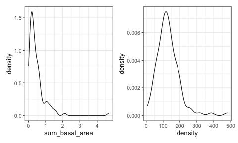

Summed basal area is continuous and non-negative with a right skew.
Lognormal distibution is usually used for e.g. size, mass (exponential
growth). The alternative way to do this would be to log the data and fit
a gaussian.

For seedling density, we probably want to model a negative binomial
response distribution (discrete, non-negative, right skew).

## 1. Including all plots

``` r
data_summed |>
    filter(treatment != "16-species-cut") |>
    group_by(treatment) |>
    summarise(n = n_distinct(plot))
```

    # A tibble: 3 × 2
      treatment      n
      <fct>      <int>
    1 1-species     32
    2 4-species     32
    3 16-species    32

``` r
data_summed |>
    filter(treatment != "16-species-cut") |>
    ggplot(aes(x = sum_basal_area, y = treatment, colour = treatment)) +
    geom_swarm(shape = 16) +
    scale_colour_sbe() +

    data_summed |>
        filter(treatment != "16-species-cut") |>
        ggplot(aes(x = density, y = treatment, colour = treatment)) +
    geom_swarm(shape = 16) +
    scale_colour_sbe() +
    plot_layout(guides = "collect")
```

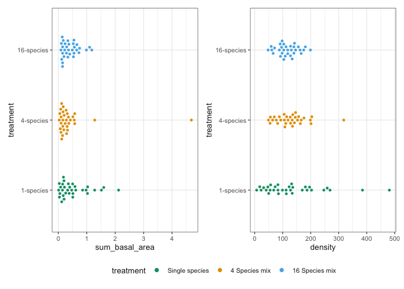

For density, I’m modelling the dispersion parameter as a function of
treatment. The single-species plots have a more variance than the other
two groups (see figure above). When I ran the model treating the
dispersion parameter as a constant, it “violated the assumption of a
homogeneous dispersion parameter across groups” - DHARMa.

``` r
m1 <-
    glmmTMB(
        sum_basal_area ~ 0 + treatment + (1 | block),
        data = filter(data_summed, treatment != "16-species-cut"),
        family = lognormal(link = "log")
    )

m2 <-
    glmmTMB(
        density ~ 0 + treatment + (1 | block),
        dispformula = ~treatment,
        data = filter(data_summed, treatment != "16-species-cut"),
        family = nbinom2(link = "log")
    )
```

Because we used a log link, we need to back transform estimates with
`exp()` to get them on the response scale.

Beacuse we use a log-link in all our models, contrasts become ratios
after back-transformation, so:

- ratio of `1` = groups have the same estimated response
- `1.25` = first group is 25% higher than the second
- `0.80` = first group is 20% lower than the second
- `2` = first group has twice the estimated response
- `0.50` = first group has half the estimated response

For confidence intervals:

- If the entire ratio CI is above `1`, the first group is estimated to
  have the higher response
- If the entire CI is below `1`, the first group is estimated to have
  the lower response
- If the CI includes `1`, the results are compatible with no difference,
  as well as the range of effects covered by the interval

``` r
results_1 <-
    tibble(name = factor(c("Basal area", "Density")), fit = list(m1, m2)) |>
    mutate(
        tidy = purrr::map(
            fit,
            tidy,
            effects = "fixed",
            conf.int = TRUE,
            exponentiate = TRUE
        )
    )
```

``` r
results_1 <-
    results_1 |>
    mutate(
        resids = purrr::map(
            fit,
            DHARMa::simulateResiduals,
            plot = FALSE
        )
    )
```

``` r
purrr::walk2(
    results_1$resids,
    results_1$name,
    \(resids, name) plot(resids, title = name)
)
```

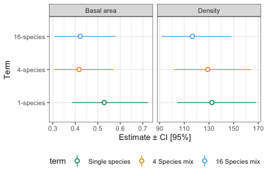


``` r
results_1 |>
    unnest(tidy) |>
    mutate(term = str_remove(term, "treatment")) |>
    mutate(
        term = fct_relevel(
            term,
            "1-species",
            "4-species",
            "16-species"
        ),
        name = fct_relevel(
            name,
            "Basal area",
            "Density"
        )
    ) |>
    ggplot(aes(
        x = term,
        y = estimate,
        ymin = conf.low,
        ymax = conf.high,
        colour = term
    )) +
    geom_pointrange(shape = 21, fill = "white") +
    labs(x = "Term", y = "Estimate ± CI [95%]") +
    coord_flip() +
    scale_colour_sbe() +
    facet_wrap(~name, ncol = 2, scales = "free_x")
```

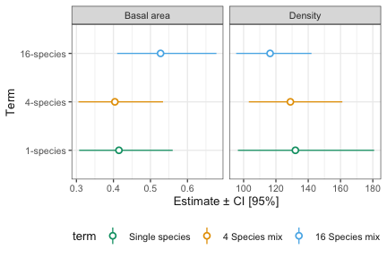

### Results

Test if any difference between treatments:

``` r
# basal area
emm_m1 <- emmeans(m1, ~treatment)

pairs(
    emm_m1,
    type = "response",
    side = "two-sided",
    infer = TRUE,
    level = 0.95,
    adjust = "none"
)
```

     contrast                   ratio     SE  df asymp.LCL asymp.UCL null z.ratio
     (1-species) / (4-species)  1.027 0.1410 Inf     0.786     1.343    1   0.196
     (1-species) / (16-species) 0.787 0.1030 Inf     0.609     1.017    1  -1.830
     (4-species) / (16-species) 0.766 0.0983 Inf     0.596     0.985    1  -2.077
     p.value
      0.8447
      0.0672
      0.0378

    Confidence level used: 0.95 
    Intervals are back-transformed from the log scale 
    Tests are performed on the log scale 

``` r
plot(
    emm_m1,
    type = "response",
    side = "two-sided",
    level = 0.95,
    comparisons = TRUE,
    adjust = "none"
) +
    ggtitle("Basal area") +
    theme_sbe()
```

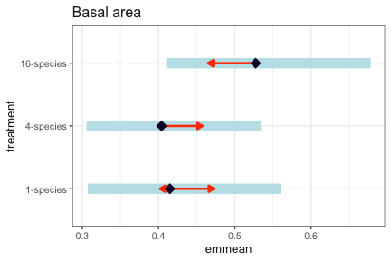

- Basal area
  - Basal area was estimated to be similar in 1- and 4-species plots
    (ratio: 1.03; 95% CI: 0.79–1.34). The interval was compatible with
    basal area being approximately 21% lower to 34% higher in 1-species
    plots
  - Basal area in 1-species plots was estimated to be 0.79 times that in
    16-species plots (95% CI: 0.61–1.02), corresponding to an estimated
    21% lower basal area. The interval ranged from approximately 39%
    lower to 2% higher and included 1
  - Basal area in 4-species plots was estimated to be 0.77 times that in
    16-species plots (95% CI: 0.60–0.99), corresponding to an estimated
    23% lower basal area. The entire interval was below 1, indicating
    that basal area was estimated to be approximately 1–40% lower in
    4-species plots

``` r
# seedling density
emm_m2 <- emmeans(m2, ~treatment)

pairs(
    emm_m2,
    type = "response",
    side = "two-sided",
    infer = TRUE,
    level = 0.95,
    adjust = "none"
)
```

     contrast                   ratio     SE  df asymp.LCL asymp.UCL null z.ratio
     (1-species) / (4-species)   1.02 0.1560 Inf     0.760      1.38    1   0.155
     (1-species) / (16-species)  1.13 0.1630 Inf     0.856      1.50    1   0.880
     (4-species) / (16-species)  1.11 0.0978 Inf     0.932      1.32    1   1.161
     p.value
      0.8764
      0.3789
      0.2455

    Confidence level used: 0.95 
    Intervals are back-transformed from the log scale 
    Tests are performed on the log scale 

``` r
plot(
    emm_m2,
    type = "response",
    side = "two-sided",
    level = 0.95,
    comparisons = TRUE,
    adjust = "none"
) +
    ggtitle("Seedling density") +
    theme_sbe()
```

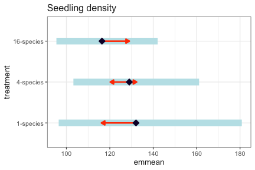

- Seedling density
  - Seedling density was estimated to be similar in 1- and 4-species
    plots (ratio: 1.02; 95% CI: 0.76–1.38)
  - Seedling density in 1-species plots was estimated to be 1.13 times
    that in 16-species plots (95% CI: 0.86–1.50), corresponding to an
    estimated 13% higher density, with the interval ranging from
    approximately 14% lower to 50% higher
  - Seedling density in 4-species plots was estimated to be 1.11 times
    that in 16-species plots (95% CI: 0.93–1.32), corresponding to an
    estimated 11% higher density, with the interval ranging from
    approximately 7% lower to 32% higher

### Modelling richness as continuous

Because the richness levels increase multiplicatively, define a
`richness_step` variable that gives equally spaced values 0, 1, 2. With
log-link models, the coefficient then represents the multiplicative
change in the response for each fourfold increase in species richness.

``` r
data_summed <-
    data_summed |>
    mutate(
        species_richness = readr::parse_number(as.character(treatment)),
        richness_step = log(species_richness, base = 4)
    )
```

``` r
m1_cont <-
    glmmTMB(
        sum_basal_area ~ richness_step + (1 | block),
        data = filter(data_summed, treatment != "16-species-cut"),
        family = lognormal(link = "log")
    )

m2_cont <-
    glmmTMB(
        density ~ richness_step + (1 | block),
        dispformula = ~treatment,
        data = filter(data_summed, treatment != "16-species-cut"),
        family = nbinom2(link = "log")
    )
```

Compare to `m1` and `m2`

``` r
anova(m1_cont, m1)
```

    Data: filter(data_summed, treatment != "16-species-cut")
    Models:
    m1_cont: sum_basal_area ~ richness_step + (1 | block), zi=~0, disp=~1
    m1: sum_basal_area ~ 0 + treatment + (1 | block), zi=~0, disp=~1
            Df    AIC    BIC  logLik deviance  Chisq Chi Df Pr(>Chisq)
    m1_cont  4 33.515 43.772 -12.757   25.515                         
    m1       5 33.821 46.643 -11.911   23.821 1.6932      1     0.1932

``` r
anova(m2_cont, m2)
```

    Data: filter(data_summed, treatment != "16-species-cut")
    Models:
    m2_cont: density ~ richness_step + (1 | block), zi=~0, disp=~treatment
    m2: density ~ 0 + treatment + (1 | block), zi=~0, disp=~treatment
            Df    AIC    BIC  logLik deviance  Chisq Chi Df Pr(>Chisq)
    m2_cont  6 1042.3 1057.7 -515.16   1030.3                         
    m2       7 1044.2 1062.1 -515.08   1030.2 0.1497      1     0.6988

Continuous models have lower AIC… but also lower DF

``` r
results_1_cont <-
    tibble(
        name = factor(c("Basal area", "Density")),
        fit = list(m1_cont, m2_cont)
    ) |>
    mutate(
        tidy = purrr::map(
            fit,
            tidy,
            effects = "fixed",
            conf.int = TRUE,
            exponentiate = TRUE
        )
    )
```

``` r
results_1_cont <-
    results_1_cont |>
    mutate(
        resids = purrr::map(
            fit,
            DHARMa::simulateResiduals,
            plot = FALSE
        )
    )
```

``` r
purrr::walk2(
    results_1_cont$resids,
    results_1_cont$name,
    \(resids, name) plot(resids, title = name)
)
```

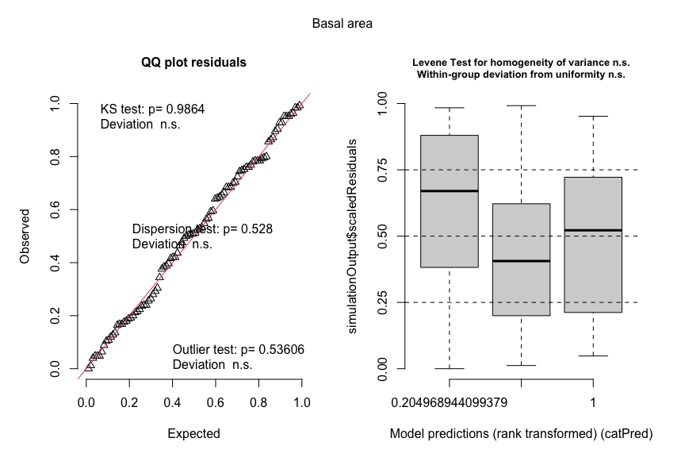

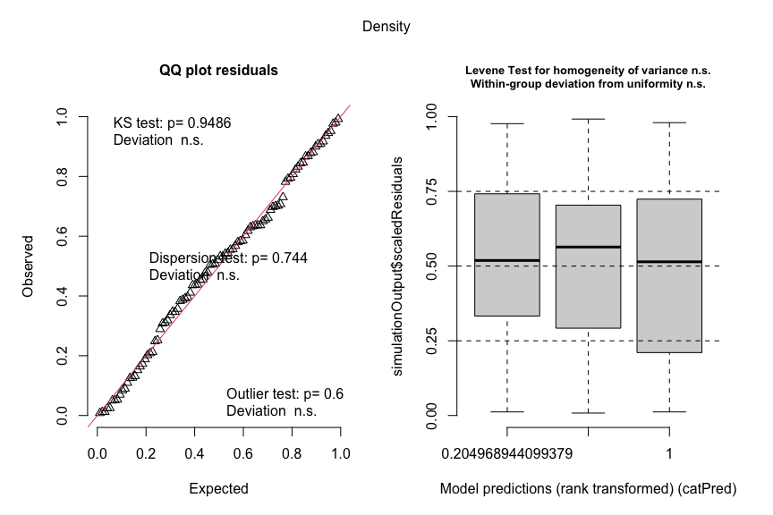

Inspect the slope on the response scale:

``` r
results_1_cont |>
    unnest(tidy) |>
    filter(term != "(Intercept)") |>
    mutate(
        name = fct_relevel(
            name,
            "Basal area",
            "Density"
        )
    ) |>
    ggplot(aes(
        x = name,
        y = estimate,
        ymin = conf.low,
        ymax = conf.high
    )) +
    geom_pointrange(shape = 21, fill = "white") +
    labs(
        x = "Term",
        y = "Response ratio per fourfold increase in species richness ± CI [95%]"
    ) +
    geom_hline(
        yintercept = 1,
        linetype = "dashed"
    ) +
    scale_y_log10() +
    coord_flip() +
    theme_sbe()
```

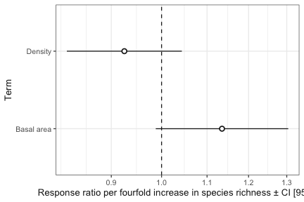

A point to the right of 1 indicates a positive slope and to the left - a
negative slope.

Get model predictions on the link scale and exponentiate them:

``` r
get_predictions <- \(model, response_name) {
    emmeans(
        model,
        ~richness_step,
        at = list(richness_step = 0:2)
    ) |>
        broom::tidy(conf.int = TRUE) |>
        transmute(
            response = response_name,
            richness_step,
            species_richness = 4^richness_step,
            estimate = exp(estimate),
            conf.low = exp(conf.low),
            conf.high = exp(conf.high)
        )
}

predictions <-
    bind_rows(
        get_predictions(m1_cont, "Basal area"),
        get_predictions(m2_cont, "Seedling density")
    )
```

``` r
predictions |>
    ggplot(
        aes(
            x = richness_step,
            y = estimate,
            ymin = conf.low,
            ymax = conf.high
        )
    ) +
    geom_ribbon(
        aes(group = response),
        alpha = 0.15
    ) +
    geom_line() +
    geom_point(size = 3) +
    facet_wrap(
        vars(response),
        scales = "free_y"
    ) +
    scale_x_continuous(
        breaks = 0:2,
        labels = c("1", "4", "16")
    ) +
    labs(
        x = "Species richness",
        y = "Predicted response"
    ) +
    theme_sbe()
```

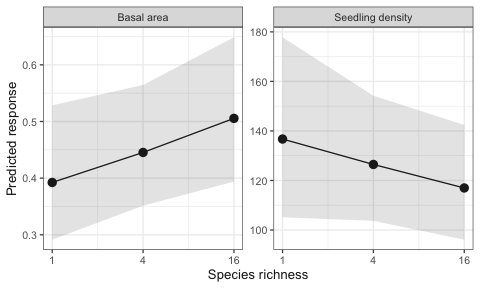

### Results (continuous)

- Basal area
  - Basal area was estimated to *increase* with species richness
  - Each fourfold increase in species richness—from 1 to 4 species or
    from 4 to 16 species—was associated with an estimated 1.14-fold
    increase in basal area (95% CI: 0.99–1.30), corresponding to an
    estimated increase of approximately 14%
  - The interval ranged from approximately 1% lower to 30% higher and
    included a response ratio of 1, so the data remained compatible with
    no change
- Seedling density
  - Seedling density was estimated to *decrease* with species richness
  - Each fourfold increase in species richness was associated with an
    estimated density ratio of 0.93 (95% CI: 0.82–1.04), corresponding
    to an estimated decrease of approximately 7%
  - The interval ranged from approximately 18% lower to 4% higher and
    included a response ratio of 1, so the data remained compatible with
    no change

## 2. 16-species plots only

``` r
data_summed |>
    filter(species_mix == "16-species") |>
    group_by(treatment) |>
    summarise(n = n_distinct(plot))
```

    # A tibble: 2 × 2
      treatment          n
      <fct>          <int>
    1 16-species        32
    2 16-species-cut    16

``` r
data_summed |>
    filter(species_mix == "16-species") |>
    ggplot(aes(x = sum_basal_area, y = treatment, colour = treatment)) +
    geom_swarm(shape = 16) +
    scale_colour_sbe() +
    data_summed |>
        filter(species_mix == "16-species") |>
        ggplot(aes(x = density, y = treatment, colour = treatment)) +
    geom_swarm(shape = 16) +
    scale_colour_sbe() +
    plot_layout(guides = "collect")
```

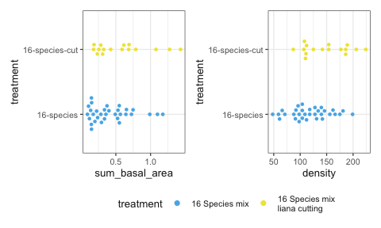

``` r
m3 <-
    glmmTMB(
        sum_basal_area ~ 0 + treatment + (1 | block),
        data = filter(data_summed, species_mix == "16-species"),
        family = lognormal(link = "log")
    )

m4 <-
    glmmTMB(
        density ~ 0 + treatment + (1 | block),
        data = filter(data_summed, species_mix == "16-species"),
        family = nbinom2(link = "log")
    )
```

``` r
results_2 <-
    tibble(name = factor(c("Basal area", "Density")), fit = list(m3, m4)) |>
    mutate(
        tidy = purrr::map(
            fit,
            tidy,
            effects = "fixed",
            conf.int = TRUE,
            exponentiate = TRUE
        )
    )
```

``` r
results_2 <-
    results_2 |>
    mutate(
        resids = purrr::map(
            fit,
            DHARMa::simulateResiduals,
            plot = FALSE
        )
    )
```

``` r
purrr::walk2(
    results_2$resids,
    results_2$name,
    \(resids, name) plot(resids, title = name)
)
```

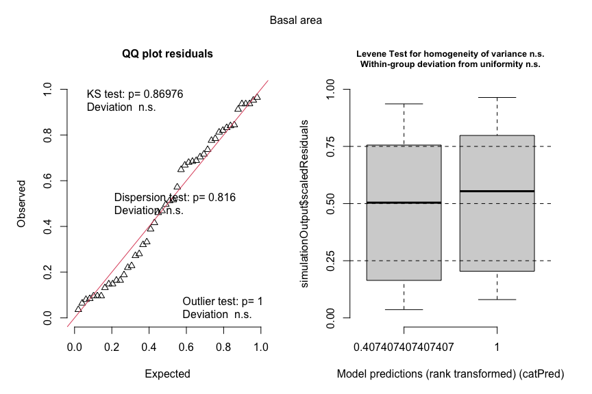

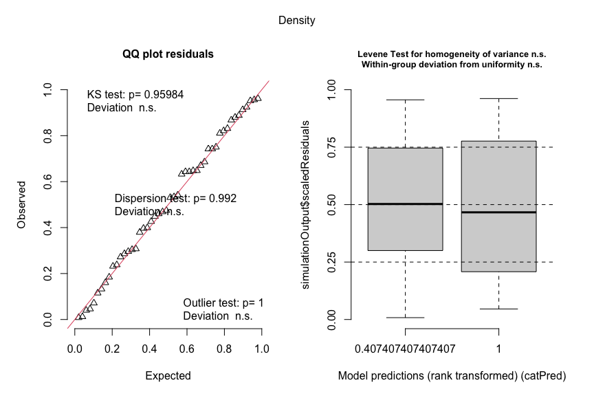

``` r
results_2 |>
    unnest(tidy) |>
    mutate(term = str_remove(term, "treatment")) |>
    mutate(
        term = fct_relevel(
            term,
            "16-species",
            "16-species-cut"
        ),
        name = fct_relevel(
            name,
            "Basal area",
            "Density"
        )
    ) |>
    ggplot(aes(
        x = term,
        y = estimate,
        ymin = conf.low,
        ymax = conf.high,
        colour = term
    )) +
    geom_pointrange(shape = 21, fill = "white") +
    labs(x = "Term", y = "Estimate ± CI [95%]") +
    coord_flip() +
    scale_colour_sbe() +
    facet_wrap(~name, ncol = 2, scales = "free_x")
```

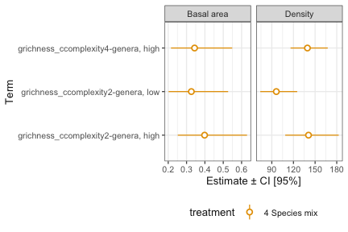

### Results

``` r
# basal area
emm_m3 <- emmeans(m3, ~treatment)

pairs(
    emm_m3,
    type = "response",
    side = "two-sided",
    infer = TRUE,
    level = 0.95,
    reverse = TRUE,
    adjust = "none"
)
```

     contrast                        ratio    SE  df asymp.LCL asymp.UCL null
     (16-species-cut) / (16-species)  1.25 0.163 Inf     0.967      1.61    1
     z.ratio p.value
       1.703  0.0885

    Confidence level used: 0.95 
    Intervals are back-transformed from the log scale 
    Tests are performed on the log scale 

``` r
plot(
    emm_m3,
    type = "response",
    side = "two-sided",
    level = 0.95,
    reverse = TRUE,
    comparisons = TRUE,
    adjust = "none"
) +
    ggtitle("Basal area") +
    theme_sbe()
```

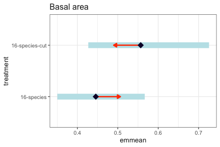

- Basal area
  - Basal area in liana-cut plots was estimated to be 1.25 times that in
    uncut 16-species plots (95% CI: 0.97–1.61), corresponding to an
    estimated 25% increase
  - The confidence interval ranged from approximately 3% lower to 61%
    higher and included a ratio of 1. The data therefore remain
    compatible with no difference, although the point estimate suggests
    higher basal area following liana cutting

``` r
# seedling density
emm_m4 <- emmeans(m4, ~treatment)

pairs(
    emm_m4,
    type = "response",
    side = "two-sided",
    infer = TRUE,
    level = 0.95,
    reverse = TRUE,
    adjust = "none"
)
```

     contrast                        ratio    SE  df asymp.LCL asymp.UCL null
     (16-species-cut) / (16-species)  1.26 0.113 Inf      1.05       1.5    1
     z.ratio p.value
       2.522  0.0117

    Confidence level used: 0.95 
    Intervals are back-transformed from the log scale 
    Tests are performed on the log scale 

``` r
plot(
    emm_m4,
    type = "response",
    side = "two-sided",
    level = 0.95,
    reverse = TRUE,
    comparisons = TRUE,
    adjust = "none"
) +
    ggtitle("Seedling density") +
    theme_sbe()
```

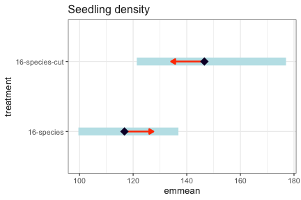

- Seedling density
  - Seedling density in liana-cut plots was estimated to be 1.26 times
    that in uncut 16-species plots (95% CI: 1.05–1.50), corresponding to
    an estimated 26% increase
  - The entire confidence interval was above 1, indicating that density
    was estimated to be approximately 5–50% higher in liana-cut plots
  - The results support higher seedling density following liana cutting,
    but the confidence interval around the magnitude of that increase is
    large

## 3. 4-species plots only:

``` r
data_summed |>
    filter(treatment == "4-species") |>
    group_by(generic_richness, struc_complexity) |>
    summarise(n = n_distinct(plot))
```

    # A tibble: 4 × 3
    # Groups:   generic_richness [2]
      generic_richness struc_complexity     n
      <fct>            <fct>            <int>
    1 2-genera         low                  8
    2 2-genera         high                 8
    3 4-genera         low                  8
    4 4-genera         high                 8

``` r
data_summed |>
    filter(treatment == "4-species") |>
    ggplot(aes(x = sum_basal_area, y = struc_complexity, colour = treatment)) +
    geom_swarm(shape = 16) +
    scale_colour_sbe() +
    facet_grid(vars(generic_richness)) +
    data_summed |>
        filter(treatment == "4-species") |>
        ggplot(aes(x = density, y = struc_complexity, colour = treatment)) +
    geom_swarm(shape = 16) +
    scale_colour_sbe() +
    plot_layout(guides = "collect") +
    facet_grid(rows = vars(generic_richness))
```

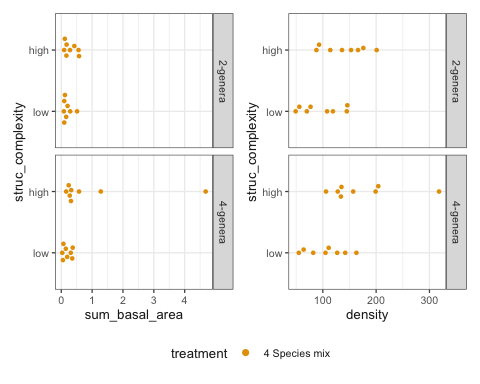

``` r
m5 <-
    glmmTMB(
        sum_basal_area ~ struc_complexity * generic_richness + (1 | block),
        data = filter(data_summed, treatment == "4-species"),
        family = lognormal(link = "log")
    )

m6 <-
    glmmTMB(
        density ~ struc_complexity * generic_richness + (1 | block),
        data = filter(data_summed, treatment == "4-species"),
        family = nbinom2(link = "log")
    )
```

``` r
results_3 <-
    tibble(name = factor(c("Basal area", "Density")), fit = list(m5, m6)) |>
    mutate(
        tidy = purrr::map(
            fit,
            tidy,
            effects = "fixed",
            conf.int = TRUE,
            exponentiate = TRUE
        )
    )
```

``` r
results_3 <-
    results_3 |>
    mutate(
        resids = purrr::map(
            fit,
            DHARMa::simulateResiduals,
            plot = FALSE
        )
    )
```

``` r
purrr::walk2(
    results_3$resids,
    results_3$name,
    \(resids, name) plot(resids, title = name)
)
```

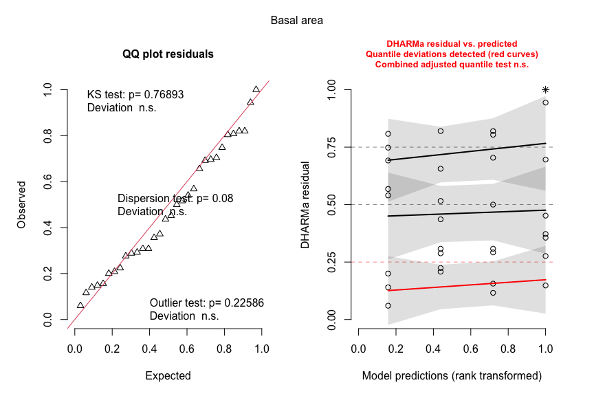

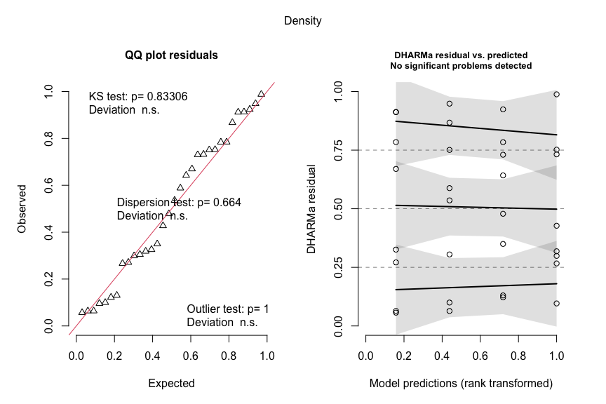

Borderline DHARMa test for the basal area model `m5`, but I think this
is due to the outlier in the 4-genera, high complexity group rather than
true heteroscedasticity.

``` r
results_3 |>
    unnest(tidy) |>
    mutate(
        name = fct_relevel(
            name,
            "Density"
        ),
        treatment = "4-species"
    ) |>
    ggplot(aes(
        x = term,
        y = estimate,
        ymin = conf.low,
        ymax = conf.high,
        colour = treatment
    )) +
    geom_pointrange(shape = 21, fill = "white") +
    labs(x = "Term", y = "Estimate ± CI [95%]") +
    coord_flip() +
    scale_colour_sbe() +
    facet_grid(~name, scales = "free_x")
```


### Results

``` r
# basal area
emm_m5 <- emmeans(m5, ~ struc_complexity * generic_richness)

pairs(
    emm_m5,
    type = "response",
    side = "two-sided",
    infer = TRUE,
    level = 0.95,
    reverse = TRUE,
    adjust = "none"
)
```

     contrast                          ratio    SE  df asymp.LCL asymp.UCL null
     (high 2-genera) / (low 2-genera)  1.221 0.308 Inf     0.745      2.00    1
     (low 4-genera) / (low 2-genera)   0.869 0.235 Inf     0.511      1.48    1
     (low 4-genera) / (high 2-genera)  0.712 0.186 Inf     0.426      1.19    1
     (high 4-genera) / (low 2-genera)  1.470 0.377 Inf     0.889      2.43    1
     (high 4-genera) / (high 2-genera) 1.203 0.298 Inf     0.741      1.96    1
     (high 4-genera) / (low 4-genera)  1.690 0.447 Inf     1.007      2.84    1
     z.ratio p.value
       0.793  0.4278
      -0.517  0.6053
      -1.297  0.1945
       1.500  0.1336
       0.748  0.4545
       1.985  0.0472

    Confidence level used: 0.95 
    Intervals are back-transformed from the log scale 
    Tests are performed on the log scale 

``` r
plot(
    emm_m5,
    type = "response",
    side = "two-sided",
    level = 0.95,
    reverse = TRUE,
    comparisons = TRUE,
    adjust = "none"
) +
    ggtitle("Basal area") +
    theme_sbe()
```

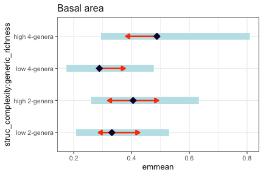

- Basal area
  - At two genera, basal area under high canopy complexity was estimated
    to be 1.22 times that under low complexity (95% CI: 0.75–2.00). The
    interval included 1 and remained compatible with no difference
  - At four genera, basal area under high canopy complexity was
    estimated to be 1.69 times that under low complexity (95% CI:
    1.01–2.84), indicating an estimated increase of approximately 1–184%
  - The high-versus-low complexity ratio was estimated to be 1.38 times
    greater at four genera than at two genera (interaction ratio: 1.38;
    95% CI: 0.68–2.83). This interval included 1, so the magnitude of
    the interaction remains uncertain
  - Comparing generic richness within each complexity level, basal area
    in four-genera plots was estimated to be 0.87 times that in
    two-genera plots under low complexity (95% CI: 0.51–1.48) and 1.20
    times that in two-genera plots under high complexity (95% CI:
    0.74–1.96). Both intervals included 1

``` r
# basal area
emm_m6 <- emmeans(m6, ~ struc_complexity * generic_richness)

pairs(
    emm_m6,
    type = "response",
    side = "two-sided",
    infer = TRUE,
    level = 0.95,
    reverse = TRUE,
    adjust = "none"
)
```

     contrast                          ratio    SE  df asymp.LCL asymp.UCL null
     (high 2-genera) / (low 2-genera)  1.464 0.247 Inf     1.051      2.04    1
     (low 4-genera) / (low 2-genera)   1.103 0.187 Inf     0.791      1.54    1
     (low 4-genera) / (high 2-genera)  0.753 0.127 Inf     0.542      1.05    1
     (high 4-genera) / (low 2-genera)  1.794 0.302 Inf     1.290      2.49    1
     (high 4-genera) / (high 2-genera) 1.225 0.205 Inf     0.883      1.70    1
     (high 4-genera) / (low 4-genera)  1.627 0.273 Inf     1.170      2.26    1
     z.ratio p.value
       2.257  0.0240
       0.576  0.5648
      -1.682  0.0926
       3.471  0.0005
       1.217  0.2237
       2.897  0.0038

    Confidence level used: 0.95 
    Intervals are back-transformed from the log scale 
    Tests are performed on the log scale 

``` r
plot(
    emm_m6,
    type = "response",
    side = "two-sided",
    level = 0.95,
    reverse = TRUE,
    comparisons = TRUE,
    adjust = "none"
) +
    ggtitle("Seedling density") +
    theme_sbe()
```

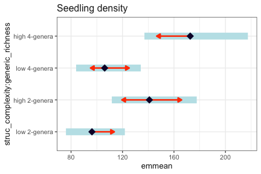

- Seedling density
  - At two genera, seedling density under high canopy complexity was
    estimated to be 1.46 times that under low complexity (95% CI:
    1.05–2.04), indicating an estimated increase of approximately 5–104%
  - At four genera, seedling density under high canopy complexity was
    estimated to be 1.63 times that under low complexity (95% CI:
    1.17–2.26), indicating an estimated increase of approximately
    17–126%
  - The high-versus-low complexity ratio was estimated to be 1.11 times
    greater at four genera than at two genera (interaction ratio: 1.11;
    95% CI: 0.70–1.77). This interval included 1, providing no clear
    evidence that the canopy-complexity effect differed with generic
    richness
  - Comparing generic richness within each complexity level, density in
    four-genera plots was estimated to be 1.10 times that in two-genera
    plots under low complexity (95% CI: 0.79–1.54) and 1.23 times that
    in two-genera plots under high complexity (95% CI: 0.88–1.70). Both
    intervals included 1

## Results summary

Across the species richness treatments (all plots) (not the continuous
models), basal area was estimated to be 23% lower in 4-species plots
than in 16-species plots (95% CI: 1–40% lower). The other basal area
comparison intervals and all seedling density comparison intervals
included 1 and remained compatible with no difference.

In the liana-cutting comparisons (16-species plots), the basal area
interval included 1. However, seedling density was estimated to be 26%
higher in liana-cut plots than in uncut plots, with the 95% confidence
interval indicating an increase of approximately 5–50%.

Within 4-species plots, high canopy complexity was associated with
higher basal area at four genera and higher seedling density at both two
and four genera. However, the interaction intervals included 1 for both
responses, so there was no clear evidence that the effect of canopy
complexity differed between the two generic-richness levels. The
generic-richness contrasts within each canopy-complexity level also
remained compatible with no difference.
