# Biodiversity partitioning models
eleanorjackson
11 September, 2026

- [1. Including all plots](#1-including-all-plots)
  - [Treatment as continuous?](#treatment-as-continuous)
- [2. 4-species plots only](#2-4-species-plots-only)

In this document I’ll fit the biodiveristy partitioning models.

`partitioning_component ~ treatment + (1 | block)`

Are we interested in if the 4- and 16-species treatments are different
from each other, or only if they are significantly positive or negative?

``` r
library("tidyverse")
library("patchwork")
library("glmmTMB")
library("broom.mixed")
library("DHARMa")
library("ggdist")
library("emmeans")
```

``` r
partitions <- readRDS(here::here("data", "derived", "biodiv_effects.rds"))
```

``` r
fit_models <- function(data, formula) {
    responses <- c(
        m_NE = "net",
        m_CE = "compl",
        m_CE_size = "size_compl",
        m_CE_dens = "dens_compl",
        m_SE = "selec",
        m_SE_size = "size_selec",
        m_SE_dens = "dens_selec"
    )

    fit_one <- purrr::quietly(\(response) {
        glmmTMB::glmmTMB(
            stats::as.formula(
                paste(response, formula)
            ),
            data = data,
            family = t_family(link = "identity")
        )
    })

    results <- purrr::map(responses, fit_one)

    # check for warnings
    tibble::tibble(
        name = names(responses),
        fit = purrr::map(results, "result"),
        warning = purrr::map_chr(
            results,
            \(x) {
                paste(unique(x$warnings), collapse = "\n")
            }
        )
    )
}
```

## 1. Including all plots

``` r
models_1 <- fit_models(
    data = partitions,
    formula = "~ 0 + treatment + (1|block)"
)
```

``` r
results_1 <-
    models_1 |>
    mutate(
        tidy = purrr::map(
            fit,
            tidy,
            effects = "fixed",
            conf.int = TRUE
        )
    ) |>
    unnest(tidy) |>
    mutate(
        term = fct_relevel(
            term,
            "treatment4-species",
            "treatment16-species"
        ),
        name = fct_relevel(
            name,
            "m_NE",
            "m_CE",
            "m_CE_size",
            "m_CE_dens",
            "m_SE",
            "m_SE_size",
            "m_SE_dens"
        )
    )
```

``` r
results_1 |>
    ggplot(aes(x = term, y = estimate, ymin = conf.low, ymax = conf.high)) +
    geom_pointrange(shape = 21, fill = "white") +
    labs(x = "Term", y = "Estimate ± CI [95%]") +
    geom_hline(yintercept = 0, color = "blue") +
    coord_flip() +
    facet_wrap(~name, ncol = 1)
```

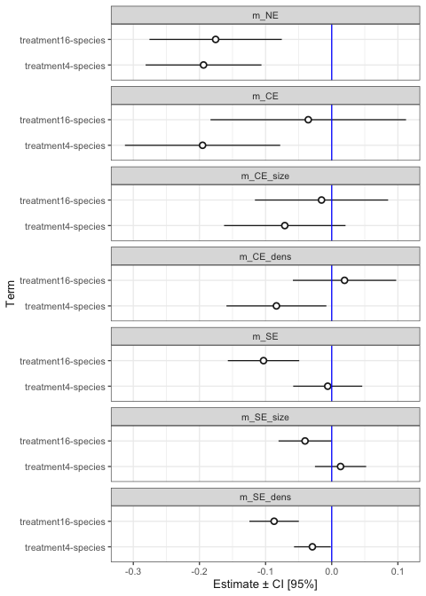

``` r
models_1 <-
    models_1 |>
    mutate(
        emmeans = purrr::map(
            fit,
            emmeans,
            ~treatment
        )
    )
```

``` r
em_plots <-
    purrr::map2(
        models_1$emmeans,
        models_1$name,
        \(emmeans, name) {
            plot(
                emmeans,
                type = "response",
                side = "two-sided",
                level = 0.95,
                comparisons = TRUE,
                adjust = "none"
            ) +
                ggtitle(name) +
                theme_sbe() +
                geom_vline(xintercept = 0, linetype = 2)
        }
    )

wrap_plots(em_plots, axes = "collect")
```

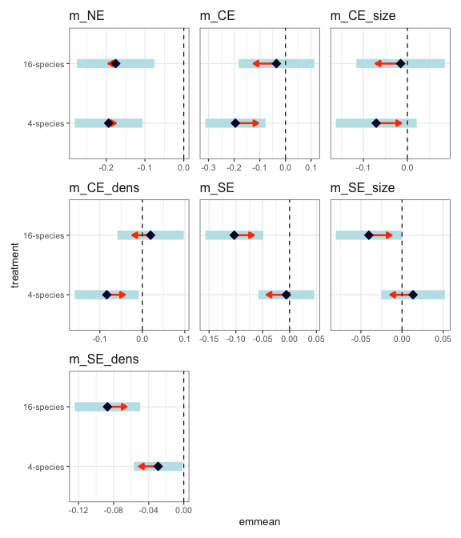

``` r
models_1 <-
    models_1 |>
    mutate(
        resids = purrr::map(
            fit,
            DHARMa::simulateResiduals,
            plot = FALSE
        )
    )
```

``` r
purrr::walk2(
    models_1$resids,
    models_1$name,
    \(resids, name) plot(resids, title = name)
)
```

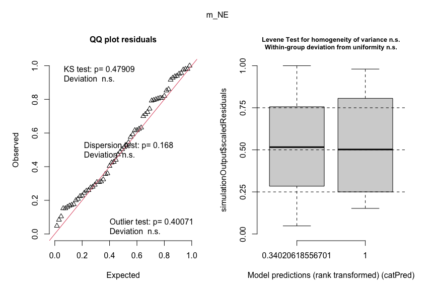

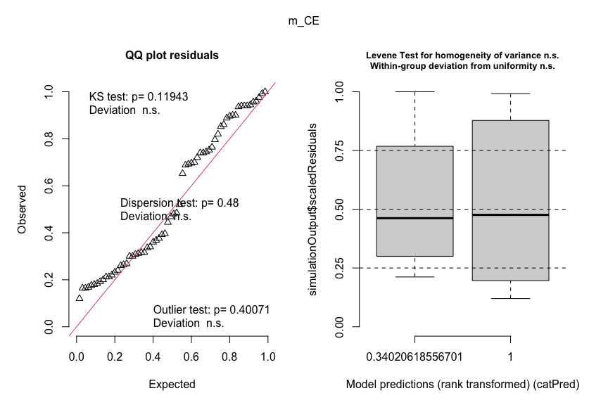

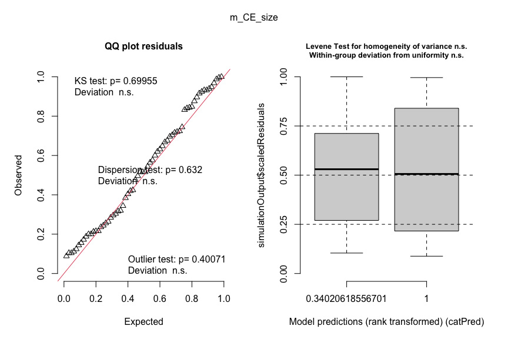

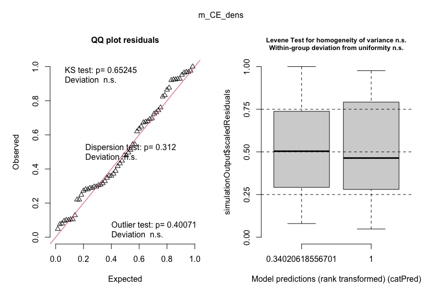

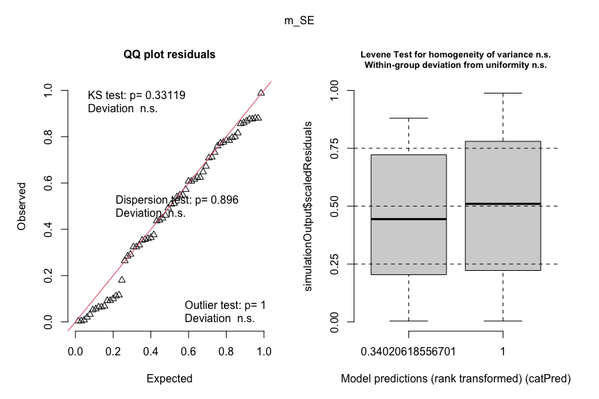

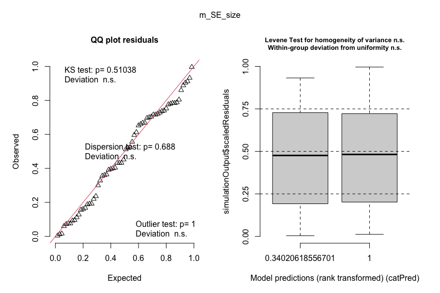

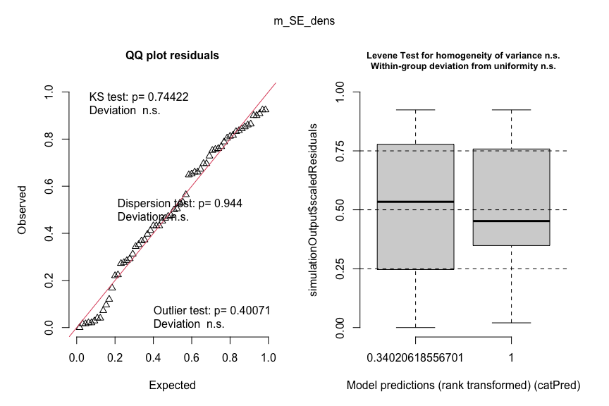

### Treatment as continuous?

``` r
partitions <-
    partitions |>
    mutate(
        species_richness = readr::parse_number(as.character(treatment)),
        richness_step = log(species_richness, base = 4)
    )
```

``` r
models_1_cont <- fit_models(
    data = partitions,
    formula = "~ 0 + richness_step + (1|block)"
)
```

``` r
models_1_cont |>
    dplyr::filter(warning != "")
```

    # A tibble: 1 × 3
      name      fit          warning                                                
      <chr>     <named list> <chr>                                                  
    1 m_SE_dens <glmmTMB>    Model convergence problem; non-positive-definite Hessi…

``` r
results_1_cont <-
    models_1_cont |>
    mutate(
        tidy = purrr::map(
            fit,
            tidy,
            effects = "fixed",
            conf.int = TRUE
        )
    ) |>
    unnest(tidy) |>
    mutate(
        name = fct_relevel(
            name,
            "m_NE",
            "m_CE",
            "m_CE_size",
            "m_CE_dens",
            "m_SE",
            "m_SE_size",
            "m_SE_dens"
        )
    )
```

``` r
results_1_cont |>
    filter(term != "(Intercept)") |>
    ggplot(aes(
        x = name,
        y = estimate,
        ymin = conf.low,
        ymax = conf.high
    )) +
    geom_pointrange(shape = 21, fill = "white") +
    labs(
        x = "Term",
        y = "Estimate ± CI [95%]"
    ) +
    geom_hline(
        yintercept = 0,
        linetype = "dashed"
    ) +
    coord_flip() +
    theme_sbe()
```

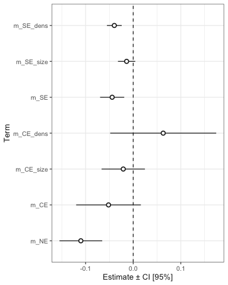

``` r
get_predictions <- \(model, response_name) {
    emmeans(
        model,
        ~richness_step,
        at = list(richness_step = 1:2)
    ) |>
        broom::tidy(conf.int = TRUE) |>
        transmute(
            response = response_name,
            richness_step,
            species_richness = 4^richness_step,
            estimate = exp(estimate),
            conf.low = exp(conf.low),
            conf.high = exp(conf.high)
        )
}

models_1_cont <-
    models_1_cont |>
    mutate(
        predictions = purrr::map2(
            fit,
            name,
            get_predictions
        )
    )
```

``` r
plots_pred <- models_1_cont$predictions |>
    purrr::map(\(predictions) {
        predictions |>
            ggplot(
                aes(
                    x = richness_step,
                    y = estimate,
                    ymin = conf.low,
                    ymax = conf.high
                )
            ) +
            geom_ribbon(
                aes(group = response),
                alpha = 0.15
            ) +
            geom_line() +
            geom_point(size = 3) +
            scale_x_continuous(
                breaks = c(1, 2),
                labels = c("4", "16")
            ) +
            labs(
                title = unique(predictions$response),
                x = "Species richness",
                y = "Predicted response"
            ) +
            theme_sbe()
    })

wrap_plots(plots_pred, ncol = 2, axes = "collect")
```

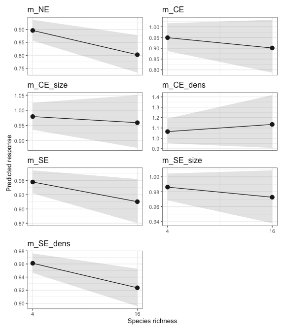

``` r
models_1_cont <-
    models_1_cont |>
    mutate(
        resids = purrr::map(
            fit,
            DHARMa::simulateResiduals,
            plot = FALSE
        )
    )
```

``` r
purrr::walk2(
    models_1_cont$resids,
    models_1_cont$name,
    \(resids, name) plot(resids, title = name)
)
```

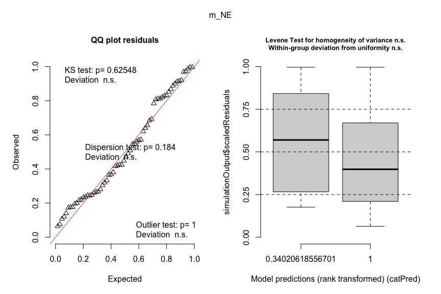

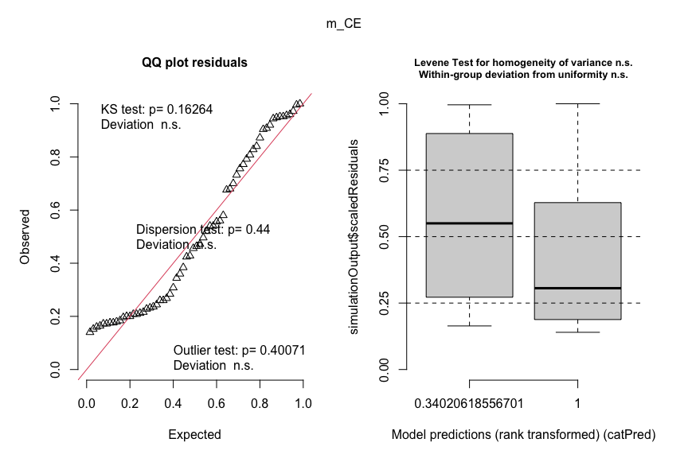

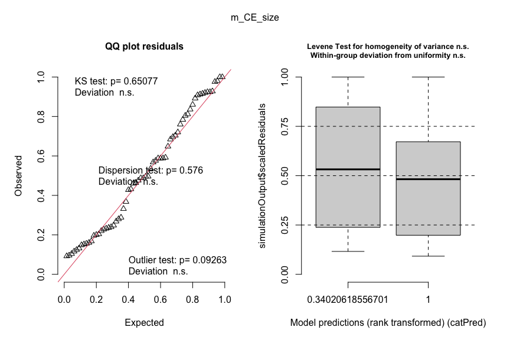

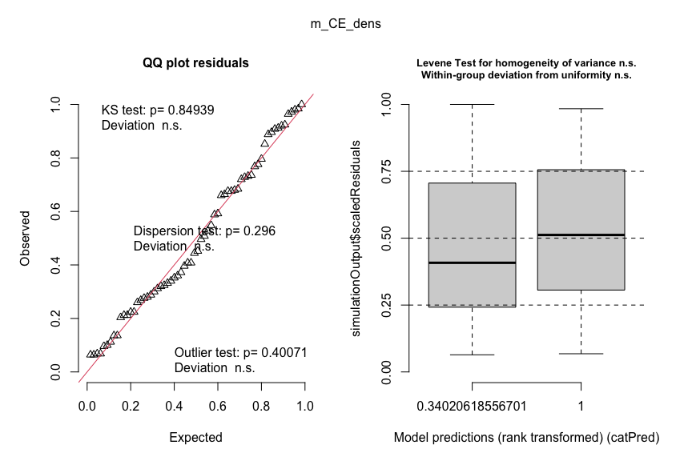

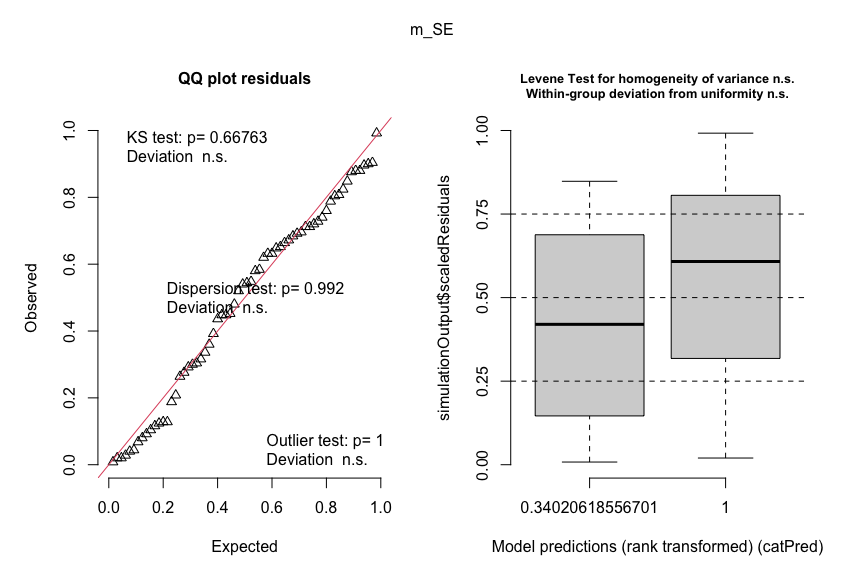

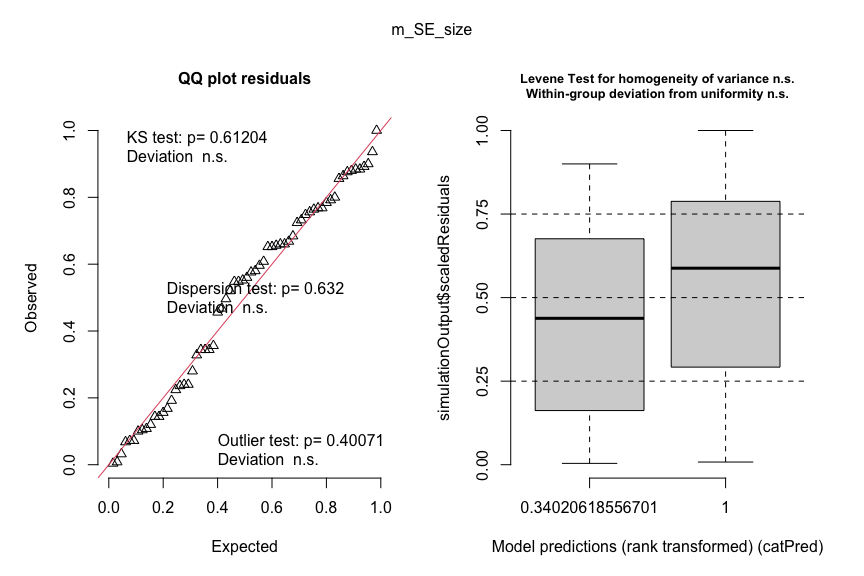

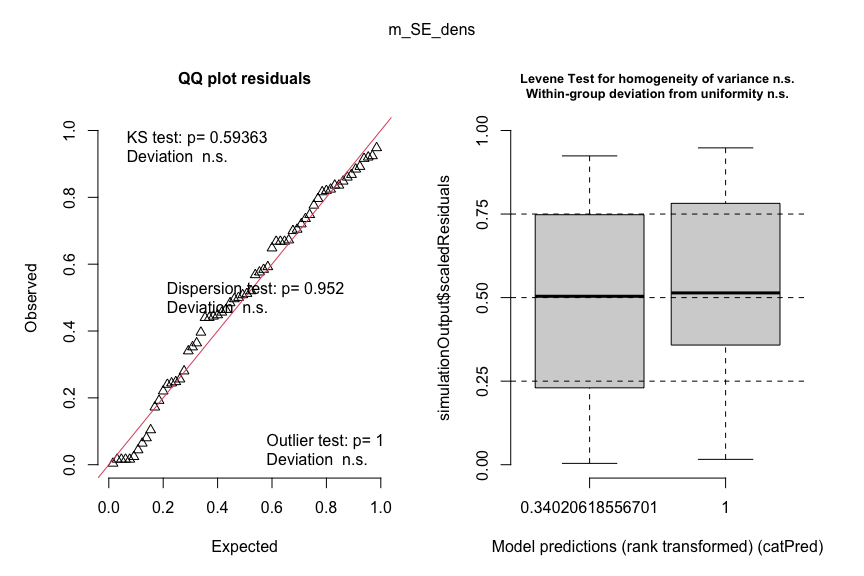

## 2. 4-species plots only

``` r
models_2 <- fit_models(
    data = filter(partitions, treatment == "4-species"),
    formula = "~ 0 + struc_complexity * generic_richness + (1|block)"
)
```

``` r
results_2 <-
    models_2 |>
    mutate(
        tidy = purrr::map(
            fit,
            tidy,
            effects = "fixed",
            conf.int = TRUE
        )
    ) |>
    unnest(tidy) |>
    mutate(
        name = fct_relevel(
            name,
            "m_NE",
            "m_CE",
            "m_CE_size",
            "m_CE_dens",
            "m_SE",
            "m_SE_size",
            "m_SE_dens"
        )
    )
```

``` r
results_2 |>
    ggplot(aes(x = term, y = estimate, ymin = conf.low, ymax = conf.high)) +
    geom_pointrange(shape = 21, fill = "white") +
    labs(x = "Term", y = "Estimate ± CI [95%]") +
    geom_hline(yintercept = 0, color = "blue") +
    coord_flip() +
    facet_wrap(~name, ncol = 1)
```

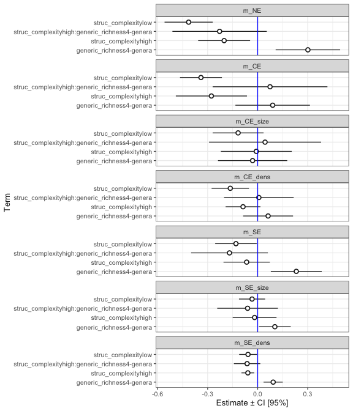

``` r
models_2 <-
    models_2 |>
    mutate(
        emmeans = purrr::map(
            fit,
            emmeans,
            ~ struc_complexity * generic_richness
        )
    )
```

``` r
em_plots <-
    purrr::map2(
        models_2$emmeans,
        models_2$name,
        \(emmeans, name) {
            plot(
                emmeans,
                type = "response",
                side = "two-sided",
                level = 0.95,
                comparisons = TRUE,
                adjust = "none"
            ) +
                ggtitle(name) +
                theme_sbe() +
                geom_vline(xintercept = 0, linetype = 2)
        }
    )

wrap_plots(em_plots, axes = "collect")
```

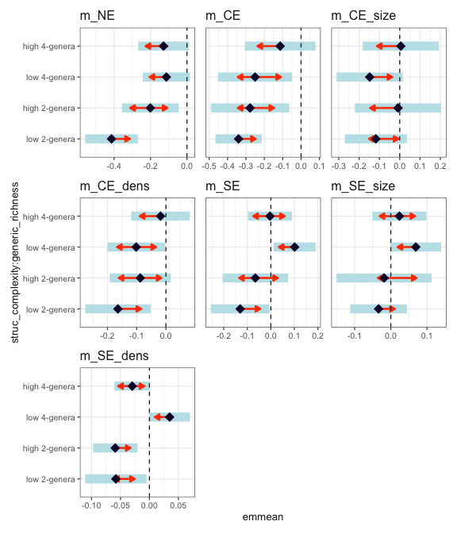

``` r
models_2 <-
    models_2 |>
    mutate(
        resids = purrr::map(
            fit,
            DHARMa::simulateResiduals,
            plot = FALSE
        )
    )
```

``` r
purrr::walk2(
    models_2$resids,
    models_2$name,
    \(resids, name) plot(resids, title = name)
)
```

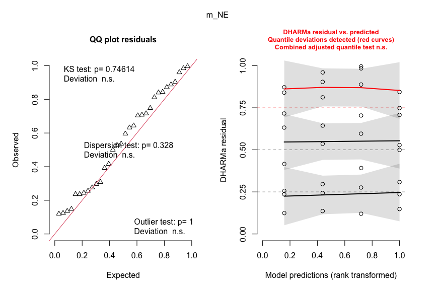

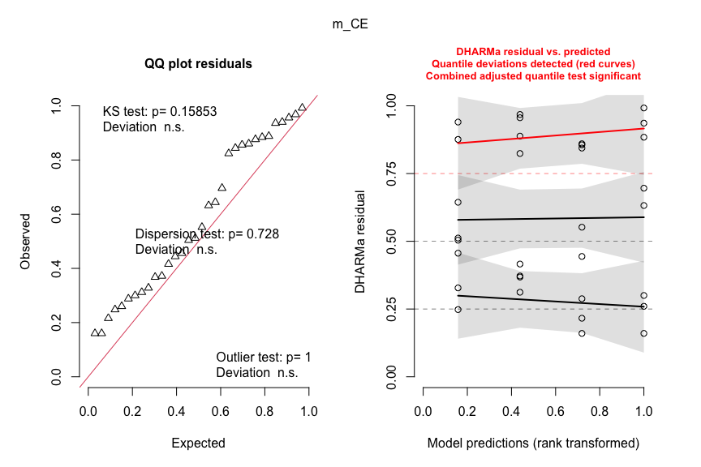


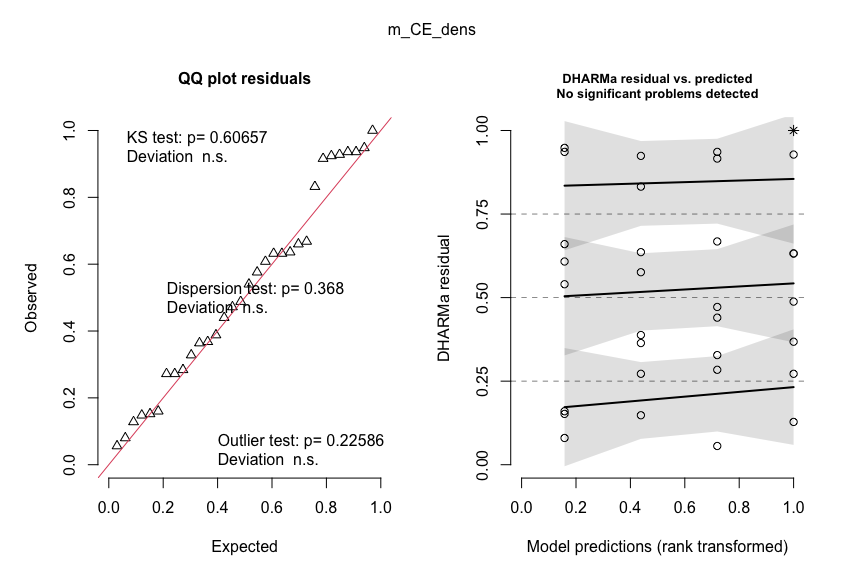

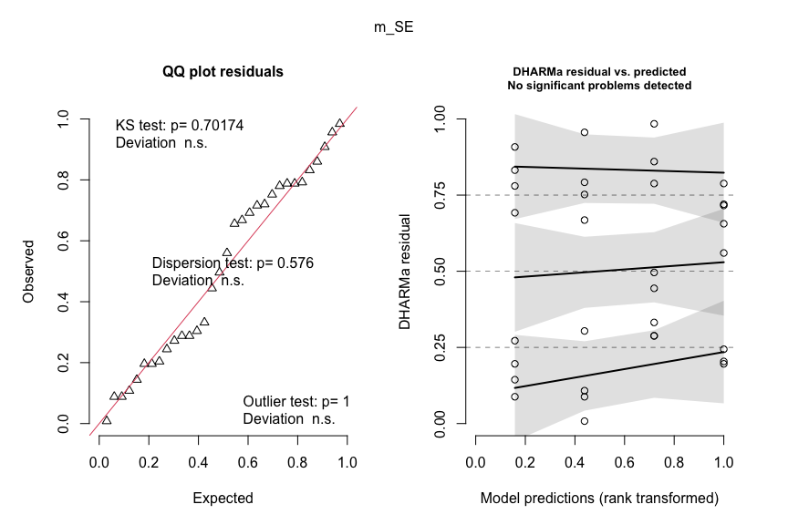

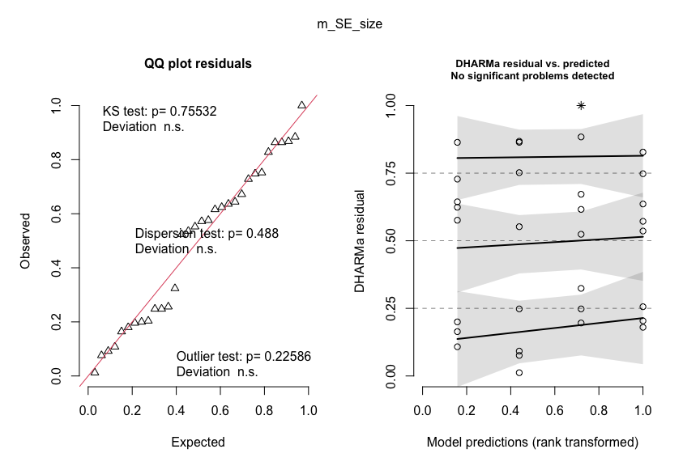

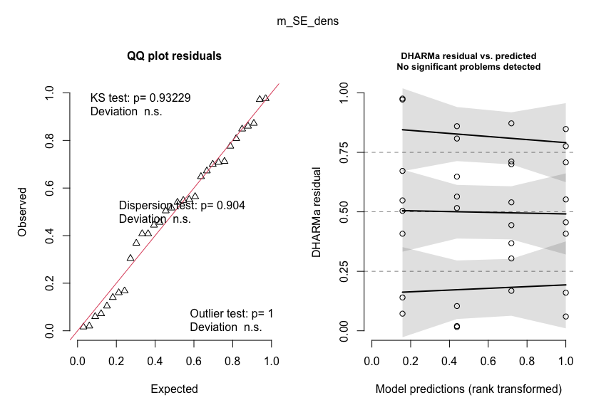
